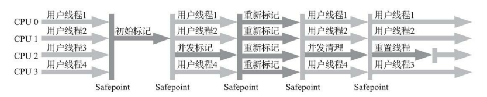

# 垃圾收集器

## 垃圾回收算法

### 分代收集理论

### 标记清除

> 首先标记出所需要回收的对象，在标记完成后，统一回收掉所有被标记的对象

### 标记复制

> 将可用内存划分为两部分，每次只使用其中一块，当一块内存用完时，将还存活对象复制到另外一块上面，然后再把已使用的内存空间清理一遍

### 标记整理

> 标记出所需要回收的对象，将所有需要存活的对象都向内存空间的一端移动，然后直接清理掉边界以外的内存

## JVM GC 流程

> [JVM堆的内存分布](https://www.yuque.com/pride_yang/blog/qsgy0z#vfjXH)

> Minor GC  新生代GC

> Major GC/Full GC

1. 开始时，对象会先分配到eden区
2. 引用运行，越来越多对象分配在eden区域
3. 当eden区域放不下时，就会发生minor GC(young GC),利用可达性分析标记出垃圾对象，然后将有用对象移动到survivor0区域，将标记出来的垃圾对象全部清除，此时eden区域就全部清理干净了。整个过程使用了 mark-sweep（标记整理）方法回收eden区，使用mark-copy（标记复制） 方法将可用对象移动到 survivor0区域。
4. 随着时间推移，eden如果又满了，再次触发minor GC，同样还是先做标记，这时eden和s0区可能都有垃圾对象了，注意：这时s1（即：to）区是空的，S0区和eden区的存活对象（S0 区域满了），将直接搬到s1区。然后将eden和S0区的垃圾清理掉，这一轮minor GC后，eden和S0区就变成了空的了。
5. 随着对象的不断分配，eden空可能又满了，这时会重复刚才的minor GC过程，不过要注意的是，这时候s0是空的，所以s0与s1的角色其实会互换，即：存活的对象，会从eden和s1区，向s0区移动。然后再把eden和s1区中的垃圾清除，这一轮完成后，eden与s1区变成空的
6. 对于那些比较“长寿”的对象一直在s0与s1中挪来挪去，一来很占地方，而且也会造成一定开销，降低gc效率，于是有了“代龄(age)”及“晋升”。对象在年青代的3个区(eden,s0,s1)之间，每次从1个区移到另1区，年龄+1，在young区达到一定的年龄阈值(-XX:MaxTenuringThreshold（默认15）)后，将晋升到老年代。
7. 如果老年代，最终也放满了，就会发生major GC（即Full GC），由于老年代的的对象通常会比较多，因为标记-清理-整理（压缩）的耗时通常会比较长，会让应用出现卡顿的现象，

　　

1. ‍

## 垃圾收集器

### 经典垃圾收集器

#### Serial 收集器/Serial Old 收集器

　　
_ Serial/Serial Old收集器运行示意图  _

#### ParNew 收集器/_Serial Old_ 收集器

　　
_ ParNew/Serial Old收集器运行示意图  _

#### Parallel Scavenge/Parallel Old收集器

　　_ Parallel Scavenge/Parallel Old收集器运行示意图 _

#### CMS收集器

　　
_ Concurrent Mark Sweep收集器运行示意图  _

### 低延迟垃圾收集器

#### Shenandozh收集器

#### ZGC收集器

## GC回收流程
