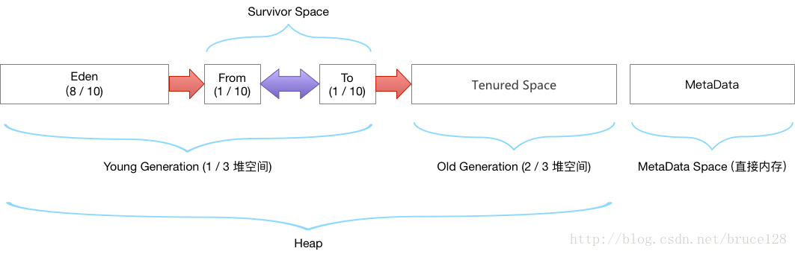

# 虚拟机运行时数据区域

## 运行时数据区域

　　

### 程序计数器

> 通过改变这个计数器 的值来选取下一条需要执行的字节码指令

　　java 虚拟机的多线程是通过线程轮流切换、分配处理器执行时间的方式来实现的，在任何一个确定的时刻，一个处理器只会执行一条线程中的指令，为了线程切换后能恢复到正确的执行位置，每条线程都需要一个独立的程序计数器。
每个线程都会有属于自己独立的线程计数器，各线程之间计数器不会相互影响，独立存储，这些区域成为线程私有。

### Java虚拟机栈

> Java方法执行的线程内存模型

　　每个方法被执行，Java虚拟机栈会创建一个栈帧[(1)](https://www.yuque.com/pride_yang/blog/gngtxy)，用于存储局部变量表，操作数栈，方法出口，动态链接等信息。
一个方法的执行对应着一个栈帧的入栈与出栈过程。
局部变量存储存放编译期间可知java虚拟机的基础类型（boolean，byte，char、short、int、float、dubbo、long）、对象引用（reference类型）、和returnAddress类型（指向一条字节码指令的地址）。
局部变量表的存储单位是局部变量槽（slot） 其中64位长度的long和 double类型的数据会占用两个变量槽，其余的数据类型只占用一个 （一个变量槽的内存占用空间由虚拟机自行决定） 。
** 《Java虚拟机规范》中  规定如果线程请求的栈深度大于虚拟机所允许的深度** **，将抛出StackOverflowError异常，当栈扩展时无法申请到足够的内存会抛出OutOfMemoryError异常。  **

### 本地方法栈

> 为虚拟机使用到的 Native 方法服务 （一个 Native Method 就是一个 java 调用非 java 代码的接口）

　　**HotSpot栈内存不允许动态扩容**

```bash
-Xss 设置栈容量 jdk11 windows最小值 180k Linux最小值228k 否则启动时会出现提示
```

### Java堆

> 被所有线程共享，在虚拟机启动时创建，用于存放对象实例。

- java堆是垃圾收集器管理的内存区域，也被成为GC堆。G1收集器出现之前，垃圾收集器一般基于分代收集理论设计，但是之后出现了一些不采用分代设计的垃圾收集器。所以收集器不一定存在新生代，老年代，永久代，Eden区，From Survivor区，To Survivor区等。
- 从内存角度看，所有线程共享的java堆可以划分为多个私有进程的分配缓存区（TLAB），以提升对象分配时的效率。

```bash
-Xmx 堆最大值
-Xms 堆最小值
-XX:+HeapDumpOnOutOfMemoryError 发生OOM时产生dump内存堆转储快照
-XX:HeapDumpPath=./ 设置快照文件保存位置
```

#### jvm堆的默认分配方案

　　
老年代 ： 三分之二的堆空间
年轻代 ： 三分之一的堆空间
eden区： 8/10 的年轻代空间
survivor0 : 1/10 的年轻代空间
survivor1 : 1/10 的年轻代空间（from 区）

　　**由于及时编译技术的进步，逃逸分析技术的日渐强大，栈上分配，标量替换等优化手段出现，对象实例也未必都全部分配在堆上。**

### 方法区

> 主要用于存储被虚拟机加载的类型信息、常量、静态变量、及时编译器编译后的代码缓存等数据

　　**在HotSpot中jdk1.8之前也被称为永久代 在jdk7后将永久代的功能转移到元空间**
**元空间默认初始大小20m**

```bash
-XX:MaxMetaspaceSize 设置元空间最大值，默认为-1 不受限制或者说收本地内存限制
-XX:MetaspaceSize 设置元空间初始空间大小 以字节为单位，达到该值会触发垃圾收集进行类型卸载，同事收集器会对该值进行调整，如果释放大量空间则适当降低该值，如果释放很少空间，那么在不超过最大值情况下适当提高。
-MinMetaspaceFreeRatio：在垃圾收集后控制最小的元空间剩余容量的百分比，可减少因元空间不足导致垃圾收集的频率
-MinMetaspaceFreeRatio：用于控制最大的元空间剩余容量的百分比
```

### 

### 运行时常量池

> 方法区的一部分，用于存放编译期产生的各种字面量和符号引用
> **给基本类型变量赋值的方式就叫做字面量或者字面值**

### 直接内存

```bash
-XX:MaxDirectMemorySize 设置字节内存大小 如果不进行设置则与java堆的最大值一致
```

## JVM四种引用

### 强引用

　　特点：GC时，永远不会被回收
使用场景

> new 对象

### 软引用SoftReference<Object>(obj);

　　特点：内存不足时（自动触发GC），会被回收
使用场景

> 缓存

### 弱引用WeakReference<Object>(obj)

　　特点：无论内存是否充足，只要进行GC，都会被回收
使用场景

> 一次性对象

### 虚引用PhantomReference<>(new Object(),new ReferenceQueue<>())

　　特点：如同虚设，和没有引用没什么区别
使用场景

> 1. 管理堆外面的引用

##
