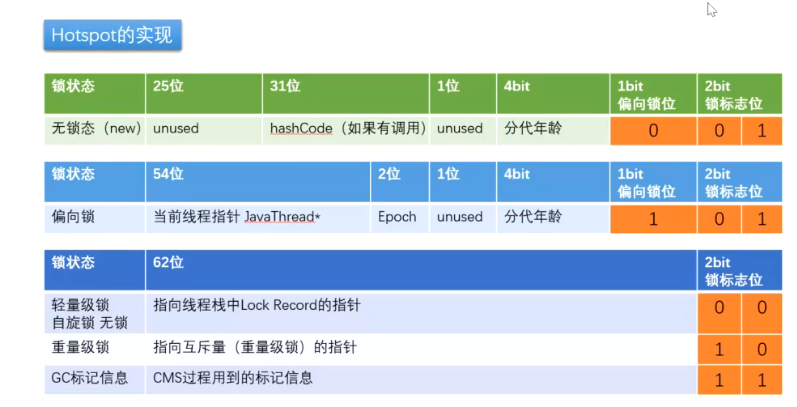

# 并发问题

## CAS （Compare and Swap（比较与交换））

### 原理

> 线程从内存中取值i 赋值给k 对k进行运算，运算完毕后与内存中的i值进行比较，若相等证明无线程修改i ，结果正确，更新结果值。若不相等则证明有其他线程修改过该值，结果不正确进行重试。

### 注意事项

#### ABA问题

　　解决方案 ：添加版本号或时间戳 java

## synchronized （执行某段代码锁定某个对象）

### 对象的内存布局

　　**jvm默认开启class pointer压缩 为4字节 **
普通对象 markword 默认八个字节 instance data 若属性则为零 padding 补足被8整除

数组对象

### 实现

　　MONITORENTER 进入锁
MONITOREXIT 退出锁
在jvm执行过程中实现锁升级

### 锁升级

|锁状态||25位||31位|||1位|4bit|1bit（偏向锁位）|2bit锁标志||
| --------------| -| -----------------------------| -| ----------------------| -| -----| ------| --------| ----------------| ----------| -|
|无锁（new）||unused||　hashcode（如果调用）|||unused|分代年龄|0|0|1|
|||||||||||||
|锁状态||54位||||2位|1位|4bit|1bit（偏向锁位）|2bit锁标志||
|偏向锁||当前线程指针||||Epoch|unused|分代年龄|1|0|1|
|||||||||||||
|锁状态||62位||||||||2bit锁标志||
|轻量锁，自旋锁||指向线程栈中Lock Record的指针||||||||0|0|
|重量级锁||指向互斥量（重量级锁）的指针||||||||1|0|
|GC标记信息||CMS过程中用到的标记信息||||||||1|1|

　　

#### 锁升级流程(hashcode存储到Lock Record)

1. 先new一个对象
2. 若有一个线程进入，将线程id放入对象头中（偏向锁）
3. 若再来一个线程，将使用CAS进行锁竞争，并这小偏向锁标识（自旋锁）（CAS等待自旋会消耗CPU）
4. jdk1.6之前为自旋10次货自旋线程大于CPU核心的一半则进入重量锁 之后则为jvm自适应锁

　　为何要升级到重量锁：升级重量锁后，其他线程进入等待状态，不消耗CPU，但是申请重量锁需要与内核打交道，会消耗资源。

#### 锁粗化

　　jvm检测到一连串操作都对同一对象加锁，此时jvm就会将锁范围加到一连串操作的外围（比如for循环append）

#### 锁消除

　　一个资源为非共享资源，jvm会自动把锁去除（比如只在一个方法内使用StringBuffer的append方法）

## AQS
