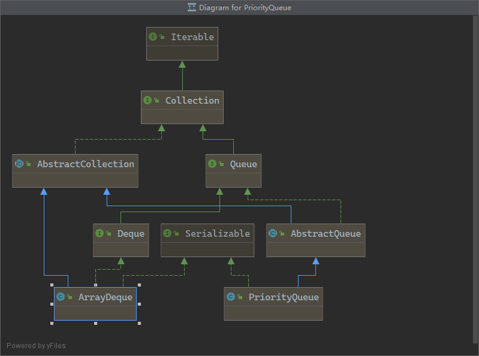

# Queue

## Queue

　　​​

|||
| :--| :-----------------------------|
|`int size()` ：|获取队列长度；|
|`boolean add(E)`/`boolean offer(E)`：|添加元素到队尾；|
|`E remove()`/`E poll()`：|获取队首元素并从队列中删除；|
|`E element()`/`E peek()`：|获取队首元素但并不从队列中删除|

　　调用`add()`方法，当添加失败时（可能超过了队列的容量），它会抛出异常
调用`offer()`方法来添加元素，当添加失败时，它不会抛异常，而是返回`false`
当前`Queue`是一个空队列，调用`remove()`方法，它会抛出异常
调用 `poll()`方法来取出队首元素，当获取失败时，它不会抛异常，而是返回`null`：

　　**注意：不要把 null 添加到队列中，否则 poll()方法返回 null 时，很难确定是取到了 null 元素还是队列为空。**

## PriorityQueue(优先队列) `extends AbstractQueue`

> 通过二叉小顶堆实现，可以用一棵完全二叉树表示
> 优先队列的作用是能保证每次取出的元素都是队列中权值最小的
> PriorityQueue 实现了 Queue 接口，不允许放入 null 元素；其通过堆实现，具体说是通过完全二叉树 （complete binary tree） 实现的小顶堆（任意一个非叶子节点的权值，都不大于其左右子节点的权值），也就意味着可以通过数组来作为 PriorityQueue 的底层实现
> 放入 PriorityQueue 的元素，必须实现 Comparable 接口，PriorityQueue 会根据元素的排序顺序决定出队的优先级

## Deque `extends Queue`(接口)

　　**队列和 Deque 方法的比较**

|队列方法|等效的 Deque 方法|
| ---------| -----------------|
|add(e)|addLast(e)|
|offer(e)|offerLast(e)|
|remove()|removeFirst()|
|poll()|pollFirst()|
|element()|getFirst()|
|peek()|peekFirst()|

## ArrayDeque `implements Deque` (实现接口)
