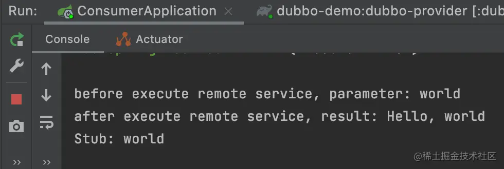

# 应用

## 负载均衡

　　Dubbo支持以下几种负载均衡策略：`Random LoadBalance`​、`RoundRobin LoadBalance`​、`LeastActive LoadBalance`​、`ConsistentHash LoadBalance`​、`Shorttest response LoadBalance`​。除了dubbo提供这些内置负载均衡策略，还支持自定义扩展负载均衡策略。

　　服务端和消费端都可以配置负载均衡策略，如果都配置的话，**以消费端为准**。

### Random LoadBalance

　　​`随机策略`​，是默认的负载均衡策略，是按按权重设置随机概率。如果服务端有多个示例，在消费端调用时会随机找一个服务端进行调用。根据调用量的情况，调用量越大，每个服务被调用的概率也就越均匀。

　　服务端配置

```java
@DubboService(loadbalance = "random")
public class HelloServiceImpl implements HelloService {
}

```

　　消费端配置

```ini
@DubboReference(loadbalance = "random")
private HelloService helloService;

```

　　当然，随机策略是默认的，可以不配置。

### RoundRobin LoadBalance

　　​`轮询策略`​，dubbo会初始化一个本地权重表，然后按照权重进行轮询的负载均衡算法。消费端调用时会按一定的顺序去调用，此方式有个弊端是，如果服务端有一个服务出现异常执行很慢，那么时间长了，所有的请求都会卡在这个服务上。

　　服务端配置

```java
@DubboService(loadbalance = "roundrobin")
public class HelloServiceImpl implements HelloService {
}
```

　　消费端配置

```ini
@DubboReference(loadbalance = "roundrobin")
private HelloService helloService;
```

### LeastActive LoadBalance

　　​`最少活跃调用数策略`​，相同活跃数的话会进行随机调用，活跃数指调用前后计数差，如果某个服务请求执行比较慢，那么这个服务接收到的请求会更少。

　　假如有3个服务端，A、B、C，他们正在处理的请求数分别为1、6、3，那么这时如果再来一个请求，那么理论上A会接收到这个请求。

　　那么，问题来了，我一个消费者是如何感知到服务端的正在请求的个数呢？

　　其实，消费端是不知道服务端正在请求的个数的。这个请求的计数是在消费端完成的，所以不同的消费端这个计数可能是不一样的。

　　服务端配置

```java
@DubboService(loadbalance = "leastactive")
public class HelloServiceImpl implements HelloService {
}

```

　　消费端配置

```ini
@DubboReference(loadbalance = "leastactive")
private HelloService helloService;

```

### ConsistentHash LoadBalance

　　​`一致性 Hash策略`​，如果消费端的请求参数相同，那么之后他们都会调到同一个服务端。

　　在服务调用时，会把请求参数进行hash算法，然后根据服务端的实例个数计算出要调用哪个服务端，之后参数相同的请求都会调到这个服务端。

　　服务端配置

```java
@DubboService(loadbalance = "consistenthash")
public class HelloServiceImpl implements HelloService {
}

```

　　消费端配置

```ini
@DubboReference(loadbalance = "consistenthash")
private HelloService helloService;

```

### Shorttest response LoadBalance

　　​`最短响应时间策略`​，顾名思义从多个服务提供者中选出执行成功并且响应时间最短的提供者。 服务端配置

```java
@DubboService(loadbalance = "shortestresponse")
public class HelloServiceImpl implements HelloService {
}

```

　　消费端配置

```ini
@DubboReference(loadbalance = "shortestresponse")
private HelloService helloService;
```

## 集群容错

　　集群容错是指消费者在调用服务时，如果服务有多个服务提供者，在经过负载均衡后选出其中一个服务提供者后进行调用，但这时如果调用报错，那么Dubbo会采取一定策略进行后续的处理。

　　Dubbo支持以下几种集群容错策略：`Failover Cluster`​、`Failfast Cluster`​、`Failsafe Cluster`​、`Failback Cluster`​、`Forking Cluster`​、`Broadcast Cluster`​、`Available Cluster`​、`Mergeable Cluster`​。

### Failover Cluster

　　失败重试，当消费者调用失败时，会尝试调用其他提供者，可以配置`retries`​来控制重试次数，当`retries`​配置为0时，代表不进行重试。重试次数可以配置为应用级别、类级别、方法级别。对调用者屏蔽失败信息，会增加资源额外开销，适用于读操作、对响应时间不敏感的场景。Failover是dubbo的默认配置。

```less
@DubboReference(cluster = "failover", retries = 0)
private HelloService helloService1;

@DubboReference(cluster = "failover", 
    methods = {@Method(name = "sayHello", retries = 0)})
private HelloService helloService2;

```

### Failfast Cluster

　　快速失败，只发起一次调用，如果失败了就立即返回，不做其他事情了。适用于写操作、非幂等性的操作。注意：`Failfast Cluster`​ 没有重试次数的配置，就算配置了也不会生效。

```ini
@DubboReference(cluster = "failfast")
private HelloService helloService;

```

### Failsafe Cluster

　　失败安全，当调用服务出现异常时，直接忽略，不做其他处理，失败了不会影响核心流程，但也屏蔽了失败信息。适用于写入审计日志、非核心流程等操作。

```ini
@DubboReference(cluster = "failsafe")
private HelloService helloService;

```

### Failback Cluster

　　失败自动恢复，调用失败后，不会去重试其他的，而是后台记录一下失败的请求，然后进行定时重发，但也可能会引发任务堆积。适用于消息通知、对实时性要求不高的操作。

```ini
@DubboReference(cluster = "failback")
private HelloService helloService;

```

### Forking Cluster

　　并行调用，调用时会同时调用多个服务端，并不是调用所有的服务端，其中只要有一个调用成功就直接返回代表调用成功，不会管其他的调用结果。可以通过`forks`​来配置最大并行的个数，默认为2次，当然这个值不能大于服务端的个数。适用于实时性要求较高的读操作。

```ini
@DubboReference(cluster = "forking", parameters = {"forks", "3"})
private HelloService helloService;

```

### Broadcast Cluster

　　广播模式，会调用所有的服务端，只有所有的调用都成功时，才表示成功，如果有一台执行失败就表示执行失败。可以通过`broadcast.fail.percent`​来配置失败的比例，假如配置20代表当失败比例超过20%时调用失败。

```ini
@DubboReference(cluster = "broadcast", 
parameters = {"broadcast.fail.percent", "20"})
private HelloService helloService;

```

### Available Cluster

　　可用模式，调用服务列表可用的实例，只调用一个服务，如果所有服务都不可以，则调用失败。

```ini
@DubboReference(cluster = "available")
private HelloService helloService;

```

### Mergeable Cluster

　　合并结果集，一般和group一起使用，调用配置的所有的提供者，将执行结果进行合并。

```kotlin
// 合并所有分组
@DubboReference(cluster = "mergeable", merger = "true", group = "*")
private HelloService helloService;
// 合并指定分组
@DubboReference(cluster = "mergeable", merger = "true", group = "a,b")
private HelloService helloService;
```

## 服务超时

　　消费者调用一个服务时，可以分为三步：

1. 消费端发送调用请求
2. 服务端执行请求
3. 服务端返回响应数据

　　其中，第1、3两步涉及到网络传输，既然有网络，那么就可能存在网络延迟、也就存在执行超时。第2步，如果执行逻辑复杂、执行时间长，也可能导致服务超时。

　　服务端和消费端都可以配置服务超时时间。

　　如果服务端或消费端只有其中一个配置了超时时间`timeout`​，这时，如果消费者调用超过了这个时间没有收到响应，那么`消费端就是抛出异常而服务端不能抛异常`​。如果服务端执行超过这个时间只会打印一个超时日志，并不会抛异常，所以服务端的逻辑会正常处理完成。

　　如果服务端和消费端都配置了超时时间，那么会以消费端的超时时间为准。假如，

　　服务端的超时时间为2s，服务执行时间为3s，消费端的超时时间为1s，那么消费端会报超时异常，而服务端不会报异常。

　　服务端配置

```java
@DubboService(timeout = 2000)
public class HelloServiceImpl implements HelloService {
}

```

　　消费端配置

```ini
@DubboReference(timeout = 3000)
private HelloService helloService;

```

　　除了在注解里指定版本外，还可以在配置文件里指定版本，例如：

```ini
dubbo.application.name=dubbo-consumer
dubbo.registry.address=zookeeper://127.0.0.1:2181
dubbo.provider.timeout=1000
dubbo.consumer.timeout=1000
```

## 服务降级

　　服务降级，是针对于某个服务提供者而言的，服务消费者在调用某个服务提供者时，如果该服务提供者报错了，所采取的措施。

　　比如消费者在调用提供者时，服务超时而导致调用失败了，就可以采用服务降级来进行容错。

　　例如，现在服务端配置超时为2s，消费端配置超时为1s，加上容错措施。

```java
@Service
public class ConsumerService {

    @DubboReference(timeout = 1000, retries = 3, mock = "fail: return Error")
    private HelloService helloService;

    public void sayHello() {
        String result = helloService.sayHello("world");
        System.out.println(result);
    }
}
复制代码
```

　　执行后，经过3次重试后，会直接返回 Error，而不是抛出异常。

　　​`mock=fail: return Error`​表示，在消费者调用提供者失败后，返回Error。

　　​`mock=force: return Error`​表示，不会执行调用，直接返回Error。

　　还可以创建一个Mock类来实现。

　　在`dubbo-api`​项目创建一个类，实现`HelloService`​接口来做Mock。

```java
public class HelloServiceMock implements HelloService {
    public String sayHello(String name) {
        return "Mock " + name;
    }
}
复制代码
```

　　消费端调用

```java
@EnableDubbo
@SpringBootApplication
public class ConsumerApplication {
    @DubboReference(timeout = 1000, retries = 3, mock = "true")
    private HelloService helloService;

    public static void main(String[] args) {
        ApplicationContext context = SpringApplication.run(ConsumerApplication.class, args);
        ConsumerApplication consumerApplication = context.getBean(ConsumerApplication.class);
        consumerApplication.sayHello("world");
    }

    public void sayHello(String name) {
        String result = helloService.sayHello(name);
        System.out.println(result);
    }
}
```

## 本地伪装

## 本地存根

　　本地存根是一段代码逻辑，这段代码逻辑一般是服务端提供者提供，但是在服务消费端执行。服务提供者可以利用这种机制在服务消费者远程调用服务提供者之前或之后再做一些其他事情，比如结果缓存、请求参数验证或其他逻辑。

　　现在我们来创建一个本地存根类`HelloServiceStub`​，同样需要实现`HelloService`​接口。本地存根类需要持有`HelloService`​一个对象。当消费者调用时会先执行本地存根这个类。

```arduino
public class HelloServiceStub implements HelloService {
    private final HelloService helloService;

    public HelloServiceStub(HelloService helloService) {
        this.helloService = helloService;
    }

    public String sayHello(String name) {
        System.out.println("before execute remote service, parameter: " + name);
        String result = this.helloService.sayHello(name);
        System.out.println("after execute remote service, result: " + result);
        return "Stub: " + name;
    }
}

```

　　消费者执行代码

```java
@EnableDubbo
@SpringBootApplication
public class ConsumerApplication {
    @DubboReference(stub = "true")
    private HelloService helloService;

    public static void main(String[] args) {
        ApplicationContext context = SpringApplication.run(ConsumerApplication.class, args);
        ConsumerApplication consumerApplication = context.getBean(ConsumerApplication.class);
        consumerApplication.sayHello("world");
    }

    public void sayHello(String name) {
        String result = helloService.sayHello(name);
        System.out.println(result);
    }
}

```

　　查看执行结果

　　​​

　　代码中的`stub="true"`​，代表启用本地存根，dubbo会根据调用的接口`全限定名+"Stub"`​来充当本地存根类，当然也支持`stub="某个类的全限定名"`​，如果找不到这个类，程序就会报错。

　　当消费者调用`sayHello`​​方法时，是先执行的`stub`​​里面的`sayHello`​​方法，在`stub`​​类里面执行一段逻辑后，才去真正执行`sayHello`​​方法，这也相当于mock的另一种实现方式。

## 参数回调

　　参数回调是指，服务消费端在调用服务提供者的时候，调用完成后给服务消费端一个回调（再调用服务消费端一个方法）。

　　一般都是消费端来调用服务端，如果在调用服务端后，想让服务端再调用对应的消费端就需要用到这种机制了。

　　​`dubbo-api`​里增加回调接口`HelloServiceListener`​

```java
public interface HelloServiceListener {
    void changed(String msg);
}

```

　　​`dubbo-provider`​服务提供者增加回调配置

```java
@DubboService(methods = {@Method(name = "sayHello", arguments = {@Argument(index = 1, callback = true)})})
public class HelloServiceImpl implements HelloService {
    @Override
    public String sayHello(String name, HelloServiceListener listener) {
        System.out.println("provider received invoke of sayHello: " + name);
        listener.changed("Callback " + name);
        return "Hello, " + name;
    }
}

```

　　​`dubbo-consumer`​服务消费者进行调用

```typescript
@EnableDubbo
@SpringBootApplication
public class ConsumerApplication {
    @DubboReference
    private HelloService helloService;

    public static void main(String[] args) {
        ApplicationContext context = SpringApplication.run(ConsumerApplication.class, args);
        ConsumerApplication consumerApplication = context.getBean(ConsumerApplication.class);
        consumerApplication.sayHello("world");
    }
    public void sayHello(String name) {
        String result = helloService.sayHello(name, new HelloServiceListenerImpl());
        System.out.println(result);
    }
}
public class HelloServiceListenerImpl implements HelloServiceListener {
    @Override
    public void changed(String msg) {
        System.out.println("Changed :" + msg);
    }
}
```

　　如果有多个回调的话，可以再加一个参数来区分。

## 异步调用

　　Dubbo支持多种异步调用，可以通过注解或xml将一个方法标记为异步方法，也可以将一个类的方法的返回值类型设置为`CompletableFuture`​。

#### 注解形式

```java
@DubboReference(methods = @Method(name = "sayHello", async = true))
private HelloService helloService;
复制代码
```

　　通过这种方式，直接调用方法会得到一个`null`​，而不是结果。需要通过`RpcContext`​来获取返回值。

```java
// 会返回null
String result = helloService.sayHello(name);
System.out.println(result);
CompletableFuture<String> helloFuture = RpcContext.getContext().getCompletableFuture();
helloFuture.whenComplete((v, t) -> {
    if (t == null) {
        System.out.println("result: " + v);
    } else {
        t.printStackTrace();
    }
});
```

　　或者通过`asyncCall`​来完成异步调用。

```java
CompletableFuture<String> f = RpcContext.getContext().asyncCall(() ->
        helloService.sayHello("async"));
System.out.println("result: " + f.get());
```

#### CompletableFuture

　　将方法声明为`CompletableFuture`​类型

```java
CompletableFuture<String> sayHello(String name);
```

　　这样消费端就不用使用`RpcContext`​就可以完成异步调用。

```java
CompletableFuture<String> helloFuture = helloService.sayHello(name);
helloFuture.whenComplete((v, t) -> {
    if (t == null) {
        System.out.println("result: " + v);
    } else {
        t.printStackTrace();
    }
});
```

## 泛化调用

　　Dubbo提供了一个类`GenericService`​，他可以调用所有的服务，通常用来做测试。使用这个类的一个好处是，我们可以不用引入额外的jar就可以调用服务，不过书写起来不叫麻烦。需要指定`generic`​为`true`​。

```java
@EnableDubbo
@SpringBootApplication
public class GenericApplication {
    @DubboReference(id = "genericService", interfaceName = "cn.juejin.dubbo.api.HelloService", generic = true)
    private GenericService genericService;

    public static void main(String[] args) {
        ApplicationContext context = SpringApplication.run(GenericApplication.class, args);
        GenericService genericService = (GenericService) context.getBean("genericService");
        Object result = genericService.$invoke("sayHello", new String[]{"java.lang.String"}, new Object[]{"generic"});
        System.out.println(result);
    }
}

```

## 泛化服务

　　在服务端实现了`GenericService`​接口的类，提供的服务称为泛化服务，是用来实现一个通用的服务测试框架。

　　服务端定义一个泛化服务

```java
@DubboService(interfaceName = "cn.juejin.dubbo.api.HelloService")
public static class GenericServiceImpl implements GenericService {
    @Override
    public Object $invoke(String method, String[] parameterTypes, Object[] args) throws GenericException {
        System.out.println("执行泛化服务: " + method);
        return "Hello, " + args[0];
    }
}

```

　　在消费端调用时，依然可以按之前的方式调用。

```java
@DubboReference
private HelloService helloService;
```

　　‍
