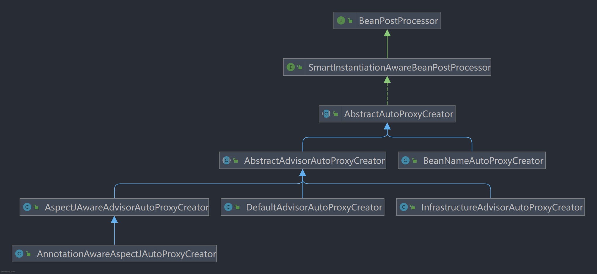

# Spring AOP

## AOP（切面编程）

> 能够将与业务无关，却为业务模块所共同调用的逻辑与责任封装（例如事务处理、日志管理、权限控制），降低模块间的耦合度，有利于维护和拓展。

　　Spring AOP 基于动态代理，若需要代理对象，实现某个接口，则 SpringAOP 使用 JDK Proxy，去创建代理对象，对于没有实现接口的对象，SpringAOP 会使用 cglib 代理（cglib 基于子类进行代理）

　　

## Spring AOP 和 AspectJ AOP 有什么区别？

- Spring AOP 属于运行时增强，而 AspectJ 是编译时增强。 Spring AOP 基于代理(Proxying)，而 AspectJ 基于字节码操作(Bytecode Manipulation)。
- Spring AOP 采用的是动态代理的方式来实现 AOP 的，使用 JDK 动态代理与 CGLIB 动态代理之间切换，基于 Spring，只能拦截 Spring IOC 容器中的 Bean。AspectJ 是一种语言型的 AOP 框架，并且采用静态织入的方式，可以代理所有的 Java 类型。但是因为是通过修改源码的方式去实现 AOP ，所以需要使用独有的编译器去处理类。

## Spring AOP 原理

　　
Spring AOP是通过`BeanPostProcessor`扩展Bean, 在 `AbstractAutoProxyCreator`中 `postProcessAfterInitialization`方法会通过`wrapIfNecessary ​`尝试代理对象

```java
	public Object postProcessAfterInitialization(@Nullable Object bean, String beanName) {
		if (bean != null) {
			Object cacheKey = getCacheKey(bean.getClass(), beanName);
			if (this.earlyProxyReferences.remove(cacheKey) != bean) {
				return wrapIfNecessary(bean, beanName, cacheKey);
			}
		}
		return bean;
	}
```

```java
protected Object wrapIfNecessary(Object bean, String beanName, Object cacheKey) {
		if (StringUtils.hasLength(beanName) && this.targetSourcedBeans.contains(beanName)) {
			return bean;
		}
		if (Boolean.FALSE.equals(this.advisedBeans.get(cacheKey))) {
			return bean;
		}
		if (isInfrastructureClass(bean.getClass()) || shouldSkip(bean.getClass(), beanName)) {
			this.advisedBeans.put(cacheKey, Boolean.FALSE);
			return bean;
		}

		// 获取Bean匹配的所有通知 通过下面的方法确认Bean是否需要进行动态代理 
		Object[] specificInterceptors = getAdvicesAndAdvisorsForBean(bean.getClass(), beanName, null);
		if (specificInterceptors != DO_NOT_PROXY) {
			this.advisedBeans.put(cacheKey, Boolean.TRUE);
			Object proxy = createProxy(
					bean.getClass(), beanName, specificInterceptors, new SingletonTargetSource(bean));
			this.proxyTypes.put(cacheKey, proxy.getClass());
			return proxy;
		}

		this.advisedBeans.put(cacheKey, Boolean.FALSE);
		return bean;
	}
```

　　 `AbstractAdvisorAutoProxyCreator ​`的 `getAdvicesAndAdvisorsForBean` 获取Bean的所有通知

```java
	protected Object[] getAdvicesAndAdvisorsForBean(
			Class<?> beanClass, String beanName, @Nullable TargetSource targetSource) {
		//获取Bean匹配的所有通知
		List<Advisor> advisors = findEligibleAdvisors(beanClass, beanName);
		if (advisors.isEmpty()) {
			return DO_NOT_PROXY;
		}
		return advisors.toArray();
	}
```

```java
protected List<Advisor> findEligibleAdvisors(Class<?> beanClass, String beanName) {
    	//拿到 IOC 容器中所有的 Advisor 类型的 Bean
		List<Advisor> candidateAdvisors = findCandidateAdvisors();
   		//获取匹配的通知
		List<Advisor> eligibleAdvisors = findAdvisorsThatCanApply(candidateAdvisors, beanClass, beanName);
		extendAdvisors(eligibleAdvisors);
		if (!eligibleAdvisors.isEmpty()) {
            //给通知排序
			eligibleAdvisors = sortAdvisors(eligibleAdvisors);
		}
		return eligibleAdvisors;
	}
```

　　从`findCandidateAdvisors`进到`BeanFactoryAdvisorRetrievalHelper` 的 `findAdvisorBeans ​`方法

```java
public List<Advisor> findAdvisorBeans() {
		// Determine list of advisor bean names, if not cached already.
    	// 获取缓存 Advisor Bean 的名称
		String[] advisorNames = this.cachedAdvisorBeanNames;
		if (advisorNames == null) {
			// Do not initialize FactoryBeans here: We need to leave all regular beans
			// uninitialized to let the auto-proxy creator apply to them!
            // 获取 IOC 容器中的 Advisor.class 类型的 Bean，
			advisorNames = BeanFactoryUtils.beanNamesForTypeIncludingAncestors(
					this.beanFactory, Advisor.class, true, false);
			this.cachedAdvisorBeanNames = advisorNames;
		}
		if (advisorNames.length == 0) {
			return new ArrayList<>();
		}

		List<Advisor> advisors = new ArrayList<>();
		for (String name : advisorNames) {
			if (isEligibleBean(name)) {
                //过滤掉特殊的Bean
				if (this.beanFactory.isCurrentlyInCreation(name)) {
					if (logger.isTraceEnabled()) {
						logger.trace("Skipping currently created advisor '" + name + "'");
					}
				}
				else {
					try {
						advisors.add(this.beanFactory.getBean(name, Advisor.class));
					}
					catch (BeanCreationException ex) {
						Throwable rootCause = ex.getMostSpecificCause();
						if (rootCause instanceof BeanCurrentlyInCreationException) {
							BeanCreationException bce = (BeanCreationException) rootCause;
							String bceBeanName = bce.getBeanName();
							if (bceBeanName != null && this.beanFactory.isCurrentlyInCreation(bceBeanName)) {
								if (logger.isTraceEnabled()) {
									logger.trace("Skipping advisor '" + name +
											"' with dependency on currently created bean: " + ex.getMessage());
								}
								// Ignore: indicates a reference back to the bean we're trying to advise.
								// We want to find advisors other than the currently created bean itself.
								continue;
							}
						}
						throw ex;
					}
				}
			}
		}
		return advisors;
	}
```

　　`findAdvisorsThatCanApply`

```java
protected List<Advisor> findAdvisorsThatCanApply(
			List<Advisor> candidateAdvisors, Class<?> beanClass, String beanName) {

		ProxyCreationContext.setCurrentProxiedBeanName(beanName);
		try {
            // 通过AOP工具类去匹配通知
			return AopUtils.findAdvisorsThatCanApply(candidateAdvisors, beanClass);
		}
		finally {
			ProxyCreationContext.setCurrentProxiedBeanName(null);
		}
	}
```

　　`AopUtils.findAdvisorsThatCanApply`

```java
public static List<Advisor> findAdvisorsThatCanApply(List<Advisor> candidateAdvisors, Class<?> clazz) {
		if (candidateAdvisors.isEmpty()) {
			return candidateAdvisors;
		}
		List<Advisor> eligibleAdvisors = new ArrayList<>();
		for (Advisor candidate : candidateAdvisors) {
			if (candidate instanceof IntroductionAdvisor && canApply(candidate, clazz)) {
				eligibleAdvisors.add(candidate);
			}
		}
		boolean hasIntroductions = !eligibleAdvisors.isEmpty();
		for (Advisor candidate : candidateAdvisors) {
			if (candidate instanceof IntroductionAdvisor) {
				// already processed
				continue;
			}
            //主要是这些行代码
			if (canApply(candidate, clazz, hasIntroductions)) {
				eligibleAdvisors.add(candidate);
			}
		}
		return eligibleAdvisors;
	}
```

　　走到当前类的 `canApply ​`方法`​ public static boolean canApply(Advisor advisor, Class<?> targetClass, boolean hasIntroductions)`。再次走到 `canApply(Pointcut pc, Class<?> targetClass, boolean hasIntroductions)`

```java
public static boolean canApply(Pointcut pc, Class<?> targetClass, boolean hasIntroductions) {
		Assert.notNull(pc, "Pointcut must not be null");
    	// TrueClassFilter 一直返回true
		if (!pc.getClassFilter().matches(targetClass)) {
			return false;
		}

		MethodMatcher methodMatcher = pc.getMethodMatcher();
		if (methodMatcher == MethodMatcher.TRUE) {
			// No need to iterate the methods if we're matching any method anyway...
			return true;
		}

		IntroductionAwareMethodMatcher introductionAwareMethodMatcher = null;
		if (methodMatcher instanceof IntroductionAwareMethodMatcher) {
			introductionAwareMethodMatcher = (IntroductionAwareMethodMatcher) methodMatcher;
		}

		Set<Class<?>> classes = new LinkedHashSet<>();
		if (!Proxy.isProxyClass(targetClass)) {
			classes.add(ClassUtils.getUserClass(targetClass));
		}
		classes.addAll(ClassUtils.getAllInterfacesForClassAsSet(targetClass));

		for (Class<?> clazz : classes) {
            //获取类的所有方法
			Method[] methods = ReflectionUtils.getAllDeclaredMethods(clazz);
			for (Method method : methods) {
				if (introductionAwareMethodMatcher != null ?
                    	//主要是这里
						introductionAwareMethodMatcher.matches(method, targetClass, hasIntroductions) :
						methodMatcher.matches(method, targetClass)) {
					return true;
				}
			}
		}

		return false;
	}
```

　　加的是Transactional通知会轴如下代码 `TransactionAttributeSourcePointcut`

```java
public boolean matches(Class<?> clazz) {
			if (TransactionalProxy.class.isAssignableFrom(clazz) ||
					TransactionManager.class.isAssignableFrom(clazz) ||
					PersistenceExceptionTranslator.class.isAssignableFrom(clazz)) {
				return false;
			}
			TransactionAttributeSource tas = getTransactionAttributeSource();
    		// 如果能解析出方法上的 Transactional 属性，那么 tas.getTransactionAttribute(method, targetClass) 就不是 null，所以这里只要加了 Transactional 注解就能返回 true
			return (tas == null || tas.isCandidateClass(clazz));
		}
```

　　最终我们回到 `AbstractAutoProxyCreator` 的 `wrapIfNecessary ​`方法，拿到了所有增强器，其中有一个默认类型的 `ExposeInvocationInterceptor`。走到这行开始正式创建代理对象了`​ Object proxy = createProxy(bean.getClass(), beanName, specificInterceptors, new SingletonTargetSource(bean));`进到 `AbstractAutoProxyCreator ​`的 `createProxy ​`方法，重点在这行`return proxyFactory.getProxy(getProxyClassLoader());`

　　进到 `ProxyFactory ​`代理工厂的 `getProxy ​`方法：

```java
public Object getProxy(@Nullable ClassLoader classLoader) {
		return createAopProxy().getProxy(classLoader);
	}
```

　　再进 `ProxyCreatorSupport ​`的 `createAopProxy` 方法：

```java
	protected final synchronized AopProxy createAopProxy() {
		if (!this.active) {
			activate();
		}
        // 拿到代理工厂去创建 AOP 代理
		return getAopProxyFactory().createAopProxy(this);
	}
```

　　再进 DefaultAopProxyFactory 的 createAopProxy 方法：

```java
public AopProxy createAopProxy(AdvisedSupport config) throws AopConfigException {
		if (!NativeDetector.inNativeImage() &&
				(config.isOptimize() || config.isProxyTargetClass() || hasNoUserSuppliedProxyInterfaces(config))) {
			Class<?> targetClass = config.getTargetClass();
			if (targetClass == null) {
				throw new AopConfigException("TargetSource cannot determine target class: " +
						"Either an interface or a target is required for proxy creation.");
			}
            //如果 targetClass 是接口就用 JDK 动态代理
			if (targetClass.isInterface() || Proxy.isProxyClass(targetClass) || AopProxyUtils.isLambda(targetClass)) {
				return new JdkDynamicAopProxy(config);
			}
            // 否则就用 CGLIB 动态代理
			return new ObjenesisCglibAopProxy(config);
		}
		else {
			return new JdkDynamicAopProxy(config);
		}
	}
```

　　之后返回代理对象。
