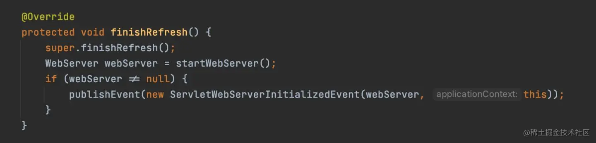
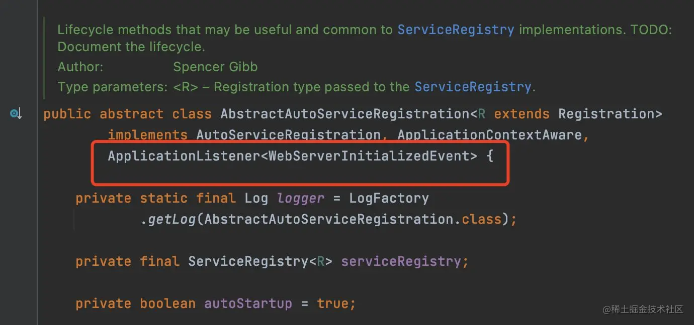
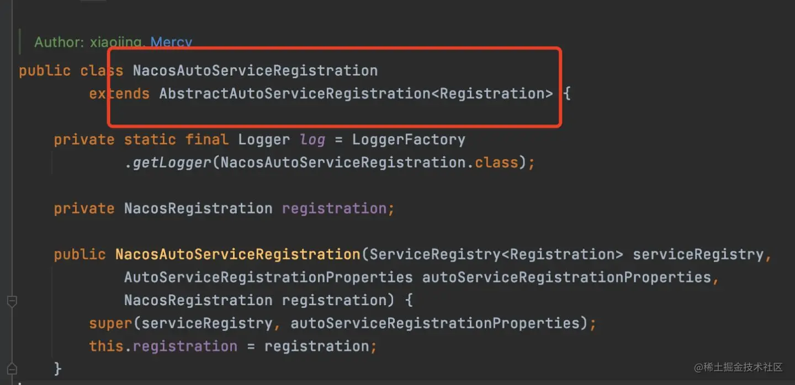

# Spring Event

## Spring Event

> Event 事件可以说是一种观察者模式的实现，主要是用来解耦合的。当发生了某件事，只要发布一个事件，对这个事件的监听者（观察者）就可以对事件进行响应或者处理。

### 实现

#### ApplicationEvent

> 事件的父类，所有具体的事件都得继承这个类，构造方法的参数是这个事件携带的参数，监听器就可以通过这个参数来进行一些业务操作。

```java
public abstract class ApplicationEvent extends EventObject {

	/** use serialVersionUID from Spring 1.2 for interoperability. */
	private static final long serialVersionUID = 7099057708183571937L;

	/** System time when the event happened. */
	private final long timestamp;


	/**
	 * Create a new {@code ApplicationEvent} with its {@link #getTimestamp() timestamp}
	 * set to {@link System#currentTimeMillis()}.
	 * @param source the object on which the event initially occurred or with
	 * which the event is associated (never {@code null})
	 * @see #ApplicationEvent(Object, Clock)
	 */
	public ApplicationEvent(Object source) {
		super(source);
		this.timestamp = System.currentTimeMillis();
	}

	/**
	 * Create a new {@code ApplicationEvent} with its {@link #getTimestamp() timestamp}
	 * set to the value returned by {@link Clock#millis()} in the provided {@link Clock}.
	 * <p>This constructor is typically used in testing scenarios.
	 * @param source the object on which the event initially occurred or with
	 * which the event is associated (never {@code null})
	 * @param clock a clock which will provide the timestamp
	 * @since 5.3.8
	 * @see #ApplicationEvent(Object)
	 */
	public ApplicationEvent(Object source, Clock clock) {
		super(source);
		this.timestamp = clock.millis();
	}


	/**
	 * Return the time in milliseconds when the event occurred.
	 * @see #ApplicationEvent(Object)
	 * @see #ApplicationEvent(Object, Clock)
	 */
	public final long getTimestamp() {
		return this.timestamp;
	}

}

```

#### ApplicationListener

> 事件监听的接口，泛型是子类需要监听的事件类型，子类需要实现onApplicationEvent，参数就是事件类型，onApplicationEvent方法的实现就代表了对事件的处理，当事件发生时，Spring会回调onApplicationEvent方法的实现，传入发布的事件。

```java
@FunctionalInterface
public interface ApplicationListener<E extends ApplicationEvent> extends EventListener {

	/**
	 * Handle an application event.
	 * @param event the event to respond to
	 */
	void onApplicationEvent(E event);


	/**
	 * Create a new {@code ApplicationListener} for the given payload consumer.
	 * @param consumer the event payload consumer
	 * @param <T> the type of the event payload
	 * @return a corresponding {@code ApplicationListener} instance
	 * @since 5.3
	 * @see PayloadApplicationEvent
	 */
	static <T> ApplicationListener<PayloadApplicationEvent<T>> forPayload(Consumer<T> consumer) {
		return event -> consumer.accept(event.getPayload());
	}

}

```

#### ApplicationEventPublisher

> 事件发布器，通过publishEvent方法就可以发布一个事件，然后就可以触发监听这个事件的监听器的回调。
> ApplicationContext 可以发布事件

　　**Spring内置的事件**

|事件类型|触发时机|
| ---------------------| -----------------------------------------------------------------|
|ContextRefreshedEvent|在调用ConfigurableApplicationContext 接口中的refresh()方法时触发|
|ContextStartedEvent|在调用ConfigurableApplicationContext的start()方法时触发|
|ContextStoppedEvent|在调用ConfigurableApplicationContext的stop()方法时触发|
|ContextClosedEvent|当ApplicationContext被关闭时触发该事件，也就是调用close()方法触发|

### **Spring事件的传播**

> 在Spring中有子父容器的概念，而Spring事件的传播就是指当通过子容器发布一个事件之后，不仅可以触发在这个子容器的事件监听器，还可以触发在父容器的这个事件的监听器。

#### 传播特性的一个坑

> 在SpringCloud的环境下，为了使像FeignClient和RibbonClient这些不同的服务的配置相互隔离，会创建很多的子容器，而这些子容器都有一个公共的父容器，那就是SpringBoot项目启动时创建的容器，事件的监听器都在这个容器中。而这些为了配置隔离创建的子容器，在容器启动的过程中，也会发布诸如ContextRefreshedEvent等这样的事件，如果你监听了这些事件，那么由于传播特性的关系，你的这个事件的监听器就会触发多次。

#### Spring事件的运用举例

　　1、在Mybatis中的使用

```java
public class SqlSessionFactoryBean
    implements FactoryBean<SqlSessionFactory>, InitializingBean, ApplicationListener<ApplicationEvent> {
    
    @Override
    public void onApplicationEvent(ApplicationEvent event) {
        if (failFast && event instanceof ContextRefreshedEvent) {
        // fail-fast -> check all statements are completed
        this.sqlSessionFactory.getConfiguration().getMappedStatementNames();
        }
    }
    
}
```

　　2、在SpringCloud的运用
在SpringCloud的中，当项目启动的时候，会自动往注册中心进行注册，那么是如何实现的呢？当然也是基于事件来的。当web服务器启动完成之后，就发布ServletWebServerInitializedEvent事件。


　　然后不同的注册中心的实现都只需要监听这个事件，就知道web服务器已经创建好了，那么就可以往注册中心注册服务实例了。如果你的服务没往注册中心，看看是不是web环境，因为只有web环境才会发这个事件。
SpringCloud提供了一个抽象类 AbstractAutoServiceRegistration，实现了对WebServerInitializedEvent（ServletWebServerInitializedEvent的父类）事件的监听

一般不同的注册中心都会去继承这个类，监听项目启动，实现往注册中心服务端进行注册。


> **Spring Event事件在Spring内部中运用很多，是解耦合的利器。在实际项目中，你既可以监听Spring/Boot内置的一些事件，进行相应的扩展，也可以基于这套模型在业务中自定义事件和相应的监听器，减少业务代码的耦合。**
