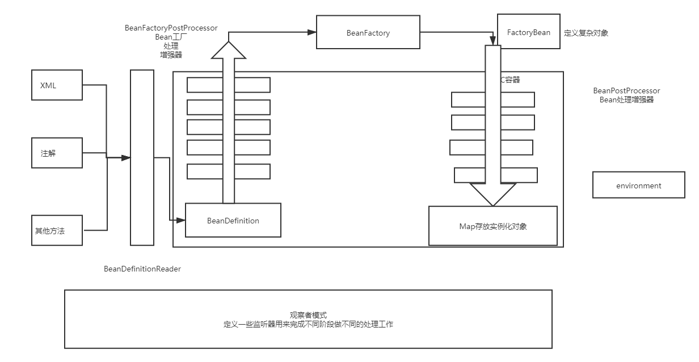

# Spring

## Ioc(控制反转)

> 将原本在程序中手动创建对象的控制权，交由 Spring 管理。Ioc 容器是 Spring 用来实现 Ioc 的载体，Ioc 容器实际上是个 Map，用来存储各种对象。

　　将对象之间的相互依赖交由 Ioc 容器管理，并由 Ioc 容器完成对象注入，Ioc 容器相当于一个工厂，当需要创建一个对象时，只需要配置好配置文件/注解即可，完全不需要考虑对象如何创建。
Spring 简化初始流程

　　


　　IOC容器初始化流程 （spring 5.3）

```java
	public void refresh() throws BeansException, IllegalStateException {

		synchronized (this.startupShutdownMonitor) {
			StartupStep contextRefresh = this.applicationStartup.start("spring.context.refresh");
			//刷新环境 准备日志和环境变量等
			// Prepare this context for refreshing.
			prepareRefresh();
			//刷新BeanFactory 如果有BenaFactory 先销毁再重新生成（@DefaultListableBeanFactory）
			// Tell the subclass to refresh the internal bean factory.
			ConfigurableListableBeanFactory beanFactory = obtainFreshBeanFactory();
			//预处理beanFactory 可以先容器中添加一些组件 常见的
			//添加两个Bean处理器 【ApplicationListenerDetector】【ApplicationContextAwareProcessor】
			//添加四个可以自动装配的自动装配器 【BeanFactory】【ResourceLoader】【ApplicationEventPublisher】【ApplicationContext】
			//添加四个组件 【environment】【systemProperties】【SystemEnvironment】【applicationStartup】...
			//...
			// Prepare the bean factory for use in this context.
			prepareBeanFactory(beanFactory);

			try {
				//子类通过重写该方法可以在BeanFactory创建并准备完成后做进一步设置
				// Allows post-processing of the bean factory in context subclasses.
				postProcessBeanFactory(beanFactory);

				StartupStep beanPostProcess = this.applicationStartup.start("spring.context.beans.post-process");
				//实例化所有的BeanFactoryProcessor处理器（包括其子类 BeanDefinitionRegistryPostProcessor）
				//此时所有 bean 定义——beanDefinition都将已加载，但尚未实例化任何普通 bean。
				// Invoke factory processors registered as beans in the context.
				invokeBeanFactoryPostProcessors(beanFactory);
				//按顺序实例化和注册所有BeanPostProcessors 便于后续Bean实例化时调用
				// Register bean processors that intercept bean creation.
				registerBeanPostProcessors(beanFactory);
				beanPostProcess.end();
				//为此上下文容器初始化MessageSource消息资源，用于语言国际化处理
				// Initialize message source for this context.
				initMessageSource();
				//初始化事件派发器，在注册监听器时会用到
				// Initialize event multicaster for this context.
				initApplicationEventMulticaster();
				//留给子容器，在容器刷新的时候可以自定义逻辑，web场景下会使用
				// Initialize other special beans in specific context subclasses.
				onRefresh();
				//注册所有监听器
				// Check for listener beans and register them.
				registerListeners();
				//初始化所有的非懒加载的单例Bean
				// Instantiate all remaining (non-lazy-init) singletons.
				finishBeanFactoryInitialization(beanFactory);
				//发布容器刷新完成时间
				// Last step: publish corresponding event.
				finishRefresh();
			} catch (BeansException ex) {
				if (logger.isWarnEnabled()) {
					logger.warn("Exception encountered during context initialization - " +
							"cancelling refresh attempt: " + ex);
				}

				// Destroy already created singletons to avoid dangling resources.
				destroyBeans();

				// Reset 'active' flag.
				cancelRefresh(ex);

				// Propagate exception to caller.
				throw ex;
			} finally {
				// Reset common introspection caches in Spring's core, since we
				// might not ever need metadata for singleton beans anymore...
				resetCommonCaches();
				contextRefresh.end();
			}
		}
	}
```

## Spring 中的 bean 的作用域

　　singleton：唯一 bena 实例，
prototype：每次请求都会实现一个新 bean 实例
request：每个 http 请求都会生成一个新 bean，只在当前 http request 内有效
session：每个 http 请求都会生成一个新 bean，只在当前 http session 内有效

## Spring中的生命周期

　　

1. **实例化**
2. **填充属性**
3. **如果bean实现beanNameAware接口**，则调用setBeanName方法
   1. 作用：通过Bean的引用获取Bean的Id
4. **如果bean实现beanFactoryAware接口**，则调用setBeanFactory(BeanFactory bf)方法
   1. 作用：主要是为了获取Spring容器，比如通过Spring容器发布事件等
5. **如果bean实现ApplicationContextAware接口**，Spring容器将调用setApplicationContext(ApplicationContext ctx)方法，将bean所在的应用引用上下文传进来
   1. 作用：与beanFactory类似都是为了获取Spring容器，不同的在于不同的Spring容器在调用setApplicationContext()时会将自己作为参数传入，而Spring容器在调用setBeanFactry（）时需要刷程序员自己指定setBeanFactory里的参数BeanFactory
6. **如果bean实现BeanPostProcess接口**，Spring会调用postProcessBeforeInitialization(预初始化)
   1. 作用：在Bean实例化创建成功后进行增强
7. **如果bean实现了BeanPostProcess接口**，Spring将调用他们的afterPropertiesSet方法，作用与再配置文件中使用init-method声明初始化作用一样。
8. **如果bean实现BeanPostProcess接口，**Spring将调用它们的postProcessAfterInitialization（后初始化）方法
   1. 作用：与6类似
9. 调用
10. **如果Bean实现了DispostbleBean接口**，Spring将调用它的destory方法，作用与在配置文件中对Bean使用destory-method属性的作用一样，都是在Bean实例销毁前执行的方法

### 总结

　　不同于普通类的加载、链接、初始化，Spring还将类封装成BeanDefinition 其中包括了像类的作用域，是否懒加载等属性，spring在启动时会对xml文件或java-config或注解进行读取解析初始化BeanDefinition（此时未进行Spring Bean的实例化），将其存储在beanDefinitionMap中，之后会执行BeanFactoryPostProcessor处理器，比如xml中的占位符配置就是在此时替换的，执行完后就来到了Bean的初始化阶段，首先会检查是否实现相关的Aware接口，有实现该接口的会进行处理，比如实现ApplicationContextAware接口，可以在普通类里获取Spring中的Bean，之后会执行BeanPostProcessor处理器，内部有两个方法，一个after一个before，before执行后会执行@PostConstruct 实现initaliationBean接口，init-method 方法，之后会执行after。Spring AOP也是在此时实现的，执行完毕Bean已经算是实例化完成

## Spring 中的单例 bean 的线程安全问题

　　单列 bean 存在多线程问题，当多个线程操作同一个对象的时候，对于这个对象的非静态成员变量的操作存在线程问题
**常见解决办法**

1. 在 bean 中尽量避免定义可变成员变量（不现实）
2. 在类中定义一个 threadlocal 变量，将所需要改变的变量保存在 threadlocal（推荐）

## Spring 三级缓存

### 三级缓存

　　Spring 解决循环依赖的核心就是提前暴露对象，而提前暴露的对象就是放置于第二级缓存中。下表是三级缓存的说明：

|名称|描述|
| ---------------------| -------------------------------------------------------------------------------|
|singletonObjects|一级缓存，存放完整的 Bean。|
|earlySingletonObjects|二级缓存，存放提前暴露的Bean，Bean 是不完整的，未完成属性注入和执行 init 方法。|
|singletonFactories|三级缓存，存放的是 Bean 工厂，主要是生产 Bean，存放到二级缓存中。|

### 解决循环依赖

　　只用 A，B 形成的循环依赖来举例：

1. 实例化 A，此时 A 还未完成属性填充和初始化方法（@PostConstruct）的执行，A 只是一个半成品。
2. 为 A 创建一个 Bean 工厂，并放入到 singletonFactories 中。
3. 发现 A 需要注入 B 对象，但是一级、二级、三级缓存均为发现对象 B。
4. 实例化 B，此时 B 还未完成属性填充和初始化方法（@PostConstruct）的执行，B 只是一个半成品。
5. 为 B 创建一个 Bean 工厂，并放入到 singletonFactories 中。
6. 发现 B 需要注入 A 对象，此时在一级、二级未发现对象 A，但是在三级缓存中发现了对象 A，从三级缓存中得到对象 A，并将对象 A 放入二级缓存中，同时删除三级缓存中的对象 A。（注意，此时的 A 还是一个半成品，并没有完成属性填充和执行初始化方法）
7. 将对象 A 注入到对象 B 中。
8. 对象 B 完成属性填充，执行初始化方法，并放入到一级缓存中，同时删除二级缓存中的对象 B。（此时对象 B 已经是一个成品）
9. 对象 A 得到对象 B，将对象 B 注入到对象 A 中。（对象 A 得到的是一个完整的对象 B）
10. 对象 A 完成属性填充，执行初始化方法，并放入到一级缓存中，同时删除二级缓存中的对象 A。

### 为何使用三级缓存
