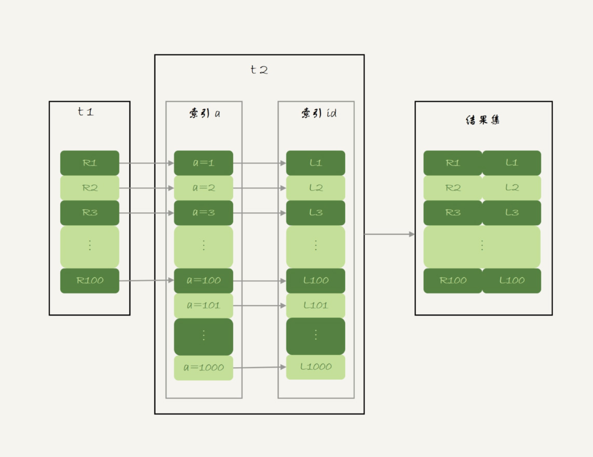

# SQl

## 一条sql的执行过程

　　

### 1.连接器

> 连接器负责和客户端建立连接、获取权限、维持和管理连接

#### 连接大概过程

- 客户端与连接器建立连接完成tcp握手后，验证用户名和密码，验证不通过断开连接，验证通过连接器会查询用户权限，之后连接内的权限判断都有此时的权限控制（**也就意味着，在此次连接过程中，即使管理员更改了该用户权限，但此次连接为中断之前，用户的权限不变**），若客户端长时间不进行操作，连接器会主动断开连接（空闲时长可配置（wait_timeout），默认为8小时），连接断开后，客户端在发送请求，会受到一个错误提醒，想继续操作就需要重新连接。

#### 数据库连接类型

- 长连接是指连接成功后，如果客户端持续有请求，则一直使用同一个连接。
- 短连接则是指每次执行完很少的几次查询就断开连接，下次查询再重新建立一个

#### 注意事项

- 建立连接的过程通常是比较复杂的，所以我建议你在使用中要尽量减少建立连接的动作，也就是尽量使用长连接。
- 但是全部使用长连接后，你可能会发现，有些时候 MySQL 占用内存涨得特别快，这是因为 MySQL 在执行过程中临时使用的内存是管理在连接对象里面的。这些资源会在连接断开的时候才释放。所以如果长连接累积下来，可能导致内存占用太大，被系统强行杀掉（OOM），从现象看就是 MySQL 异常重启了。

　　**解决方案**

- 定期断开长连接。使用一段时间，或者程序里面判断执行过一个占用内存的大查询后，断开连接，之后要查询再重连。
- 如果你用的是 MySQL 5.7 或更新版本，可以在每次执行一个比较大的操作后，通过执行 mysql_reset_connection 来重新初始化连接资源。这个过程不需要重连和重新做权限验证，但是会将连接恢复到刚刚创建完时的状态。

### 2.查询缓存

#### 查询缓存流程

- MySQL 拿到一个查询请求后，会先到查询缓存看看，之前是不是执行过这条语句。之前执行过的语句及其结果可能会以 key-value 对的形式，被直接缓存在内存中。key 是查询的语句，value 是查询的结果。如果你的查询能够直接在这个缓存中找到 key，那么这个 value 就会被直接返回给客户端。
- 如果语句不在查询缓存中，就会继续后面的执行阶段。执行完成后，执行结果会被存入查询缓存中。你可以看到，如果查询命中缓存，MySQL 不需要执行后面的复杂操作，就可以直接返回结果，这个效率会很高。

#### 注意事项

- 查询缓存的失效非常频繁，只要有对一个表的更新，这个表上所有的查询缓存都会被清空。因此很可能你费劲地把结果存起来，还没使用呢，就被一个更新全清空了。对于更新压力大的数据库来说，查询缓存的命中率会非常低。除非你的业务就是有一张静态表，很长时间才会更新一次。比如，一个系统配置表，那这张表上的查询才适合使用查询缓存。
- MySQL 也提供了这种“按需使用”的方式。你可以将参数 query_cache_type 设置成 DEMAND，这样对于默认的 SQL 语句都不使用查询缓存。而对于你确定要使用查询缓存的语句，可以用 SQL_CACHE 显式指定，像下面这个语句一样：

```sql
select SQL_CACHE * from T where ID=10；
```

　　**查询缓存功能自MySQL8.0已删除**

### 3.分析器

- 解析识别sql语句，判断SQL是否存在错误（判断查询语句中的某个字段也是在该阶段进行）

### 4.优化器

- 优化器是在表里面有多个索引的时候，决定使用哪个索引；或者在一个语句有多表关联（join）的时候，决定各个表的连接顺序。

### 5.执行器

- 开始执行的时候，要先判断一下你对这个表 T 有没有执行查询的权限，如果没有，就会返回没有权限的错误，如果有权限，就打开表继续执行。打开表的时候，执行器就会根据表的引擎定义，去使用这个引擎提供的接口

## SQL语句书写顺序和执行的顺序

### 书写顺序

　　

### 执行顺序

　　

　　​

1. 我们先执行from,join来确定表之间的连接关系，得到初步的数据
2. where对数据进行普通的初步的筛选
3. group by 分组
4. 各组分别执行having中的普通筛选或者聚合函数筛选。
5. 然后把再根据我们要的数据进行select，可以是普通字段查询也可以是获取聚合函数的查询结果，如果是集合函数，select的查询结果会新增一条字段
6. 将查询结果去重distinct
7. 最后合并各组的查询结果，按照order by的条件进行排序

　　‍

## Join

> 假设两张边 t1 和 t2  使用 straight_join 让 MySQL 使用固定的连接方式执行查询，便于分析

　　**测试sql**

```sql
CREATE TABLE `t2` (
  `id` int(11) NOT NULL,
  `a` int(11) DEFAULT NULL,
  `b` int(11) DEFAULT NULL,
  PRIMARY KEY (`id`),
  KEY `a` (`a`)
) ENGINE=InnoDB;
 
drop procedure idata;
delimiter ;;
create procedure idata()
begin
  declare i int;
  set i=1;
  while(i<=1000)do
    insert into t2 values(i, i, i);
    set i=i+1;
  end while;
end;;
delimiter ;
call idata();
 
create table t1 like t2;
insert into t1 (select * from t2 where id<=100)

```

- Index Nested-Loop Join （ NLJ）

```sql
select * from t1 straight_join t2 on (t1.a=t2.a);
```

- 从表 t1 中读入一行数据 R；
- 从数据行 R 中，取出 a 字段到表 t2 里去查找；
- 取出表 t2 中满足条件的行，跟 R 组成一行，作为结果集的一部分；
- 重复执行步骤 1 到 3，直到表 t1 的末尾循环结束。

　　
查询流程

- Simple Nested-Loop Join (mysql 未使用)

```sql
select * from t1 straight_join t2 on (t1.a=t2.b);
```

　　由于表 t2 的字段 b 上没有索引，因此再用图 2 的执行流程时，每次到 t2 去匹配的时候，就要做一次全表扫描。

- Block Nested-Loop Join
  - 被驱动表上没有可用的索引，算法的流程是这样的：
  - 把表 t1 的数据读入线程内存 join_buffer 中，由于我们这个语句中写的是 select *，因此是把整个表 t1 放入了内存；
  - 扫描表 t2，把表 t2 中的每一行取出来，跟 join_buffer 中的数据做对比，满足 join 条件的，作为结果集的一部分返回。

　　流程图


### 能不能使用join？

1. 如果可以使用 Index Nested-Loop Join 算法，也就是说可以用上被驱动表上的索引，其实是没问题的；
2. 如果使用 Block Nested-Loop Join 算法，扫描行数就会过多。尤其是在大表上的 join 操作，这样可能要扫描被驱动表很多次，会占用大量的系统资源。所以这种 join 尽量不要用。

### 如果要使用 join，应该选择大表做驱动表还是选择小表做驱动表？

1. 如果是 Index Nested-Loop Join 算法，应该选择小表做驱动表；
2. 如果是 Block Nested-Loop Join 算法：
   1. 在 join_buffer_size 足够大的时候，是一样的；
   2. 在 join_buffer_size 不够大的时候（这种情况更常见），应该选择小表做驱动表。

> 在决定哪个表做驱动表的时候，应该是两个表按照各自的条件过滤，过滤完成之后，计算参与 join 的各个字段的总数据量，数据量小的那个表，就是“小表”，应该作为驱动表。

## 全文索引查询

```sql
-- 使用全文索引查询
SELECT * FROM articles WHERE MATCH (title,body) AGAINST ('一路 一带' IN NATURAL LANGUAGE MODE);

// 不指定模式，默认使用自然语言模式
SELECT * FROM articles WHERE MATCH (title,body) AGAINST ('一路 一带'); 
-- 结果会自动按照相关性排序，相关性高的在前面,相关性的值是一个非负浮点数，0表示无相关性。

// 必须包含"腾讯"
SELECT * FROM articles WHERE MATCH (title,body) AGAINST ('+腾讯' IN BOOLEAN MODE);


-- BOOLEAN模式下运算符的使用方式：
'apple banana' 
无操作符，表示或，要么包含apple，要么包含banana

'+apple +juice'
必须同时包含两个词

'+apple macintosh'
必须包含apple，但是如果也包含macintosh的话，相关性会更高。

'+apple -macintosh'
必须包含apple，同时不能包含macintosh。

'+apple ~macintosh'
必须包含apple，但是如果也包含macintosh的话，相关性要比不包含macintosh的记录低。

'+apple +(>juice <pie)'
查询必须包含apple和juice或者apple和pie的记录，但是apple juice的相关性要比apple pie高。

'apple*'
查询包含以apple开头的单词的记录，如apple、apples、applet。

'"some words"'
使用双引号把要搜素的词括起来，效果类似于like '%some words%'，
例如“some words of wisdom”会被匹配到，而“some noise words”就不会被匹配。
```

## 一些不常用sql

```sql


-- 查询一张表的所有字段信息：
show full columns from table_name1;


```
