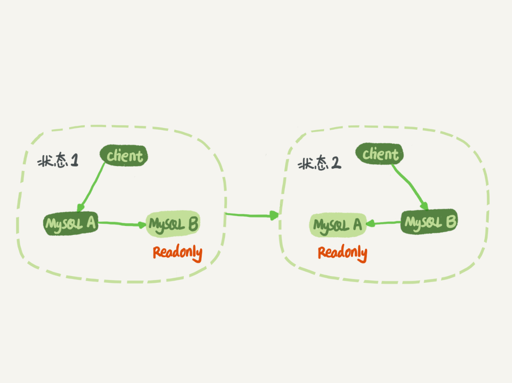

# 集群

## MySQl主从备份

### MySQL 主备切换流程(M-S)

　　
在状态 1 中，虽然节点 B 没有被直接访问，但是我依然建议你把节点 B（也就是备库）设置成只读（readonly）模式。这样做，有以下几个考虑：

- 有时候一些运营类的查询语句会被放到备库上去查，设置为只读可以防止误操作；
- 防止切换逻辑有 bug，比如切换过程中出现双写，造成主备不一致；
- 可以用 readonly 状态，来判断节点的角色。

> readonly 设置对超级 (super) 权限用户是无效的，而用于同步更新的线程，就拥有超级权限

### MySQL主备流程图

　　
主库接收到客户端的更新请求后，执行内部事务的更新逻辑，同时写 binlog。
备库 B 跟主库 A 之间维持了一个长连接。主库 A 内部有一个线程，专门用于服务备库 B 的这个长连接。一个事务日志同步的完整过程是这样的：

1. 在备库 B 上通过 change master 命令，设置主库 A 的 IP、端口、用户名、密码，以及要从哪个位置开始请求 binlog，这个位置包含文件名和日志偏移量。
2. 在备库 B 上执行 start slave 命令，这时候备库会启动两个线程，就是图中的 io_thread 和 sql_thread。其中 io_thread 负责与主库建立连接。
3. 主库 A 校验完用户名、密码后，开始按照备库 B 传过来的位置，从本地读取 [binlog](https://www.yuque.com/pride_yang/blog/twvrrg#qAmRb)，发给 B。
4. 备库 B 拿到 binlog 后，写到本地文件，称为中转日志（relay log）。
5. sql_thread 读取中转日志，解析出日志里的命令，并执行。

> 由于多线程复制方案的引入，sql_thread 演化成为了多个线程

### 循环复制问题

　　MySQL 主备切换流程 -- 双 M 结构

> 业务逻辑在节点 A 上更新了一条语句，然后再把生成的 binlog 发给节点 B，节点 B 执行完这条更新语句后也会生成 binlog。（我建议你把参数 log_slave_updates 设置为 on，表示备库执行 relay log 后生成 binlog）。那么，如果节点 A 同时是节点 B 的备库，相当于又把节点 B 新生成的 binlog 拿过来执行了一次，然后节点 A 和 B 间，会不断地循环执行这个更新语句，也就是循环复制了

　　**解决方案**

- 规定两个库的 server id 必须不同，如果相同，则它们之间不能设定为主备关系；
- 一个备库接到 binlog 并在重放的过程中，生成与原 binlog 的 server id 相同的新的 binlog；
- 每个库在收到从自己的主库发过来的日志后，先判断 server id，如果跟自己的相同，表示这个日志是自己生成的，就直接丢弃这个日志。

　　**双M的主备流程**

- 从节点 A 更新的事务，binlog 里面记的都是 A 的 server id；
- 传到节点 B 执行一次以后，节点 B 生成的 binlog 的 server id 也是 A 的 server id；
- 再传回给节点 A，A 判断到这个 server id 与自己的相同，就不会再处理这个日志。所以，死循环在这里就断掉了。
