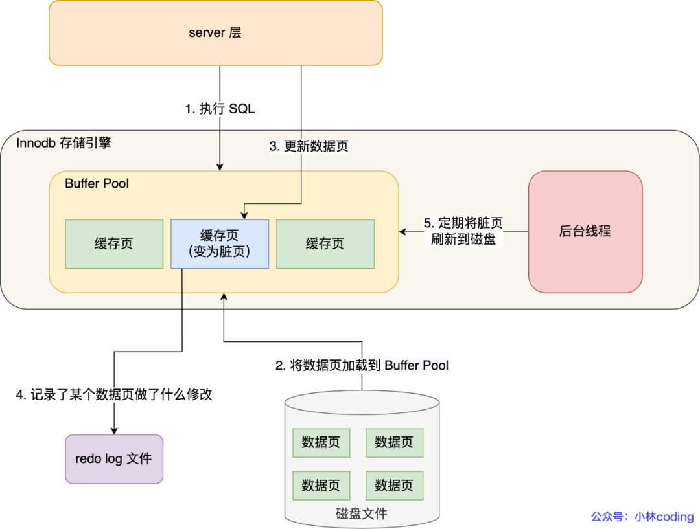
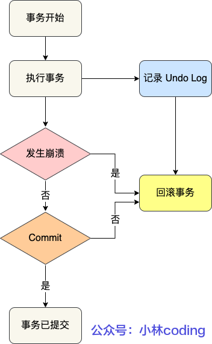

# MySQL事务和锁

## 锁

### InnoDB 中的锁类型

* 标准行级锁

  * 排他锁（X Lock），允许事务删除或更新一行数据
  * 共享锁（S Lock），允许事务读一行数据
* 表级意向锁

  * 意向排他锁（IX Lock），事务想要获取一张表中某几行的排他锁
  * 意向共享锁（IS Lock），事务想要获取一张表中某几行的共享锁

　　‍

　　锁的兼容性

||IS|IX|S|X|
| ----| --------| --------| --------| :------: |
|IS|兼容|兼容|兼容|不兼容|
|IX|兼容|兼容|不兼容|不兼容|
|S|兼容|不兼容|兼容|不兼容|
|X|不兼容|不兼容|不兼容|不兼容|

　　兼容：指对同一个记录（row）锁的兼容性情况

　　InnoDB支持的行级锁，所以意向锁不会阻塞除全表扫描以外的任何请求

### 一致性非锁定读

> InnoDB通过MVCC（多版本控制）的方法读取当前值行时间数据库中行的数据

　　‍

### 锁的算法

#### 行锁三种算法

* Record Lock：单个行记录上的锁
* Gap Lock：间隙锁，锁定一个范围，但不包含记录本身（前开后闭）
* Next-Key Lock（Record Lock + Gap Lock）：锁定一个范围，并且锁定记录本身

#### 加锁规则

> 两个“原则”、两个“优化”和一个“bug”：

* 原则 1：加锁的基本单位是 next-key lock。希望你还记得，next-key lock 是前开后闭区间。
* 原则 2：查找过程中访问到的对象才会加锁。
* 优化 1：索引上的等值查询，给唯一索引加锁的时候，next-key lock 退化为行锁（Record Lock）。
* 优化 2：索引上的等值查询，向右遍历时且最后一个值不满足等值条件的时候，next-key lock 退化为间隙锁。
* 一个 bug：唯一索引上的范围查询会访问到不满足条件的第一个值为止。

　　[加锁规则案例](siyuan://blocks/20230218225905-i4ud438)

　　**Read** **Committed 隔离级别下只使用Record Lock**

　　**RepeaTable Read 隔离级别下使用Next-Key Lock**

### Phantom Problem （Next-Key Lock解决）

> 同一个事务下，连续执行两次同样的SQL语句可能导致不同的结果，第二次的SQL语句可能返回之前不存在的行

　　‍

　　根据加锁范围，MySQl里面的锁大致可以分为**全局锁**、**表级锁**和**行锁**

### 全局锁

> 对整个数据实例加锁

* MySQL 提供了一个加全局读锁的方法，命令是 Flush tables with read lock (FTWRL)。当你需要让整个库处于只读状态的时候，可以使用这个命令，之后其他线程的以下语句会被阻塞：数据更新语句（数据的增删改）、数据定义语句（包括建表、修改表结构等）和更新类事务的提交语句。
* 使用场景：全库逻辑备份
* 官方自带的逻辑备份工具是 mysqldump。当 mysqldump 使用参数–single-transaction 的时候，导数据之前就会启动一个事务，来确保拿到一致性视图。而由于 MVCC 的支持，这个过程中数据是可以正常更新的。**single-transaction 方法只适用于所有的表使用事务引擎的库。**如果有的表使用了不支持事务的引擎，那么备份就只能通过 FTWRL 方法

### 表级锁

> MySQL 里面表级别的锁有两种：一种是表锁，一种是元数据锁（meta data lock，MDL)。

#### 表锁的语法是 lock tables … read/write

* 例子: 如果在某个线程 A 中执行 lock tables t1 read, t2 write; 这个语句，则其他线程写 t1、读写 t2 的语句都会被阻塞。同时，线程 A 在执行 unlock tables 之前，也只能执行读 t1、读写 t2 的操作。连写 t1 都不允许，自然也不能访问其他表。

#### 类表级的锁是 MDL（metadata lock)

* MDL 不需要显式使用，在访问一个表的时候会被自动加上。MDL 的作用是，保证读写的正确性。你可以想象一下，如果一个查询正在遍历一个表中的数据，而执行期间另一个线程对这个表结构做变更，删了一列，那么查询线程拿到的结果跟表结构对不上，肯定是不行的。
* 因此，在 MySQL 5.5 版本中引入了 MDL，当对一个表做增删改查操作的时候，加 MDL 读锁；当要对表做结构变更操作的时候，加 MDL 写锁。

## 事务

### 事务的实现

* 锁实现事务的隔离性
* 重做日志保证事务的持久性和原子性
* 回滚日志保证事务的一致性

#### Redo log（重做日志）

　　        InnoDB通过 Force Log as Commit 机制实现事务的持久性，即当事务提交（Commit）时，必须先将该事务的所有日志写入文件中进行持久化，待事务的Commit操作完成时才算完成 。使用 `Write-Ahead Logging(预写日志技术)`​

　　        Redo日志会把事务在执行过程 中对数据库所做的所有修改都记录下来，在之后系统奔溃重启后可以把事务所做的任何修改都恢复出来

　　   ​

　　‍

#### Undo log（回滚日志）

　　        事务的原子性是通过 undo log 实现的。在事务没提交之前，MySQL 会先记录更新前的数据到 undo log 日志文件里面，当事务回滚时，可以利用 undo log 来进行回滚。如下图：

　　

### 隐式提交的SQL语句

　　‍

　　‍

　　‍

## 相关问题

* [快照是如何在MVCC 里是怎么工作的](siyuan://blocks/20230214231449-hwna73l)
* [事务的可重复读的能力是怎么实现的](siyuan://blocks/20230214231646-46ztwha)
* [全库只读，为什么不使用 set global readonly=true 的方式呢](siyuan://blocks/20230214231746-g6zjv0f)
* [Write-Ahead Logging](siyuan://blocks/20230330212737-b0uctfu)
* [InnoDB 刷脏页的时机](siyuan://blocks/20230330212753-yxywdym)

　　‍
