# 加锁规则案例

# 案例一：等值查询间隙锁

　　第一个例子是关于等值条件操作间隙：

　　​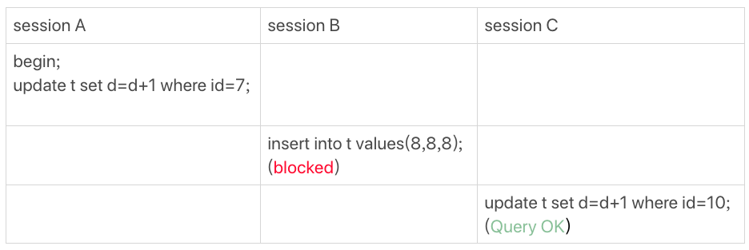​

　　[图 1](siyuan://blocks/20230218230318-y5vi64g) 等值查询的间隙锁由于表 t 中没有 id=7 的记录，所以用我们上面提到的加锁规则判断一下的话：

1. 根据原则 1，加锁单位是 next-key lock，session A 加锁范围就是 (5,10]；
2. 同时根据优化 2，这是一个等值查询 (id=7)，而 id=10 不满足查询条件，next-key lock 退化成间隙锁，因此最终加锁的范围是 (5,10)。

　　所以，session B 要往这个间隙里面插入 id=8 的记录会被锁住，但是 session C 修改 id=10 这行是可以的。

# 案例二：非唯一索引等值锁

　　第二个例子是关于覆盖索引上的锁：

　　​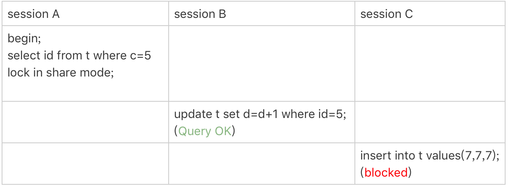​

　　[图 2](siyuan://blocks/20230218230318-ba5oxwz) 只加在非唯一索引上的锁看到这个例子，你是不是有一种“该锁的不锁，不该锁的乱锁”的感觉？我们来分析一下吧。

　　这里 session A 要给索引 c 上 c=5 的这一行加上读锁。

1. 根据原则 1，加锁单位是 next-key lock，因此会给 (0,5] 加上 next-key lock。
2. 要注意 c 是普通索引，因此仅访问 c=5 这一条记录是不能马上停下来的，需要向右遍历，查到 c=10 才放弃。根据原则 2，访问到的都要加锁，因此要给 (5,10] 加 next-key lock。
3. 但是同时这个符合优化 2：等值判断，向右遍历，最后一个值不满足 c=5 这个等值条件，因此退化成间隙锁 (5,10)。
4. 根据原则 2 ，**只有访问到的对象才会加锁**，这个查询使用覆盖索引，并不需要访问主键索引，所以主键索引上没有加任何锁，这就是为什么 session B 的 update 语句可以执行完成。

　　但 session C 要插入一个 (7,7,7) 的记录，就会被 session A 的间隙锁 (5,10) 锁住。

　　需要注意，在这个例子中，lock in share mode 只锁覆盖索引，但是如果是 for update 就不一样了。 执行 for update 时，系统会认为你接下来要更新数据，因此会顺便给主键索引上满足条件的行加上行锁。

　　这个例子说明，锁是加在索引上的；同时，它给我们的指导是，如果你要用 lock in share mode 来给行加读锁避免数据被更新的话，就必须得绕过覆盖索引的优化，在查询字段中加入索引中不存在的字段。比如，将 session A 的查询语句改成 select d from t where c=5 lock in share mode。你可以自己验证一下效果。

# 案例三：主键索引范围锁

　　第三个例子是关于范围查询的。

　　举例之前，你可以先思考一下这个问题：对于我们这个表 t，下面这两条查询语句，加锁范围相同吗？

```
mysql> select * from t where id=10 for update;mysql> select * from t where id>=10 and id<11 for update;
```

　　你可能会想，id 定义为 int 类型，这两个语句就是等价的吧？其实，它们并不完全等价。

　　在逻辑上，这两条查语句肯定是等价的，但是它们的加锁规则不太一样。现在，我们就让 session A 执行第二个查询语句，来看看加锁效果。

　　​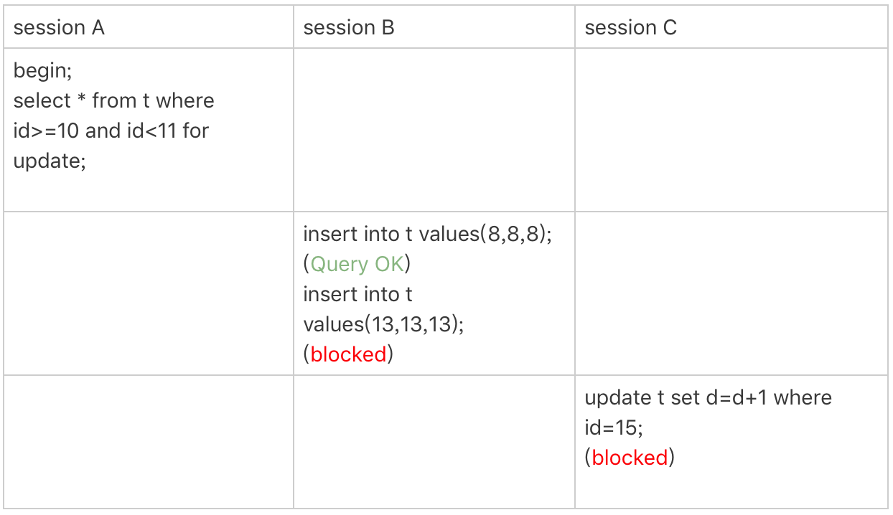​

　　[图 3](siyuan://blocks/20230218230318-05n9zby) 主键索引上范围查询的锁现在我们就用前面提到的加锁规则，来分析一下 session A 会加什么锁呢？

1. 开始执行的时候，要找到第一个 id=10 的行，因此本该是 next-key lock(5,10]。 根据优化 1， 主键 id 上的等值条件，退化成行锁，只加了 id=10 这一行的行锁。
2. 范围查找就往后继续找，找到 id=15 这一行停下来，因此需要加 next-key lock(10,15]。

　　所以，session A 这时候锁的范围就是主键索引上，行锁 id=10 和 next-key lock(10,15]。这样，session B 和 session C 的结果你就能理解了。

　　这里你需要注意一点，首次 session A 定位查找 id=10 的行的时候，是当做等值查询来判断的，而向右扫描到 id=15 的时候，用的是范围查询判断。

# 案例四：非唯一索引范围锁

　　接下来，我们再看两个范围查询加锁的例子，你可以对照着案例三来看。

　　需要注意的是，与案例三不同的是，案例四中查询语句的 where 部分用的是字段 c。

　　​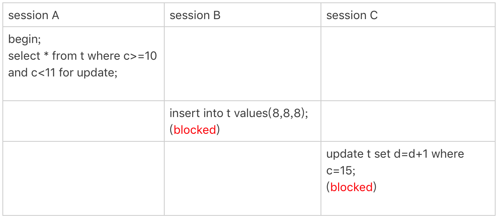​

　　[图 4](siyuan://blocks/20230218230318-3ula5j1) 非唯一索引范围锁这次 session A 用字段 c 来判断，加锁规则跟案例三唯一的不同是：在第一次用 c=10 定位记录的时候，索引 c 上加了 (5,10] 这个 next-key lock 后，由于索引 c 是非唯一索引，没有优化规则，也就是说不会蜕变为行锁，因此最终 sesion A 加的锁是，索引 c 上的 (5,10] 和 (10,15] 这两个 next-key lock。

　　所以从结果上来看，sesson B 要插入（8,8,8) 的这个 insert 语句时就被堵住了。

　　这里需要扫描到 c=15 才停止扫描，是合理的，因为 InnoDB 要扫到 c=15，才知道不需要继续往后找了。

# 案例五：唯一索引范围锁 bug

　　前面的四个案例，我们已经用到了加锁规则中的两个原则和两个优化，接下来再看一个关于加锁规则中 bug 的案例。

　　​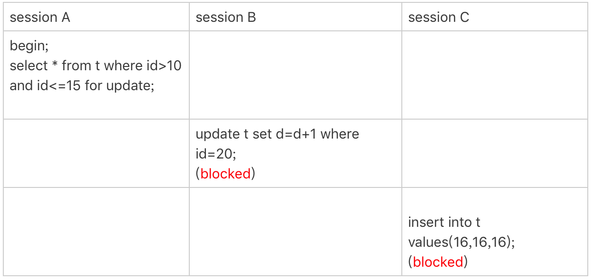​

　　[图 5](siyuan://blocks/20230218230318-bk7nnpe) 唯一索引范围锁的 bugsession A 是一个范围查询，按照原则 1 的话，应该是索引 id 上只加 (10,15] 这个 next-key lock，并且因为 id 是唯一键，所以循环判断到 id=15 这一行就应该停止了。

　　但是实现上，InnoDB 会往前扫描到第一个不满足条件的行为止，也就是 id=20。而且由于这是个范围扫描，因此索引 id 上的 (15,20] 这个 next-key lock 也会被锁上。

　　所以你看到了，session B 要更新 id=20 这一行，是会被锁住的。同样地，session C 要插入 id=16 的一行，也会被锁住。

　　照理说，这里锁住 id=20 这一行的行为，其实是没有必要的。因为扫描到 id=15，就可以确定不用往后再找了。但实现上还是这么做了，因此我认为这是个 bug。

　　我也曾找社区的专家讨论过，官方 bug 系统上也有提到，但是并未被 verified。所以，认为这是 bug 这个事儿，也只能算我的一家之言，如果你有其他见解的话，也欢迎你提出来。

# 案例六：非唯一索引上存在"等值"的例子

　　接下来的例子，是为了更好地说明“间隙”这个概念。这里，我给表 t 插入一条新记录。

```
mysql> insert into t values(30,10,30);
```

　　新插入的这一行 c=10，也就是说现在表里有两个 c=10 的行。那么，这时候索引 c 上的间隙是什么状态了呢？你要知道，由于非唯一索引上包含主键的值，所以是不可能存在“相同”的两行的。

　　​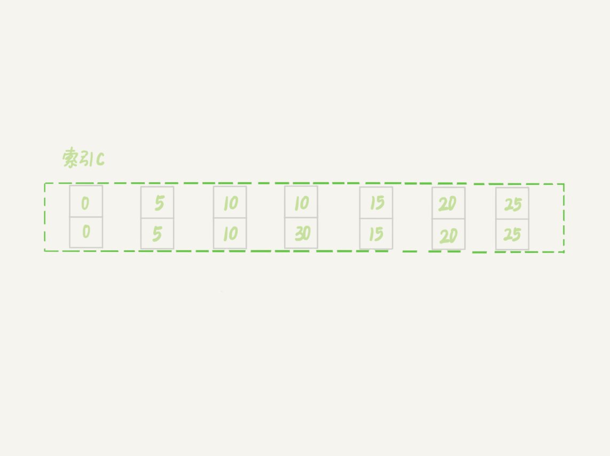​

　　[图 6](siyuan://blocks/20230218230318-yruadpb) 非唯一索引等值的例子可以看到，虽然有两个 c=10，但是它们的主键值 id 是不同的（分别是 10 和 30），因此这两个 c=10 的记录之间，也是有间隙的。

　　图中我画出了索引 c 上的主键 id。为了跟间隙锁的开区间形式进行区别，我用 (c=10,id=30) 这样的形式，来表示索引上的一行。

　　现在，我们来看一下案例六。

　　这次我们用 delete 语句来验证。注意，delete 语句加锁的逻辑，其实跟 select ... for update 是类似的，也就是我在文章开始总结的两个“原则”、两个“优化”和一个“bug”。

　　​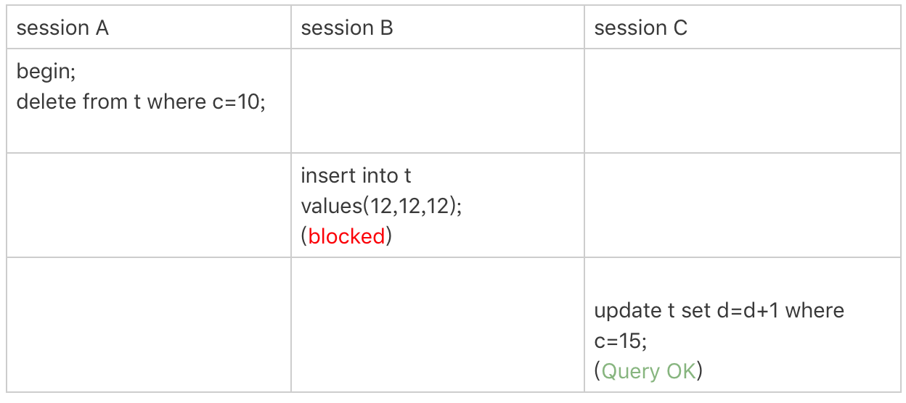​

　　[图 7](siyuan://blocks/20230218230318-d4r2c4q) delete 示例这时，session A 在遍历的时候，先访问第一个 c=10 的记录。同样地，根据原则 1，这里加的是 (c=5,id=5) 到 (c=10,id=10) 这个 next-key lock。

　　然后，session A 向右查找，直到碰到 (c=15,id=15) 这一行，循环才结束。根据优化 2，这是一个等值查询，向右查找到了不满足条件的行，所以会退化成 (c=10,id=10) 到 (c=15,id=15) 的间隙锁。

　　也就是说，这个 delete 语句在索引 c 上的加锁范围，就是下图中蓝色区域覆盖的部分。  
​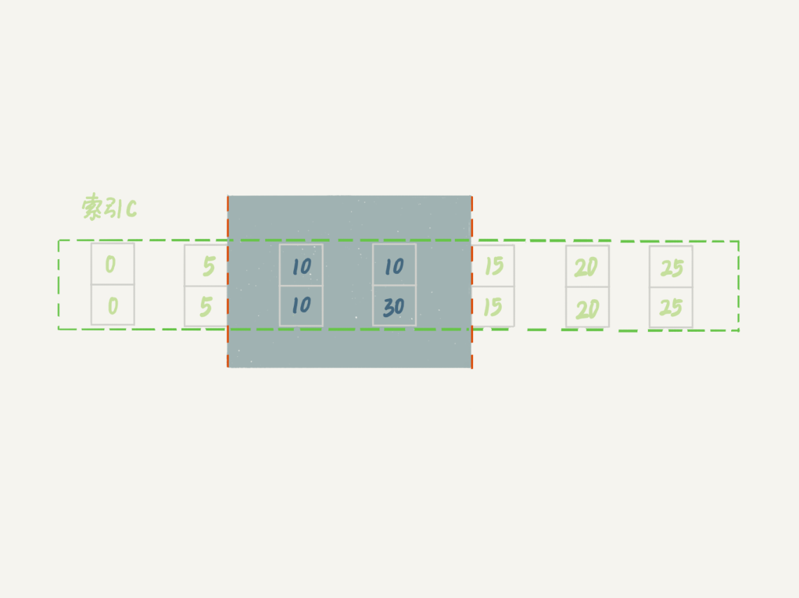​

　　[图 8](siyuan://blocks/20230218230318-9ezoh9l) delete 加锁效果示例这个蓝色区域左右两边都是虚线，表示开区间，即 (c=5,id=5) 和 (c=15,id=15) 这两行上都没有锁。

# 案例七：limit 语句加锁

　　例子 6 也有一个对照案例，场景如下所示：

　　​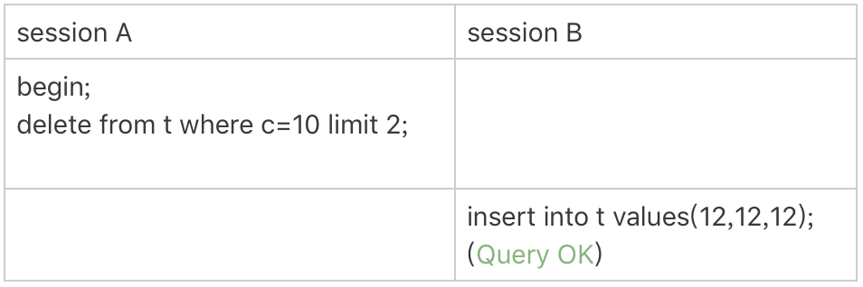​

　　[图 9](siyuan://blocks/20230218230318-0g71n9s) limit 语句加锁这个例子里，session A 的 delete 语句加了 limit 2。你知道表 t 里 c=10 的记录其实只有两条，因此加不加 limit 2，删除的效果都是一样的，但是加锁的效果却不同。可以看到，session B 的 insert 语句执行通过了，跟案例六的结果不同。

　　这是因为，案例七里的 delete 语句明确加了 limit 2 的限制，因此在遍历到 (c=10, id=30) 这一行之后，满足条件的语句已经有两条，循环就结束了。

　　因此，索引 c 上的加锁范围就变成了从（c=5,id=5) 到（c=10,id=30) 这个前开后闭区间，如下图所示：  
​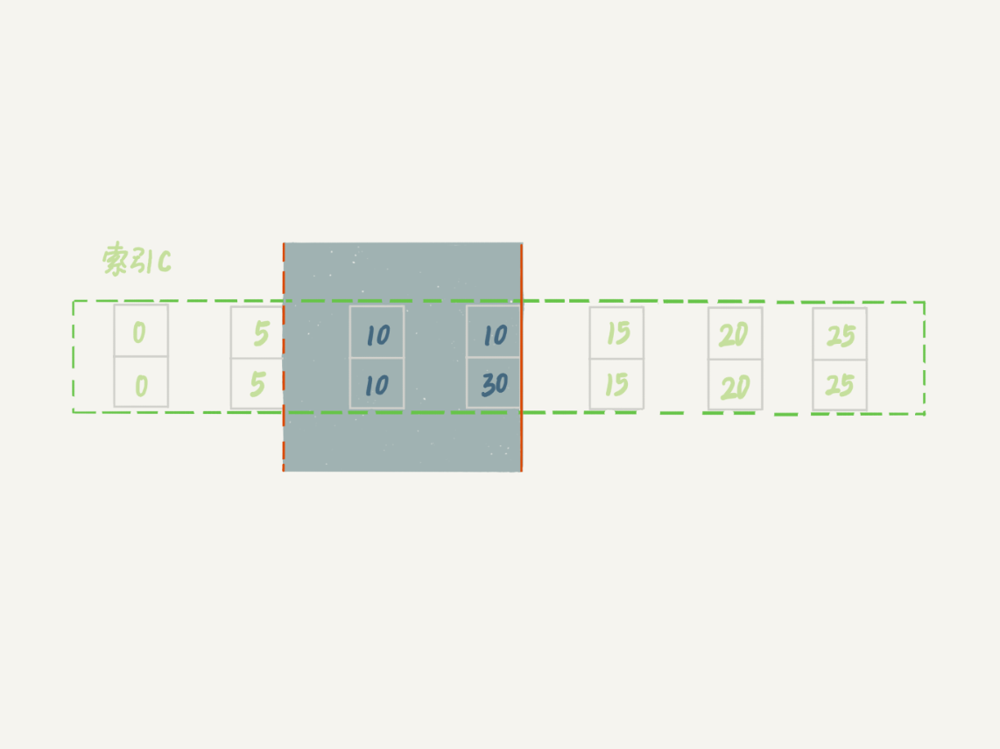​

　　[图 10](siyuan://blocks/20230218230318-emxelha) 带 limit 2 的加锁效果可以看到，(c=10,id=30）之后的这个间隙并没有在加锁范围里，因此 insert 语句插入 c=12 是可以执行成功的。

　　这个例子对我们实践的指导意义就是，**在删除数据的时候尽量加 limit**。这样不仅可以控制删除数据的条数，让操作更安全，还可以减小加锁的范围。

# 案例八：一个死锁的例子

　　前面的例子中，我们在分析的时候，是按照 next-key lock 的逻辑来分析的，因为这样分析比较方便。最后我们再看一个案例，目的是说明：next-key lock 实际上是间隙锁和行锁加起来的结果。

　　你一定会疑惑，这个概念不是一开始就说了吗？不要着急，我们先来看下面这个例子：

　　​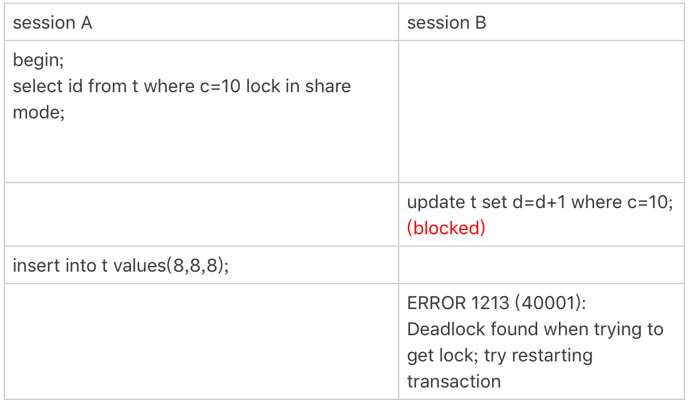​

　　[图 11](siyuan://blocks/20230218230318-rsa35uv) 案例八的操作序列现在，我们按时间顺序来分析一下为什么是这样的结果。

1. session A 启动事务后执行查询语句加 lock in share mode，在索引 c 上加了 next-key lock(5,10] 和间隙锁 (10,15)；
2. session B 的 update 语句也要在索引 c 上加 next-key lock(5,10] ，进入锁等待；
3. 然后 session A 要再插入 (8,8,8) 这一行，被 session B 的间隙锁锁住。由于出现了死锁，InnoDB 让 session B 回滚。

　　你可能会问，session B 的 next-key lock 不是还没申请成功吗？

　　其实是这样的，session B 的“加 next-key lock(5,10] ”操作，实际上分成了两步，先是加 (5,10) 的间隙锁，加锁成功；然后加 c=10 的行锁，这时候才被锁住的。

　　也就是说，我们在分析加锁规则的时候可以用 next-key lock 来分析。但是要知道，具体执行的时候，是要分成间隙锁和行锁两段来执行的。

　　‍
