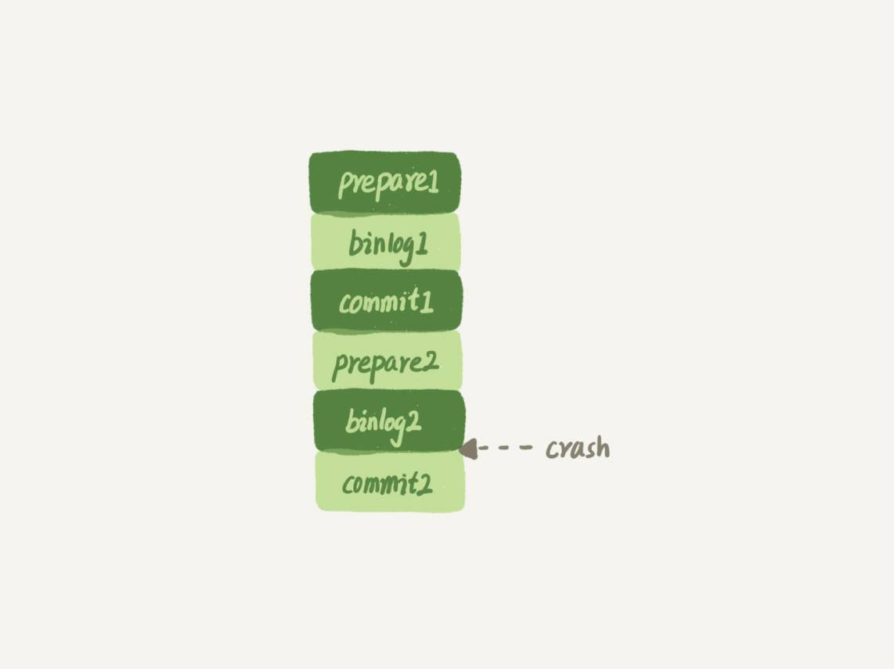

# 两阶段提交

## 两阶段提交(redolog和binlog)

> 用意：为了保证redolog和binlog数据的安全一致性

　　

### 为何使用两阶段提交

1. **先写入redo log，再写入binlog**
   1. 先写入redo log 当redo log 写入完毕时，mysql服务进程异常导致mysql重启，因为 redo log已写入完毕，可恢复到发生异常前，但由于binlog没写完就发生异常，导致binlog中没有记录异常前的sql，如果使用binlog回复数据库，就会导致数据库部分数据丢失。
2. **先写入binlog，再写入redo log**
   1. 如果在 binlog 写完之后 crash，由于 redo log 还没写，崩溃恢复以后这个事务无效，在之后用 binlog 来恢复的时候就多了一个事务出来，导致数据库与原库不一致。

### 为何有redo log还需要binlog

* redolog只有InnoDB有，别的引擎没有。
* redolog是循环写的，不持久保存，binlog的“归档”这个功能，redolog是不具备的。
* 因为MySQL写数据是写在内存里的，不保证落盘，binlog 没有能力恢复“数据页”。

### 为何不能只用 redo log，不要 binlog

* 如果只从崩溃恢复的角度来讲是可以的。你可以把 binlog 关掉，这样就没有两阶段提交了，但系统依然是 crash-safe 的。
* 一个是归档。redo log 是循环写，写到末尾是要回到开头继续写的。这样历史日志没法保留，redo log 也就起不到归档的作用。
* 一个就是 MySQL 系统依赖于 binlog。binlog 作为 MySQL 一开始就有的功能，被用在了很多地方。其中，MySQL 系统高可用的基础，就是 binlog 复制。

　　假设无redo log 流程如下图

如果在图中标的位置，也就是 binlog2 写完了，但是整个事务还没有 commit 的时候，MySQL 发生了 crash。
重启后，引擎内部事务 2 会回滚，然后应用 binlog2 可以补回来；但是对于事务 1 来说，系统已经认为提交完成了，不会再应用一次 binlog1。
但是，InnoDB 引擎使用的是 WAL 技术，执行事务的时候，写完内存和日志，事务就算完成了。如果之后崩溃，要依赖于日志来恢复数据页。
也就是说在图中这个位置发生崩溃的话，事务 1 也是可能丢失了的，而且是数据页级的丢失。此时，binlog 里面并没有记录数据页的更新细节，是补不回来的。

### 处于 prepare 阶段的 redo log 加上完整 binlog，重启就能恢复，MySQL 为什么要这么设计?

　　和数据与备份的一致性有关。在时刻 B，也就是 binlog 写完以后 MySQL 发生崩溃，这时候 binlog 已经写入了，之后就会被从库（或者用这个 binlog 恢复出来的库）使用。  
所以，在主库上也要提交这个事务。采用这个策略，主库和备库的数据就保证了一致性。

### 为何不先 redo log 写完，再写 binlog。崩溃恢复的时候，必须得两个日志都完整才可以。

　　两阶段提交是经典的分布式系统问题 ，比如事务的持久性问题。  
对于 InnoDB 引擎来说，如果 redo log 提交完成了，事务就不能回滚（如果这还允许回滚，就可能覆盖掉别的事务的更新）。而如果 redo log 直接提交，然后 binlog 写入的时候失败，InnoDB 又回滚不了，数据和 binlog 日志又不一致了。  
两阶段提交就是为了给所有人一个机会，当每个人都说“我 ok”的时候，再一起提交。

### redo log 和binlog 区别

1. redo log 是 InnoDB 引擎特有的；binlog 是 MySQL 的 Server 层实现的，所有引擎都可以使用。
2. redo log 是物理日志，记录的是“在某个数据页上做了什么修改”；binlog 是逻辑日志，记录的是这个语句的原始逻辑，及对应的sql语句
3. redo log 是循环写的，空间固定会用完；binlog 是可以追加写入的。“追加写”是指 binlog 文件写到一定大小后会切换到下一个，并不会覆盖以前的日志。

### redo log 和 binlog 是怎么关联起来的?

　　它们有一个共同的数据字段，叫 XID。崩溃恢复的时候，会按顺序扫描 redo log：

- 如果碰到既有 prepare、又有 commit 的 redo log，就直接提交；
- 如果碰到只有 parepare、而没有 commit 的 redo log，就拿着 XID 去 binlog 找对应的事务

### redo log buffer 是什么？是先修改内存，还是先写 redo log 文件？

　　插入数据的过程中，生成的日志都得先保存起来，但又不能在还没 commit 的时候就直接写到 redo log 文件里。所以，redo log buffer 就是一块内存，用来先存 redo 日志的。也就是说，在执行第一个 insert 的时候，数据的内存被修改了，redo log buffer 也写入了日志。但是，真正把日志写到 redo log 文件（文件名是 ib_logfile+ 数字），是在执行 commit 语句的时候做的。
