# 索引

## B+树 基本介绍

### 概述

　　Mysql 的默认储存引擎 是InnoDB，索引是储存引擎快速搜索数据的关键，而InnoDB使用的索引数据结构就是B+树。

　　索引使用最形象的比喻就是目录，可以帮助mysql在大量数据中定位到我们想要的数据。

　　今天要介绍的就是开发工作中最经常接触到的 B+树索引。

　　B+树本质上是指的一种数据结构，它是由二叉查找树，平衡二叉树 和 B树演化而来，要想掌握它，我们必须先了解这三种数据结构。

### 二叉排序树

#### 适用场景

　　**先看一个需求**

　　给你一个数列 (7, 3, 10, 12, 5, 1, 9)，要求能够高效的完成对数据的查询和添加

　　**解决方案分析**

* 使用数组  
  数组未排序， 优点：直接在数组尾添加，速度快。 缺点：查找速度慢.  
  数组排序，优点：可以使用二分查找，查找速度快，缺点：为了保证数组有序，在添加新数据时，找到插入位 置后，后面的数据需整体移动，速度慢。
* 使用链式存储-链表

　　不管链表是否有序，查找速度都慢，添加数据速度比数组快，不需要数据整体移动。

* 使用二叉排序树

#### 二叉排序树介绍

　　**二叉排序树：BST: (Binary Sort(Search) Tree), 对于二叉排序树的任何一个非叶子节点，要求左子节点的值比当 前节点的值小，右子节点的值比当前节点的值大。**

　　特别说明：如果有相同的值，可以将该节点放在左子节点或右子节点

　　比如针对前面的数据 (7, 3, 10, 12, 5, 1, 9) ，对应的二叉排序树为：

　　​​

　　将之应用到表结构中，可以构成这样的图，可以满足对数据的快速查找和添加。

　　​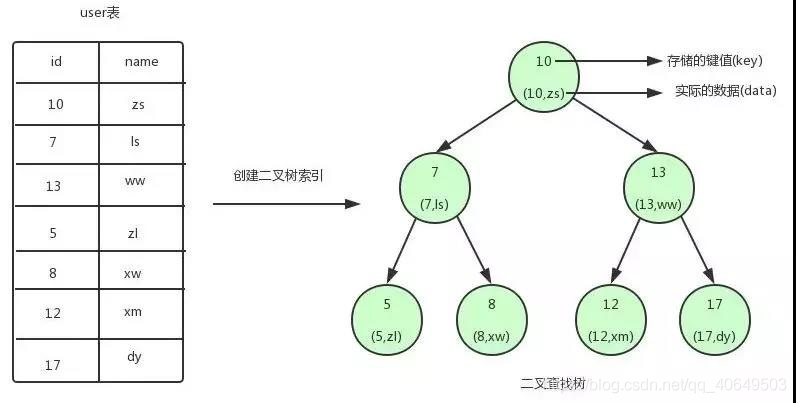​

　　比如我们需要查询id = 12的用户，只需要从根节点出发，12 > 10 找右节点，然后 12 < 13，找右节点，三次便可找到id = 12 的节点。

### 平衡二叉树（AVL树）

　　上面我们讲解了利用二叉查找树可以快速的找到数据。但是，如果上面的二叉查找树是这样的构造：

　　​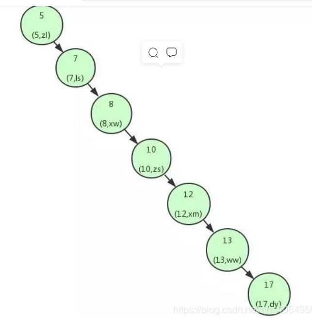​

　　这个时候可以看到我们的二叉查找树变成了一个链表。如果我们需要查找 id=17 的用户信息，我们需要查找 7 次，也就相当于全表扫描了。  
 导致这个现象的原因其实是二叉查找树变得不平衡了，也就是高度太高了，从而导致查找效率的不稳定。

#### 平衡二叉树介绍

1. 平衡二叉树也叫平衡二叉搜索树（Self-balancing binary search tree）又被称为 AVL 树， 可以保证查询效率较高。
2. 具有以下特点：它是一 棵空树或它的左右两个子树的高度差的绝对值不超过 1，并且左右两个子树都是一棵 平衡二叉树。

　　3）平衡二叉树就是二叉排序树的改进方式，将二叉排序树转换为平衡二叉树可加快查询效率。

　　平衡二叉树举例：

　　​​

　　下面是平衡二叉树和非平衡二叉树的对比：

　　​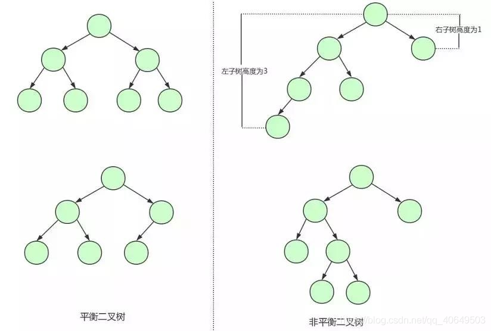​

#### 平衡二叉树的转换过程。

##### 1.左旋转

　　数列 {4,3,6,5,7,8}转换为平衡二叉树

　　​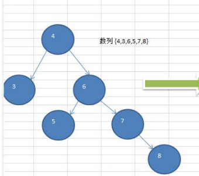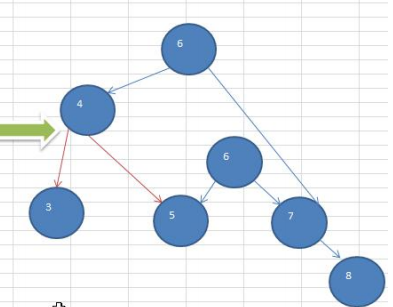​

##### 2. 右旋转

　　数列 {10,12, 8, 9, 7, 6}转换为平衡二叉树

　　​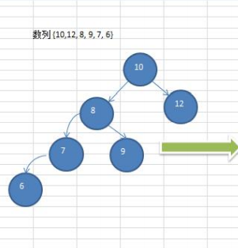​

　　据图可知需要右旋转

　　​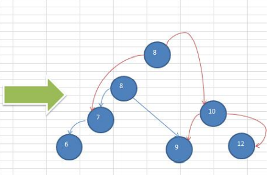​

##### 3. 双旋转

　　前面的两个数列，进行单旋转(即一次旋转)就可以将非平衡二叉树转成平衡二叉树,但是在某些情况下，单旋转 不能完成平衡二叉树的转换。比如数列

　　int[] arr = { 10, 11, 7, 6, 8, 9 }; int[] arr = {2,1,6,5,7,3};

　　运行原来的代码可以看到，并没有转成 AVL 树

　　​​

　　平衡二叉树保证了树的构造是平衡的，当我们插入或删除数据导致不满足平衡二叉树不平衡时，平衡二叉树会进行调整树上的节点来保持平衡。具体的调整方式这里就不介绍了。

　　平衡二叉树相比于二叉查找树来说，查找效率更稳定，总体的查找速度也更快。

### B树

　　因为内存的易失性。一般情况下，我们都会选择将 user 表中的数据和索引存储在磁盘这种外围设备中。

　　但是和内存相比，从磁盘中读取数据的速度会慢上百倍千倍甚至万倍，所以，我们应当尽量减少从磁盘中读取数据的次数。

　　另外，从磁盘中读取数据时，都是按照磁盘块来读取的，并不是一条一条的读。

　　如果我们能把尽量多的数据放进磁盘块中，那一次磁盘读取操作就会读取更多数据，那我们查找数据的时间也会大幅度降低。

　　如果我们用树这种数据结构作为索引的数据结构，那我们每查找一次数据就需要从磁盘中读取一个节点，也就是我们说的一个磁盘块。  
 我们都知道平衡二叉树可是每个节点只存储一个键值和数据的。那说明什么？说明每个磁盘块仅仅存储一个键值和数据！那如果我们要存储海量的数据呢？

　　可以想象到二叉树的节点将会非常多，高度也会极其高，我们查找数据时也会进行很多次磁盘 IO，我们查找数据的效率将会极低！

　　​​

　　为了解决平衡二叉树的这个弊端，我们应该寻找一种单个节点可以存储多个键值和数据的平衡树。也就是我们接下来要说的 B 树。

　　B 树（Balance Tree）即为平衡树的意思，下图即是一棵 B 树：

　　​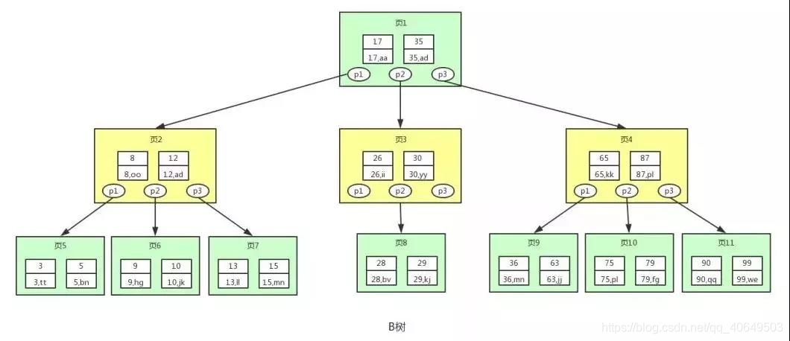​

　　图中的 p 节点为指向子节点的指针，二叉查找树和平衡二叉树其实也有，因为图的美观性，被省略了。

　　图中的每个节点称为页，页就是我们上面说的磁盘块，在 MySQL 中数据读取的基本单位都是页，所以我们这里叫做页更符合 MySQL 中索引的底层数据结构。

　　页的结构我们在下文再具体介绍。

　　从上图可以看出，B 树相对于平衡二叉树，每个节点存储了更多的键值（key）和数据（data），并且每个节点拥有更多的子节点，子节点的个数一般称为阶，上述图中的 B 树为 3 阶 B 树，高度也会很低。

　　基于这个特性，B 树查找数据读取磁盘的次数将会很少，数据的查找效率也会比平衡二叉树高很多。

　　这里页

* 先找到根节点也就是页 1，判断 28 在键值 17 和 35 之间，那么我们根据页 1 中的指针 p2 找到页 3。
* 将 28 和页 3 中的键值相比较，28 在 26 和 30 之间，我们根据页 3 中的指针 p2 找到页 8。
* 将 28 和页 8 中的键值相比较，发现有匹配的键值 28，键值 28 对应的用户信息为（28，bv）。

　　（这里是为了页1 - 页8 是为了方便理解，mysql在分配页的时候并不是按照顺序分配的，很大可能页是不连续的）

### B+ 树

　　B+ 树是对 B 树的进一步优化。让我们先来看下 B+ 树的结构图：

　　​​

　　根据上图我们来看下 B+ 树和 B 树有什么不同：

1. **B+ 树非叶子节点上是不存储数据的，仅存储键值，而 B 树节点中不仅存储键值，也会存储数据，**

　　非叶子节点被称为目录项记录 上面只储存主键值和对应的页号。（存储着很多对，和叶子节点的页结构一样。）

　　叶子节点储存着真正的数据，每一个页的默认大小是16KB

　　因为非叶子节点只存主键值和对应的页号，所以能储存更多的键值，相应的树的阶数（节点的子节点树）就会更大，树就会更矮更胖，如此一来我们查找数据进行磁盘的 IO 次数又会再次减少，数据查询的效率也会更快。

2. **B+ 树索引的所有数据均存储在叶子节点，而且数据是按照顺序排列**（页内的数据也是通过链表储存）

　　因为 B+ 树索引的所有数据均存储在叶子节点，而且数据是按照顺序排列的。那么 B+ 树使得范围查找，排序查找，分组查找以及去重查找变得异常简单。而 B 树因为数据分散在各个节点，要实现这一点是很不容易的。

3. **B+ 树中各个页之间是通过双向链表连接的，叶子节点中的数据是通过单向链表连接的**。

　　其实上面的 B 树我们也可以对各个节点加上链表。这些不是它们之前的区别，是因为在 MySQL 的 InnoDB 存储引擎中，索引就是这样存储的。

## InnoDB 数据页结构

　　页是InnoDB管理储存空间的基本单位，一个页的大小一般是16KB。InnoDB 为了不同的目的而设计了多种不同类型的页，例如 存放表空间头部信息的页、储存Change Buffer 信息的页、存放INODE信息的页、存放undo日志的页。这里我们主要介绍储存记录的页，和储存目录项的页。

　　在刚才的介绍中，我们了解到B+树索引每个节点都是一个页，**叶子节点储存的是数据，我们称之为数据页，非叶子节点储存的是主键值和页号，我们称之为目录页。**我们可以把数据页理解为书本的正文内容，目录页理解为书本的目录。

### InnoDB页的储存空间划分

　　页是InnoDB储存数据的基本单位，一个InnoDB页的储存空间被划分为7个部分：

|名称|中文名|占用空间大小|描述|
| --------------------| ----------------------------| --------------| ------------------------|
|File Header|文件头部|38字节|页的一些通用信息|
|Page Header|页面头部|56字节|数据页专有的一些信息|
|Infimum + Supremum|页面中的最小记录和最大记录|26字节|两个虚拟的记录|
|User Records|用户记录|不确定|用户储存的记录内容|
|Free Space|空闲空间|不确定|页中尚未使用的记录|
|Page Directory|页目录|不确定|页中某些记录的相对位置|
|File Trailer|文件尾部|8字节|校验页是否完整|

　　我们平常储存的数据就是储存在 User Records 空间中，但在一开始生成页的时候，其实并没有User Records 部分，**每当插入一条记录时，都会从Free Space部分申请一个记录大小的空间，并将这个空间划分到User Records部分。当Free Space部分空间全部被User Records替代掉后，就意味着这个页空间用完了，需要申请新的页了。**

　　​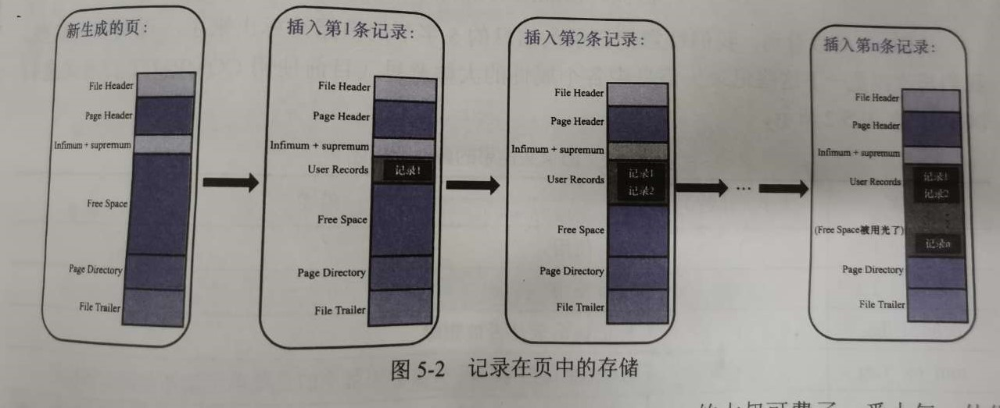​

　　当然，记录不可能直接一条一条塞到User Records中，InnoDB 有他自己储存记录的方式，如何管理好这些杂乱无章的记录，才是最重要的。

### 记录头信息

　　要想了解记录在User Records中的储存方式，我们需要先了解下记录头的概念。

　　首先我们先看一张图：

　　​​

　　这个是一条行格式为compact的记录的行格式示意图。

　　这里可以先简单介绍一下compact 行格式，InnoDB中共有4中不同类型的行格式 分别是 **COMPACT、REDUNDANT、DYNAMIC、COMPRESSED。**

　　我们知道mysql是以一行记录为单位向表中插入数据的。

　　每行的数据除了记录我们所插入的真实数据外，InnoDB还需要记录一些额外的信息去维护这些记录。

　　他们分别是变长长度列表 、NULL 值列表、记录头信息。 前两者在这里我就不再介绍，有兴趣的可以看 《Mysql是怎样运行的》这本书，第四章有仔细介绍四种行格式。

　　在这里我想仔细说一下记录头所储存的东西，这有关于记录之间的联系。

　　​​

|名称|大小|描述|
| --------------| ------| -----------------------------------------------------------------------------------------------------------------------------------------------------------------------------------------|
|预留位1|1|没有使用|
|预留位2|1|没有使用|
|deleted_flag|1|标记该记录是否使用,默认为0，删除标记为1，所有被删除的记录会被组成一个垃圾链表，记录在这个链表占用的空间被称为可重用空间，如果有新的记录插入，它们可能覆盖掉被删除的这些记录占用的空间。|
|min_rec_flag|1|B+树中每层非叶子节点的最小目录项都会添加该标记|
|n_owned|1|一个页面中的记录会被分成若干小组，每个组中有一个记录是“带头大哥”，其余记录都是其附属的“小弟”，n_owned记录了该组的记录条数，“小弟”们的n_owned值为0|
|heap_no|13|表示当前记录在堆中的相对位置|
|record_type|3|表示当前记录的类型，0表示普通记录，1表示B+数非叶子节点的目录项记录，2表示Infimum记录，3表示Supremum记录、|
|next_record|16|表示下一条记录的相对位置|

　　我们暂时来关注三个属性，heap_no、record_type、next_record。

#### heap_no

　　我们像表中插入的记录从本质上来说都是放到数据页的UserRecords部分，这些记录一条条亲密无间的排列着。

　　如图：

　　​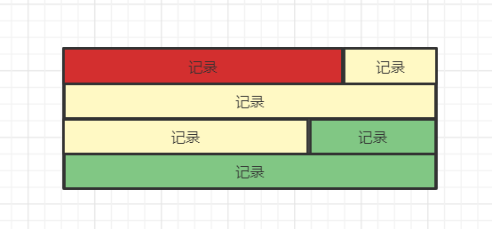​

　　我们把这一条条亲密无间排列的结构称之为堆，为了方便管理这个堆，他们把一条条记录在堆中的相对位置称之为heap_no。我们可以模拟一下几条记录的储存图。

　　​​

　　可以发现一个问题，为什么heap_no 是从 2开始的呢，0和1上哪了？这其实是InnoDB默认为我们添加了两条虚拟记录。

　　一条是页面中的最小记录（Infimum）

　　一条是页面中的最大记录 （Supremum）

　　为什么说他们是最大和最小记录呢，那么记录又是如何比大小的呢？

　　**对于一条完整的记录来说，记录比较的大小就是主键的大小。但是无论我们插入了多少记录，InndoDB的都规定，任何用户记录都比Infimum大，比Supremum小。**

　　这两条记录的构造非常简单，都是由5个字节的记录头信息和8个字节的一个固定单词组成。

* Infimum 和 Supremum 并不储存在User_Records空间中，而是存在 一个专门的空间，就是上文我们看到的Infimum + Supremum部分。
* Infimum 和 Supremum 的heap_no分别是0 和 1。

　　有一点需要特别注意，堆记录中的heap_no基本是不变的，即使被删除了，这条记录的heap_no也不会改变。

#### **record_type**

　　表示当前记录的类型，共有四种

* 0 普通记录
* 1 B+树非叶子节点的目录项记录
* 2 Infimum 记录
* 3 Supremum 记录

#### **next_record**

　　这个属性才是重点，他表示的是当前记录的真实数据到下一条记录的真实数据的距离。如果该值为正数，说明该记录的下一条记录在当前记录地址空间后面，改值为负数，说明该记录的下一条记录在当前记录地址空间的前面。

　　有了这个属性，就让杂乱无章的记录形成了一个链表结构，可以快速找到下一条记录的位置。

　　需要注意的是，下一条记录指的并不是插入记录的下一条，而是按照主键从小到大排序的下一条记录（默认情况下），而且规定infimum记录的下一条就是本页主键最小的一条记录，本页主键最大的一条记录就是 supremum。

　　我们可以通过如下图更明朗的看到next_record的作用

　　​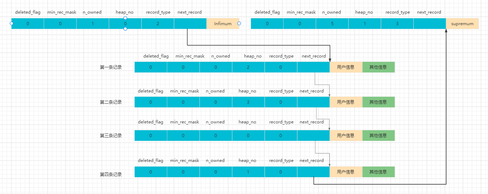​

　　如果我们要删除第二条记录

　　​​

　　那么将发生如下改变

* 第二条记录的deleted_flag = 1，该记录储存空间仍保留着。
* 第二条记录的 next_record = 0
* 第一条记录的next_record指向了第三条记录。
* o_owned的值从 5 变成了 4。

　　至此，我们得出一个结论，无论对页中的记录如何操作，InnoDB始终会维护记录的一个单向链表，且各节点都是按照主键值排序的。

　　如果我们再插入第二条记录，则他会直接复用我们刚才删除记录的储存空间。

### 页目录

　　要想彻底弄懂InnoDB是如何快速在页内找到想要的数据，我们还需要知道一个知识点，那就是页目录。

　　比如我们此时想查询 id = 3 的记录（假设是上图第三条记录）我们需要怎么找呢，

　　按现在我们所需到的，最笨的办法就是遍历链表，一个一个找，因为每个节点都是按照id排序的。

　　但当数据过多时，这个方法就不太好了，InnoDB就设计了一种比较好的查询方案，模仿书的目录，建立一个页目录。

　　建立的具体过程：

* 将所有正常的记录划分为几个组（包括Infimum 和 Supremum记录，但不包括被删除的记录）
* 每个组的主键最大的一条记录（即最后一条记录）为“头领”，其他记录为“小弟”,“头目”记录中的n_owned属性记录改组记录数量。
* 每组“头领”在页面中的地址偏移量，按顺序储存到靠近页尾的地方。**这个地方就被成为页目录，页目录的这些地址偏移量就被成为槽。**

　　​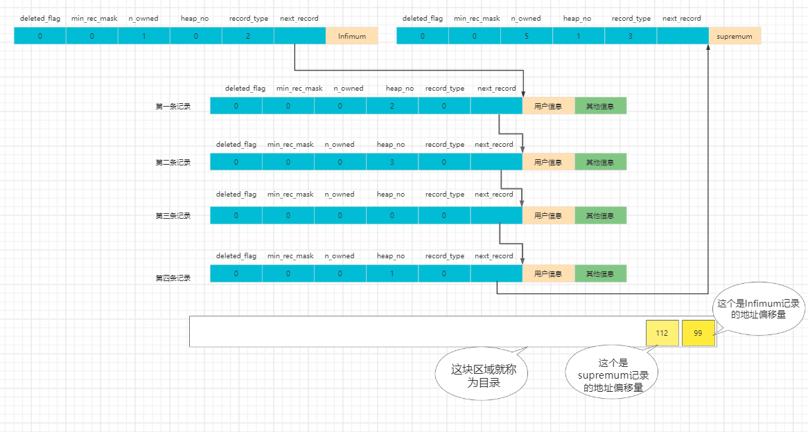​

　　上图中，数据被分为了两个组，我们可以看到页目录中有两个槽。

　　同时注意 infimum和 supremum的 o_owned值，可以看到，Infimum n_owned = 1，supremum n_owned = 5，

　　说明Infimum组只有一个，就是他一个。

　　supremum 组五个，他自己和其他四条用户记录。

　　为什么infimum 只有一个呢？

　　因为InnoDB规定：**对于Infimum记录所在分组只能有1条记录，而Supremum记录所在的分组拥有1~8条记录，其他的分组 为 4~8条。**

　　在页面中一条数据没有的情况下，就会有两个分组，当插入数据大于8条时，就会将组内数据拆分成两个组，一个组中4条记录，另一个5条记录。在拆分过程中会新增一个槽，记录新增分组中最大的那条记录的偏移量。

　　那么有了槽，对我们查找数据有什么帮助吗？我们继续往下看。

　　​​

　　我们将行信息简化一下，得到了插入id 为1 ~16数据的页面结构图。（先不用纠结槽的位置，只是为了更清晰）

　　此时，如果我们想要访问id = 6 的数据，是什么步骤呢。

* 我们可以通过二分法快速定位槽的位置， (4 + 0)/2 = 2 ，所以先找2槽
* 2号槽的最后一条数据是8， 8 > 6,所以我们应该向上找，
* 我们重新计算中间槽的位置 （0+2）/ 2 = 1，槽1的最后一条数据是 4,4 < 6,说明该记录在1槽下面，
* 此时已经可以确定记录是在2槽中，但链表只能单向遍历，我们必须要找到2槽的第一条记录，
* 其实虽然数据被分为一个一个组，但数据之间还是相连的，1槽最后一个记录的下一个记录即是2槽的第一个记录，这时我们就可以，从2槽开始遍历，直到找到id = 6的数据。

　　综上所述，一个数据页想要查找主键值的记录时，过程可以分两步。

1. 通过二分法找到分组对应的槽
2. 通过记录的链表结构，遍历链表找到我们想要的记录。

　　InnoDB页的其他信息我也就不再过多介绍，如有请自行了解，可以看《mysql是怎样运行的》第五章。

## 再探InnoDB B+树索引

　　我们了解了InnoDB 数据页的存储结构后，再来了解InnoDB为什么要用B+树这种数据结构，就会好理解很多。

### 没有索引时查找数据

　　首先我们先探讨下如果没有这种数据结构，我们应该如何查找记录

#### 在一个页中查找

1. 以主键为搜索条件时  
    这跟我们上文将的一致，先在页目录中使用二分法快速定位到槽，然后再遍历该槽对应分组中的记录，即可快速找到指定的记录。
2. 以其他列作为搜搜条件时  
    我们只能从Infimum开始遍历整个链表，知道找到我们想要的记录。

### 在很多页中查找

　　我们可以归结为两步

* 定位到记录所在的页；
* 在页内查找相应的记录

　　在没有索引的条件下我们不能快速的找到记录所在的位置，所以只能从第一页开始，沿着双向链表一路遍历下去。

　　那么此时，索引的作用就显得如此重要。
