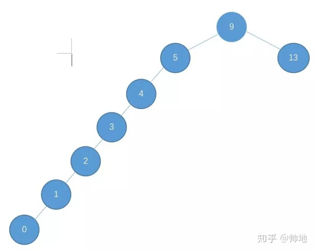

# 二叉树

## 二叉树

> 树的每个节点最多有 2 个孩子节点

　　**满二叉树**

> 一个二叉树的所有非叶子节点都存在左右孩子， 并且所有叶子节点都在同一层级上， 那么这个树就是满二叉树

　　**完全二叉树**

> 按层级顺序编号.该树所有节点和同样深度的满二叉树的编号节点位置完全相同

### 二叉树存储结构

```java
@Data
public class TreeNode<T> {
	T key;				// 关键字(键值)
	TreeNode<T> left;	// 左孩子
	TreeNode<T> right;	// 右孩子
	TreeNode<T> parent;	// 父结点

	public TreeNode(T key, TreeNode<T> parent, TreeNode<T> left, TreeNode<T> right) {
		this.key = key;
		this.parent = parent;
		this.left = left;
		this.right = right;
	}
}
public
```java
@Data
public class BSTree<T>{
    TreeNode mRoot;
}
```

### 二叉树遍历

　　**递归遍历**
前序遍历 根左右

```java
private void preOrder(TreeNode<T> tree) {
	if(tree != null) {
		System.out.print(tree.key+" ");//中间节点
		preOrder(tree.left);//左节点
		preOrder(tree.right);//右节点
	}
}
```

　　中序遍历

```java
	private void inOrder(TreeNode<T> tree) {
		if(tree != null) {
			inOrder(tree.left);
			System.out.print(tree.key+" ");
			inOrder(tree.right);
		}
	}
```

　　后序遍历

```java
private void postOrder(TreeNode<T> tree) {
	if(tree != null)
	{
		postOrder(tree.left);
		postOrder(tree.right);
		System.out.print(tree.key+" ");
	}
}
```

　　**非递归遍历**

　　先序遍历

```java
public void preOrder(TreeNode<T> root) {
	Stack<TreeNode> stack = new Stack<>();
	TreeNode pNode = root;
	while (pNode != null || !stack.isEmpty()) {
		if (pNode != null) {
            stack.push(pNode);
			System.out.print(pNode.val+"  ");
			pNode = pNode.left;
		} else { //pNode == null && !stack.isEmpty()
			TreeNode node = stack.pop();
			pNode = node.right;
		}
	}
}
```

　　中序遍历

```java
public void inOrder(TreeNode root) {
	Stack<TreeNode> stack = new Stack<>();
	TreeNode pNode = root;
	while (pNode != null || !stack.isEmpty()) {
		if (pNode != null) {
			stack.push(pNode);
			pNode = pNode.left;
		} else { //pNode == null && !stack.isEmpty()
			System.out.print(node.val+"  ");
			pNode = node.right;
            TreeNode node = stack.pop();
		}
	}
}
```

　　后序遍历

```java
public void postOrder(TreeNode root) {
	Stack<TreeNode> stack = new Stack<>();
    TreeNode current = root, prev = NULL;

    while (current || !stack.empty()) {
        while (current) {
            s.push(current);
            current = current->left;
        }

        TreeNode now = stack.peek();//存储需要后退到的节点
        if (now->right == NULL || now->right == prev) {
            // stage (5)
            System.out.print(now.val+"  ");
            prev = now; // update the prev
            s.pop();
            current = NULL; // let the stack keep popping
        } else {
            // stage (4)
            current = now->right;
        }
    }
}
```

### 二叉树深度

```java
public int maxDepth(TreeNode root){
	if(root == null){
		return 0;
	}
	int leftDepth = maxDepth(root.left);
	int rightDepth = maxDepth(root.right);
	return Math.max(leftDepth,rightDepth) + 1;
}
```

## 平衡二叉树(AVL 树)

> 空树或者任一节点左.右子树高度差的绝对值不超过一

```java
@Data
public class AVLTreeNode<T> {
	T key;				// 关键字(键值)
	int height;     	// 高度
	AVLTreeNode<T> left;	// 左孩子
	AVLTreeNode<T> right;	// 右孩子
}
```

```java
public class AVLTree<T>{

    public int max ( int a, int b ){
        return a > b ? a : b;
    }

    public AVLTree singleLeftRotation ( AVLTree A ){ /* 注意：A必须有一个左子结点B */
    /* 将A与B做左单旋，更新A与B的高度，返回新的根结点B */

        AVLTree B = A.left;
        A.left = B.right;
        B.right = A;
        A.height = Math.max( getHeight(A.Left), getHeight(A.Right) ) + 1;
        B.height = Math.max( getHeight(B.Left), A.Height ) + 1;

        return B;
    }
    public AVLTree singleRightRotation ( AVLTree A ){ /* 注意：A必须有一个右子结点B */
    /* 将A与B做右单旋，更新A与B的高度，返回新的根结点B */

        AVLTree B = A.right;
        A.right = B.left;
        B.left = A;
        A.height = Math.max( getHeight(A.Left), getHeight(A.Right) ) + 1;
        B.height = Math.max( getHeight(B.Left), A.Height ) + 1;

        return B;
    }
    public AVLTree doubleLeftRightRotation ( AVLTree A ){ /* 注意：A必须有一个左子结点B，且B必须有一个右子结点C */
    /* 将A、B与C做两次单旋，返回新的根结点C */

        /* 将B与C做右单旋，C被返回 */
        A.left = singleRightRotation(A.left);
        /* 将A与C做左单旋，C被返回 */
        return singleLeftRotation(A);
    }
    AVLTree Insert( AVLTree T, T X ){
        /* 将X插入AVL树T中，并且返回调整后的AVL树 */
        if ( T == null ) { /* 若插入空树，则新建包含一个结点的树 */
            AVLTree T = new AVLTree();
            T.data = X;
            T.height = 0;
            T.left = T.right = null;
        } /* if (插入空树) 结束 */

        else if ( X < T.data ) {
            /* 插入T的左子树 */
            T.left = Insert( T.left, X);
            /* 如果需要左旋 */
            if ( getHeight(T.left)-getHeight(T.right) == 2 )
                if ( X < T.left.data )
                T = singleLeftRotation(T);      /* 左单旋 */
                else
                T = doubleLeftRightRotation(T); /* 左-右双旋 */
        } /* else if (插入左子树) 结束 */

        else if ( X > T.data ) {
            /* 插入T的右子树 */
            T.right = Insert( T.right, X );
            /* 如果需要右旋 */
            if ( getHeight(T.Left)-getHeight(T.Right) == -2 )
                if ( X > T.right.data )
                T = singleRightRotation(T);     /* 右单旋 */
                else
                T = doubleRightLeftRotation(T); /* 右-左双旋 */
        } /* else if (插入右子树) 结束 */

        /* else X == T.Data，无须插入 */

        /* 更新树高 */
        T.height = Math.max( getHeight(T.left), getHeight(T.right) ) + 1;

        return T;
    }

}
```

## 二叉搜索树(二叉排序树)

> 一棵二叉树,可以为空;如果不为空,满足以下性质: 1.非空左子树的所有键值小于其根结点的键值. 2.非空右子树的所有键值大于其根结点的键值. 3.左、右子树都是二叉搜索树.

## 红黑树

> 1、具有二叉查找树的特点。
> 2、根节点是黑色的；
> 3、每个叶子节点都是黑色的空节点（NIL），也就是说，叶子节点不存数据。
> 4、任何相邻的节点都不能同时为红色，也就是说，红色节点是被黑色节点隔开的。
> 5、每个节点，从该节点到达其可达的叶子节点是所有路径，都包含相同数目的黑色节点。

## 比较

### 二叉搜索树

> 极端情况下,搜索树会退化成线性结构

　　[https://imgchr.com/i/Javb7R](https://imgchr.com/i/Javb7R)

### 平衡树

> 因为平衡树要求每个节点的左子树和右子树的高度差至多等于 1，这个要求实在是太严了，导致每次进行插入/删除节点的时候，几乎都会破坏平衡树的第二个规则，进而我们都需要通过左旋和右旋来进行调整，使之再次成为一颗符合要求的平衡树。如果在那种插入、删除很频繁的场景中，平衡树需要频繁着进行调整，这会使平衡树的性能大打折扣
