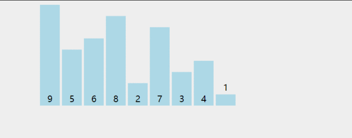
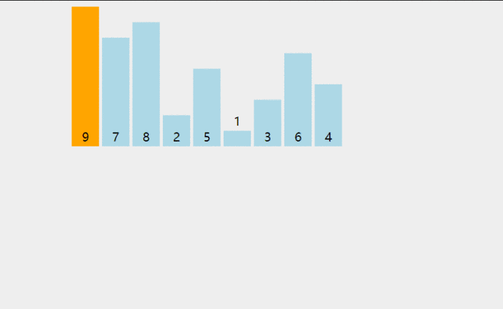
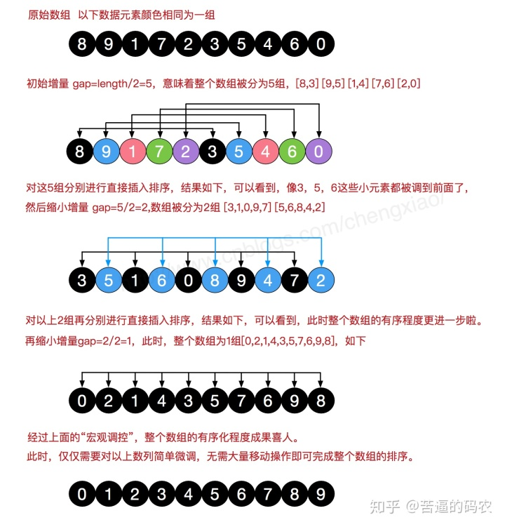

# 常见排序

### 选择排序

#### 算法描述

　　首先，找到数组中最小的那个元素，其次，将它和数组的第一个元素交换位置(如果第一个元素就是最小元素那么它就和自己交换)。其次，在剩下的元素中找到最小的元素，将它与数组的第二个元素交换位置。如此往复，直到将整个数组排序

#### 算法实现

```java
int[] selectSort(int[] a) {
    int n = a.length;
    for (int i = 0; i < n - 1; i++) {
        int min = i;
        for (int j = i + 1; j < n; j++) {
            if(a[min] > a[j]) {min = j;}
        }
        //交换
        int temp = a[i];
        a[i] = a[j];
        a[j] = temp;
    }
    return a;
}
```

　　[https://imgchr.com/i/JD8mLV](https://imgchr.com/i/JD8mLV)

### 冒泡排序（Bubble Sort）

#### 算法描述

1. 比较相邻的元素。如果第一个比第二个大，就交换它们两个；
2. 对每一对相邻元素作同样的工作，从开始第一对到结尾的最后一对，这样在最后的元素应该会是最大的数；
3. 针对所有的元素重复以上的步骤，除了最后一个；
4. 重复步骤 1~3，直到排序完成。

#### 算法实现

```java
    int[] bubbleSort(int[] array) {
        if (array == null || array.length < 2) {
            return array;
        }
        for (int i = 0; i < array.length; i++) {
            for (int j = 0; j < array.length - 1 - i; j++) {
                if (array[j + 1] < array[j]) {
                    int temp = array[j + 1];
                    array[j + 1] = array[j];
                    array[j] = temp;
                }
            }
        }
        return array;
    }
```

　　[https://imgchr.com/i/JDu7VJ](https://imgchr.com/i/JDu7VJ)

### 插入排序

#### 算法描述

1. 从数组第 2 个元素开始抽取元素。
2. 把它与左边第一个元素比较，如果左边第一个元素比它大，则继续与左边第二个元素比较下去，直到遇到不比它大的元素，然后插到这个元素的右边。
3. 继续选取第 3，4，....n 个元素,重复步骤 2 ，选择适当的位置插入。

#### 算法实现

```java
    static int[] InsertionSort(int[] a) { /* 插入排序 */
        if(arr == null || arr.length < 2){
            return arr;
        }
        int j;
        for (int i = 1; i < a.length; i++) {
            /*取出未排序序列中的第一个元素*/
            int temp = a[i];
            for ( j= i-1; j > 0 && a[j]>temp; j--) {
                //依次与已排序序列中元素比较并右移
                a[j+1] = a[j];
            }
            a[j+1]=temp;
        }
        return a;
    }
```

　　[https://imgchr.com/i/JDuRCq](https://imgchr.com/i/JDuRCq)

### 希尔排序

#### 算法描述

　　加快速度简单地改进了插入排序，交换不相邻的元素以对数组的局部进行排序
采用插入排序的方法，先让数组中任意间隔为 h 的元素有序，刚开始 h 的大小可以是 h = n / 2,接着让 h = n / 4，让 h 一直缩小，当 h = 1 时，也就是此时数组中任意间隔为 1 的元素有序，此时的数组就是有序的了

#### 算法实现

```java
    static int[] shellSort(int[] a) {
        // i 增量  每组间隔i
        for (int i = a.length / 2; i > 0; i /= 2) {
            //对各部分进行插入排序
            for (int j = i; j < a.length; j++) {
                int k = j;
                int temp = a[k];

                // k - i 就是代表与它同组的前一个元素
                while (k - i >= 0 && a[k - i] > temp) {
                    a[k] = a[k - i];
                    k = k - i;
                }
                a[k] = temp;
            }

        }
        return a;
    }
```

　　[https://imgchr.com/i/JDgR0O](https://imgchr.com/i/JDgR0O)

### 快速排序

#### 算法描述

　　从数组中选择一个元素，我们把这个元素称之为中轴元素吧，然后把数组中所有小于中轴元素的元素放在其左边，所有大于或等于中轴元素的元素放在其右边，显然，此时中轴元素所处的位置的是有序的。也就是说，我们无需再移动中轴元素的位置。
从中轴元素那里开始把大的数组切割成两个小的数组(两个数组都不包含中轴元素)，接着我们通过递归的方式，让中轴元素左边的数组和右边的数组也重复同样的操作，直到数组的大小为 1

#### 算法实现

```java
 public static void quickSort(int[] arr, int L, int R) {
        int i = L;
        int j = R;

        //支点
        int pivot = arr[(L + R) / 2];

        //左右两端进行扫描，只要两端还没有交替，就一直扫描
        while (i <= j) {

            //寻找直到比支点大的数
            while (pivot > arr[i])
                i++;

            //寻找直到比支点小的数
            while (pivot < arr[j])
                j--;

            //此时已经分别找到了比支点小的数(右边)、比支点大的数(左边)，它们进行交换
            if (i <= j) {
                int temp = arr[i];
                arr[i] = arr[j];
                arr[j] = temp;
                i++;
                j--;
            }
        }
        //上面一个while保证了第一趟排序支点的左边比支点小，支点的右边比支点大了。


        //“左边”再做排序，直到左边剩下一个数(递归出口)
        if (L < j)
            quickSort(arr, L, j);

        //“右边”再做排序，直到右边剩下一个数(递归出口)
        if (i < R)
            quickSort(arr, i, R);
    }
```

### 堆排序

#### 算法描述

　　堆排序是将数据看成是完全二叉树、根据完全二叉树的特性来进行排序的一种算法
最大堆要求节点的元素都要不小于其孩子，最小堆要求节点元素都不大于其左右孩子

　　在堆中可以得出它的父节点是`（i-1）/ 2`，它的左孩子是`2*i+1`，它的右孩子是`2*i+2`。
堆排序方法:把最大堆堆顶的最大数取出，将剩余的堆继续调整为最大堆，再次将堆顶的最大数取出，这个过程持续到剩余数只有一个时结束

#### 算法实现

```java
    public static void heapSort(int[] arr, int length) {
        //建立大根堆
        for (int i = length/2 - 1; i >= 0; i--) {
            heapify(arr, i, length);
        }
        //从栈顶取出元素
        for (int i = length-1; i >=0; i--) {
            swap(arr, 0, i);
            heapify(arr, 0, i);
        }
    }

    //建立堆函数
    public static void heapify(int[] arr, int index, int length) {
        {
            // 将最大元素设置为堆顶元素
            int largest = index;
            // left = 2*i + 1
            int l = 2 * index + 1;
            // right = 2*i + 2
            int r = 2 * index + 2;

            // 如果 left 比 root 大的话
            if (l < length && arr[l] > arr[largest]) {
                largest = l;
            }
            // 如果 right 比 root 大的话
            if (r < length && arr[r] > arr[largest]) {
                largest = r;
            }
            if (largest != index) {
                swap(arr, index, largest);
                // 递归地定义子堆
                heapify(arr, largest, length);
            }
        }


    }

    //交换两个数
    public static void swap(int[] arr, int i, int j) {
        int temp = arr[i];
        arr[i] = arr[j];
        arr[j] = temp;
    }
```

### 计数排序

#### 算法描述

　　计数排序是一种非比较型整数排序算法，其原理是将整数按位数切割成不同的数字，然后按每个位数分别比较。排序过程是将所有待比较数值统一为同样的数位长度，数位较短的数前面补零，然后从最低位开始，依次进行一次排序。这样从最低位排序一直到最高位排序完成以后, 数列就变成一个有序序列

#### 算法实现

### 归并排序

#### 算法描述

#### 算法实现

```java
// 非递归式的归并排序
    public static int[] mergeSort(int[] arr) {
        int n = arr.length;
        // 子数组的大小分别为1，2，4，8...
        // 刚开始合并的数组大小是1，接着是2，接着4....
        for (int i = 1; i < n; i += i) {
            //进行数组进行划分
            int left = 0;
            int mid = left + i - 1;
            int right = mid + i;
            //进行合并，对数组大小为 i 的数组进行两两合并
            while (right < n) {
                // 合并函数和递归式的合并函数一样
                merge(arr, left, mid, right);
                left = right + 1;
                mid = left + i - 1;
                right = mid + i;
            }
            // 还有一些被遗漏的数组没合并，千万别忘了
            // 因为不可能每个字数组的大小都刚好为 i
            if (left < n && mid < n) {
                merge(arr, left, mid, n - 1);
            }
        }
        return arr;
    }
// 归并排序
    public static int[] mergeSort(int[] arr, int left, int right) {
        // 如果 left == right，表示数组只有一个元素，则不用递归排序
        if (left < right) {
            // 把大的数组分隔成两个数组
            int mid = (left + right) / 2;
            // 对左半部分进行排序
            arr = sort(arr, left, mid);
            // 对右半部分进行排序
            arr = sort(arr, mid + 1, right);
            //进行合并
            merge(arr, left, mid, right);
        }
        return arr;
    }

    // 合并函数，把两个有序的数组合并起来
    // arr[left..mif]表示一个数组，arr[mid+1 .. right]表示一个数组
    private static void merge(int[] arr, int left, int mid, int right) {
        //先用一个临时数组把他们合并汇总起来
        int[] a = new int[right - left + 1];
        int i = left;
        int j = mid + 1;
        int k = 0;
        while (i <= mid && j <= right) {
            if (arr[i] < arr[j]) {
                a[k++] = arr[i++];
            } else {
                a[k++] = arr[j++];
            }
        }
        while(i <= mid) a[k++] = arr[i++];
        while(j <= right) a[k++] = arr[j++];
        // 把临时数组复制到原数组
        for (i = 0; i < k; i++) {
            arr[left++] = a[i];
        }
    }
```
