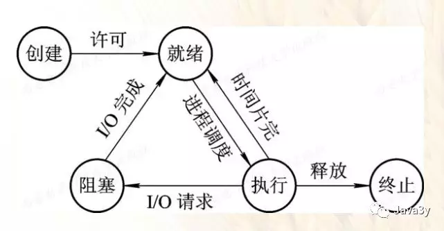

# 操作系统

### 历程

- 手工操作阶段
  - 程序员将对应于程序和数据的已穿孔的纸带(或卡片)装入输入机，然后启动输入机把程序和数据输入计算机内存
- 单道批处理系统
  - 行批处理，操作员把用户提交的作业分类，把一批中的作业编成一个作业执行序列。每一批作业将有专门编制的监督程序(Monitor)自动依次处理
- 多道批处理系统
  - 多道程序的运行特点是计算机内存中同时存放多道相互独立的程序。
  - 多道批处理系统的缺点是无交互性，用户一旦提交作业就失去了对其运行的控制能力；同时，由于是批处理，所以作业周转时间长，用户使用不方便。
- 分时操作系统
  - 分时(Time Sharing)是把计算机的系统资源(尤其是 CPU 时间)进行时间上的分割，每个时间段称为一个时间片(Time Slice)，每个用户依次轮流使用时间片
  - 分时系统具有交互性、多用户同时性和独立性的特征。
- 实时操作系统
  - 实时操作系统是一种联机的用于实时控制和实时信息处理领域的操作系统，主要用于过程控制、事务处理等有实时要求的领域，其主要特征是实时性和可靠性。

　　

### 特性

- 并发性
  - 并发性是指同一时间间隔内发生两个或多个事件。并行性是指同一时刻内发生两个或多个事件。
- 共享性
  - 共享性指多个计算任务(或多道程序)对系统资源的共同使用。
- 虚拟性
  - 即通过某种技术把一个物理实体变为若干个逻辑上的对应物。
- 异步性
  - 只要环境相同，作业经过多次的运行，所获得的结果也应该是完全相同的

### 功能

- 处理机管理功能
  - 在多道程序或多用户的情况下，要组织多个作业同时运行，就要解决对处理机分配调度策略，分配实施和资源回收等问题。
- 存储管理功能、
  - 对内部存储器进行分配，保护和扩充。
- 设备管理功能
  - 设备管理是通道、控制器和输入输出设备的分配和管理，以及实现设备独立性。
- 文件系统管理(信息管理)功能
  - 信息的共享，保密和保护也是文件系统所要解决的。
- 提供用户接口功能
  - 程序一级的接口：提供一组广义指令(或称系统调用、程序请求)供用户程序和其他系统程序调用。
  - 作业一级的接口：提供一组控制操作命令(或称作业控制语言，或象 UNIX 中的 shell 命令语言)供用户去组织和控制自己作业的运行。

## 进程和线程

### 进程

#### 特征

- 动态性
  - 进程是程序的一次执行，它有着创建、活动、暂停、终止等过程。
  - 具有一定的生命周期，是动态的产生、变化和消亡的。动态性是进程最基本的特征。
- 并发性
  - 指多个进程实体，同存于内存中，能在一段时间内同时运行。
  - 并发性是进程的重要特征，同时也是操作系统的重要特征。
  - 引入进程的目的就是为了使程序能与其他进程的程序并发执行，以提高资源利用率。
- 独立性
  - 指进程实体是一个能独立运行、独立获得资源和独立接受调度的基本单位。
  - 凡未建立 PCB 的程序都不能作为一个独立的单位参与运行。
- 异步性
  - 由于进程的相互制约，使进程具有执行的间断性。
  - 即进程按照各自独立的、不可预知的速度向前推进。
  - 异步性会导致执行结果的不可再现性，为此，在操作系统中必须配置相应的进程同步机制。
- 结构性
  - 每个进程都配置一个 PCB 对其进行描述。
  - 从结构上看，进程实体是由程序段、数据段和进程控制段三部分组成的。

### 进程转态转化

　　每一个进程至少应处于以下三种基本状态之一：

　　**(1) 就绪(Ready)状态。(2) 执行(Running)状态。(3) 阻塞(Block)状态。**

　　

# 线程

> 引入线程主要是为了提高系统的执行效率，减少处理机的空转时间和调度切换(保护现场信息)的时间，以及便于系统管理。，使 OS 具有更好的并发性

> 线程与进程的关系：一个进程可以派生出多个线程。

- 线程有 3 个基本状态：执行、就绪、阻塞。
- 线程有 5 种基本操作：派生、阻塞、激活、 调度、 结束
- 线程的另一个执行特性是同步。线程中所使用的同步控制机制与进程中所使用的同步控制机制相同。

### 线程有两个基本类型：

1. 用户级线程：管理过程全部由用户程序完成，操作系统内核心只对进程进行管理。
2. 系统级线程(核心级线程)：由操作系统内核进行管理。操作系统内核给应用程序提供相应的系统调用和应用程序接口 API，以使用户程序可以创建、执行以及撤消线程。

## 进程通信

### 进程通信方法

- 管道（匿名管道、有名管道（FIFO））
- 消息队例
- 信号
- 信号量
- 共享内存
- 套接字

### 线程同步方法

- 信号量
- 互斥量
- 事件（Wait/Notify）

### 进程调度

- 先来先服务算法 FCFS
- 短进程/作业优先算法 SJF
- 最高响应比优先算法 HRN
- 优先级算法
- 基于时间片的轮转调度算法
- 多级反馈排队算法

## 内存管理

> 作用：负责内存的分配与回收，负责地址转换

### 内存管理机制

- 块式管理：物理内存分成固定的块
- 页式管理：页式管理通过页表对应逻辑地址和物理地址
- 段式管理：段式管理通过段表对应逻辑地址和物理地址
- 段页式管理：先把主存分为若干段，再分为若干页。

### 分页和分段机制异同点

- 同
  - 提高内存利用率，减少碎片
  - 离散存储，但每个段或页的内存是连续的
- 不同
  - 页的大小事固定的，由操作系统决定。段的大小有应用程序决定
  - 分页便于系统管理内存，分段便于应用程序满足需求

## 虚拟内存

### 页面置换算法

　　地址映射过程中，若在页面中发现所要访问的页面不在内存中，则发生缺页中断 。

> **缺页中断**就是要访问的页不在主存，需要操作系统将其调入主存后再进行访问。 在这个时候，被内存映射的文件实际上成了一个分页交换文件。

- OPT 页面置换算法（最佳页面置换算法）（无法实现）
- FIFO（First In First Out） 页面置换算法（先进先出页面置换算法）
- LRU （Least Currently Used）页面置换算法（最近最久未使用页面置换算法）
- LFU （Least Frequently Used）页面置换算法（最少使用页面置换算法）
