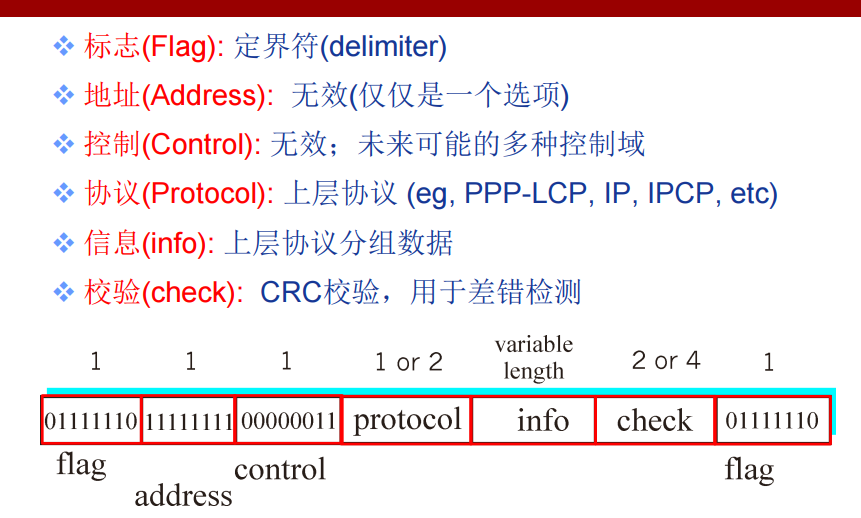
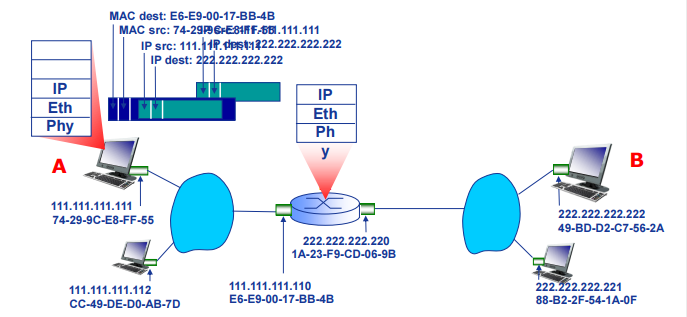
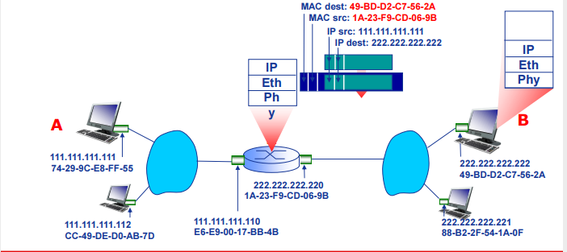
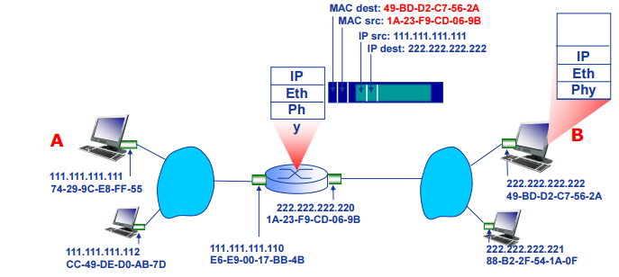
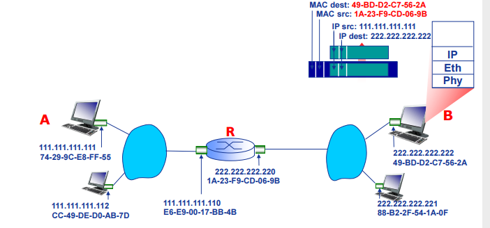

# 局域网

---

## PPP 协议

> 对于点对点的链路，目前使用得最广泛的数据链路层协议是点对点协议 PPP (Point-to-Point Protocol)。

　　PPP 协议有三个组成部分：

- (1) 一个将 IP 数据报封装到串行链路的方法。
- (2) 链路控制协议 LCP (Link Control Protocol)。
- (3) 网络控制协议 NCP (Network Control Protocol)。

### 协议帧格式

　　PPP 帧的首部和尾部分别为 4 个字段和 2 个字段。

　　标志字段 F = 0x7E （符号“0x”表示后面的字符是用十六进制表示。十六进制的 7E 的二进制表示是 01111110）。
地址字段 A 只置为 0xFF。地址字段实际上并不起作用。
控制字段 C 通常置为 0x03。
**PPP 是面向字节的，所有的 PPP 帧的长度都是整数字节。**

　　

### PPP 协议透明传输的问题

　　与上面在信道传输的数据一样、PPP 协议也是要解决透明传输的问题，来确保我们的帧的定界。

- 当 PPP 用在同步传输链路时，协议规定采用硬件来完成比特填充（和 HDLC 的做法一样）。
- 当 PPP 用在异步传输时，就使用一种特殊的字符填充法。

### 字节填充

> “数据透明传输”需求: 数据域必须允许包含标志模式<01111110>

> Q: 如何判断该作为数据接收，还是作为标志处理？

- 发送端: 在数据中的<01111110>和<01111101>字节前添加额外的字节<01111101> (“填充(stuffs)”)
- 接收端:
  - 单个字节<01111101>表示一个填充字节；
  - 连续两个字节<01111101>：丢弃第 1 个，第 2 个作为数据接收
  - 单个字节<01111110>: 标志字节

## ARP 协议

### ARP 协议

　　地址解析协议，即 ARP（Address Resolution Protocol），是根据 IP 地址获取 mac 物理地址的协议

#### ARP 工作过程

　　每台电脑或路由器在其内存中有一个 ARP 表

> ARP 表: LAN 中的每个 IP 结点(主机、路由器)维护一个表
>
> - 存储某些 LAN 结点的 IP/MAC 地址映射关系:
> - TTL (Time To Live)：经过这个时间以后该映射关系会被遗弃(典型值为 20min)
>   < IP 地址; MAC 地址; TTL>

1. 同一局域网内

- A 想要给同一局域网内的 B 发送数据报
  - B 的 MAC 地址不在 A 的 ARP 表中.
- A 广播 ARP 查询分组，其中包含 B 的 IP 地址
  - 目的 MAC 地址 = FF-FF￾FF-FF-FF-FF
  - LAN 中所有结点都会接收 ARP 查询
- B 接收 ARP 查询分组，IP 地址匹配成功，向 A 应答 B 的 MAC 地址
  - 利用单播帧向 A 发送应答
- A 在其 ARP 表中，缓存 B 的 IP-MAC 地址对，直至超时
  - 超时后，再次刷新
- ARP 是“即插即用”协议:
  - 结点自主创建 ARP 表，
  - 无需干预

2. 从一个 LAN 路由至另一个 LAN

- A 构造 IP 数据报，其中源 IP 地址是 A 的 IP 地址，目的 IP 地址是 B 的 IP 地址
- A 构造链路层帧，其中源 MAC 地址是 A 的 MAC 地址，目的 MAC 地址是(左)接口的 MAC 地址，封装 A 到 B 的 IP 数据报。
- 帧从 A 发送至 R
- R 接收帧，提取 IP 数据报，传递给上层 IP 协议
- R 转发 IP 数据报（源和目的 IP 地址不变！）
- R 创建链路层帧，其中源 MAC 地址是 R(右)接口的 MAC 地址，目的 MAC 地址是 B 的 MAC 地址，封装 A 到 B 的 IP 数据报。
- R 转发 IP 数据报（源和目的 IP 地址不变！）
- R 创建链路层帧，其中源 MAC 地址是 R (右)接口的 MAC 地址，目的 MAC 地址是 B 的 MAC 地址，封装 A 到 B 的 IP 数据报。

##
