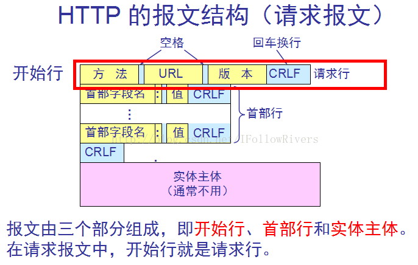
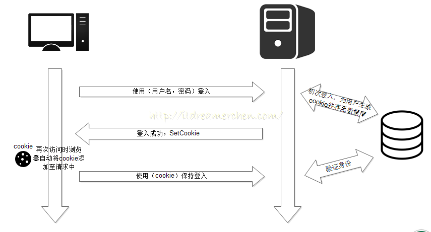
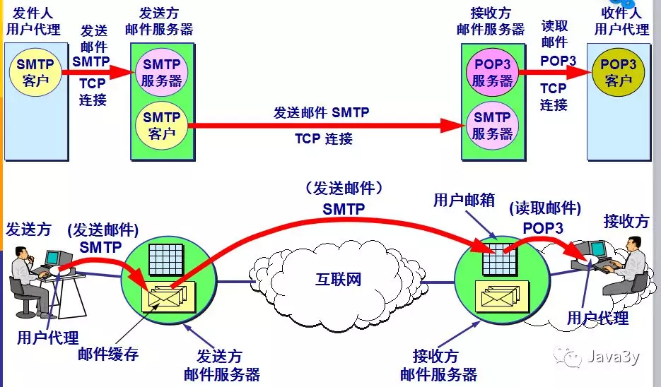
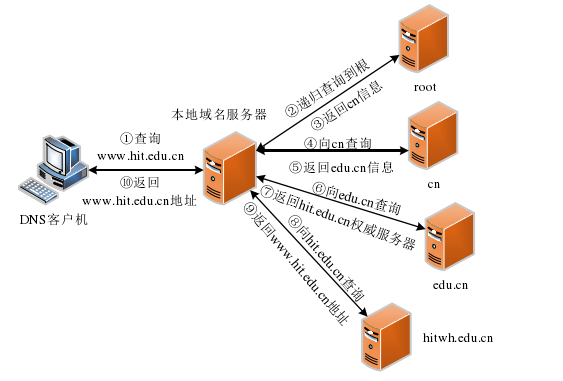

# 应用层

---

# 应用层

## 网络应用程序体系结构

### 握手协议作用

> 让客户端和服务端确认彼此身份，握手协议还能协助双方选择连接时所使用的加密算法、MAC 算法及相关密钥。

## HTTP

1. http 分为持久连接（persistent connections）和短连接（short-lived connections） 1. http1.1 默认采用持久连接，http1.0 默认采用短链接，HTTP2.0 采用多路复用(multiplexing)
2. 短链接必须为每一个请求对象建立和维护一个全新的链接，消耗服务器资源。 短链接每个对象要经历两个 RTT 时延
3. 持久连接在空闲状态，它还是会消耗服务器资源，而且在重负载时，还有可能遭受 DoS attacks 攻击

　　http 报文结构图

　　

### 状态码

|状态码|类别|原因|
| ------| ------------------------------| ----------------------------------------------------------------------------------------------------------|
|1XX|Informational(信息性状态码)|接收的请求正在处理|
|2XX|Success(成功状态码)|请求正常处理完毕|
|200||请求被正常处理|
|204||请求被受理但没有资源可以返回|
|206||客户端只是请求资源的一部分，服务器只对请求的资源执行 GET 方法，相应报文中通过 Content-Range 指定范围的资源|
|3XX|Redirection(重定向状态码)|需要进行附加操作以完成请求|
|301||永久性重定向|
|302||临时重定向|
|303||与 302 状态码有相似的功能，只是它希望客户端应使用 GET 方法定向获取请求的资源|
|304||发送附带条件的请求时，条件不满足时返回，与重定向无关|
|307||临时重定向，与 302 类似，只是强制要求使用 post 方法|
|4XX|Client error(客户端错误状态码)|服务器无法处理请求|
|400||请求报告语法有误，服务器无法识别|
|401||请求需要认证|
|403||请求的对应的资源禁止被访问|
|404||服务器无法找到对应的资源|
|5XX|Server Error(服务器错误状态码)|服务器处理请求出错|
|500||服务器内部错误|
|503||服务器正忙|
|502||（错误网关）服务器作为网关或代理，从上游服务器收到无效响应。|
|504||（网关超时）服务器作为网关或代理，但是没有及时从上游服务器收到请求。|

### HTTP1.0 和 HTTP1.1 区别

- HTTP1.1 默认开启长连接，1.0 默认使用短连接
  - HTTP/1.1 的持续连接有**非流水线方式**和**流水线方式** 。流水线方式是客户在收到 HTTP 的响应报文之前就能接着发送新的请求报文。与之相对应的非流水线方式是客户在收到前一个响应后才能发送下一个请求
- HTTP1.1 新增 24 个错误状态响应码
- HTTP1.1 引入更多缓存策略
- HTTP1.1 引入 range 头域，允许只请求资源的某一部分

### get和post区别

|区别|Post|Get|
| ----------------------| -----------------------------------| --------------------------------------|
|请求参数|无限制，请求参数放置在requestBody中|只接受ASCII字符，请求参数放置在url上|
|是否可以被缓存|不可被缓存（可手动设置）|可以被缓存|
|是否幂等性|否（有副作用）|是（无副作用）|
|请求参数长度是否有限制|协议中无限制，但服务器可能有限制|协议中无限制，但浏览器等可能有不同限制|
|是否可以被设为书签|不可以|可以|
|历史记录|Post请求的历史纪录不会被记录|get的请求历史记录会被记录|

　　**注意事项**

- **get的请求 会将header和data一起发送 服务器返回200响应码。**
- **post请求 会先将header发送给服务器，返回响应100 再发送data给服务器，返回响应200。**

　　**GET产生一个TCP数据包；POST产生两个TCP数据包。**

　　**具体点说来就是：**

- ***对于GET方式的请求，浏览器会把http header和data一并发送出去，服务器响应200（返回数据）；***
- ***对于POST，浏览器先发送header，服务器响应100 continue，浏览器再发送data，服务器响应200 ok（返回数据）。（火狐浏览器特例）***

### Cookie 的作用是什么?和 Session 有什么区别？

　　相同：

- 都是用来追踪用户身份的方式

　　区别：

- **Cookie 一般用来保存用户信息** 一般用来记录登录信息 一般存储于客户端
- **Session 的主要作用就是通过服务端记录用户的状态** 典型场景：购物车 一般存储于服务器

### cookie

　　**cookie 工作流程**

　　

## 电子邮件协议 SMTP、POP3、IMAP

　　

- 邮件读取协议 POP 或 IMAP
- 邮件传送协议 SMTP
- 现代客户访问自己得邮件服务器采用 http 协议

## DNS 域名系统

　　

2. 假设本地域名服务器没有缓存，则本地域名服务器向根域名服务器发送查询请求。
3. 根域名服务器把`.cn`顶级域名服务器的地址返回给本地域名服务器。
4. 本地域名服务器接收到根域名服务器返回的地址后，向`.cn` 顶级域名服务器发送查询请求。
5. `.cn`顶级域名服务器收到请求后，把 `edu.cn`权威域名服务器的地址返回给`.cn` 顶级域名服务器。
6. 本地域名服务器根据`.cn` 顶级域名服务器返回的地址，向`edu.cn` 权威域名服务器发送查询请求。
7. `edu.cn` 权威域名服务器把 `hitwh.edu.cn` 权威域名服务器的地址反馈给本地域名服务器。
8. 本地 域 名 服 务 器 根 据 `edu.cn` 权 威 域 名 服务 器 返 回 的 地 址 ，向`hitwh.edu.cn` 权威域名服务器发送查询请求。
9. `hitwh.edu.cn` 权威域名服务器收到请求后，把 `www.hitwh.edu.cn` 的 IP 地址返回给本地域名服务器。
10. 本地域名服务器收到 `www.hitwh.edu.cn` 的 IP 地址后，把地址返回给主机。

## 从浏览器输入URL到页面显示

|过程|涉及协议|
| -----------------------------| ----------------------|
|查找域名IP地址|DNS ： 获取域名ip|
|浏览器想web服务器发送http请求|TCP 建立与服务器的连接|
|IP协议||
|OSPF 路由选择协议||
|ARP协议 ：IP与MAC地址转化协议||
|HTTP协议||
|服务器处理请求||
|服务器返回html响应||
|浏览器渲染html||

　　**详细过程**

1. URL解析
2. DNS 递归和迭代查询域名IP 浏览器DNS缓存==》HOST==> 本地DNS缓存 ==》 根DNS服务器 ==》 下级DNS服务器
3. 查询到 IP 后建立 TCP 连接 （TCP三次握手）（如果是HTTPS 会在三次握手前会先进行TLS/SSL握手）（连接结束四次挥手 ）
4. 服务器处理请求并返回http报文。
5. 浏览器解析渲染页面

　　**涉及硬件层面（**网卡把数据包传输出去到服务器发生了什么**）**

1. 局域网把数据传送到交换机 （使用ARP协议进行mac地址与IP地址映射）
2. 交换机将数据发送到路由器，由路由器进行转发和分组数据包的功能 （路由器通过路由选择协议建立路由表）
3. 路由器转发ip数据包 ，内部局域网IP 一般使用NAT转换，让内网IP能够访问外网。
4. 然后上层传输协议开始运作 TCP或UDP  传输数据
5. 最后交由应用层处理数据。
