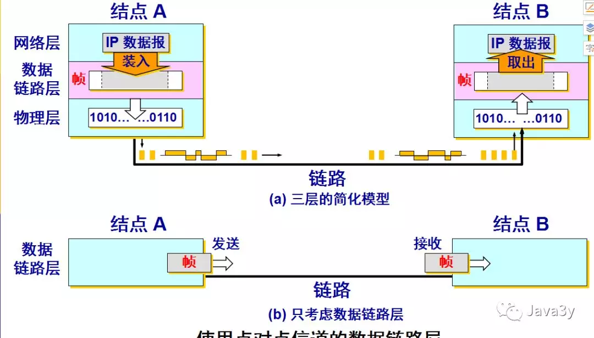
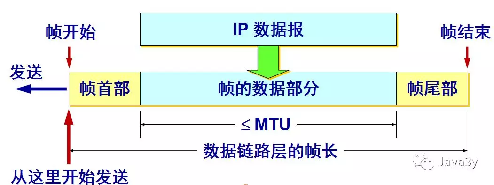
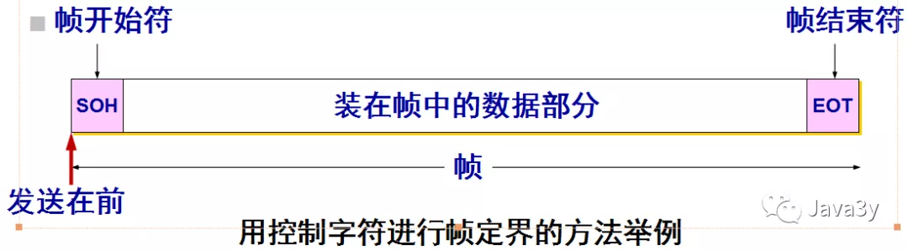
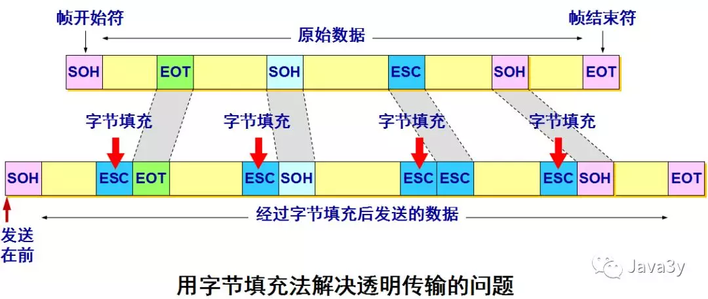
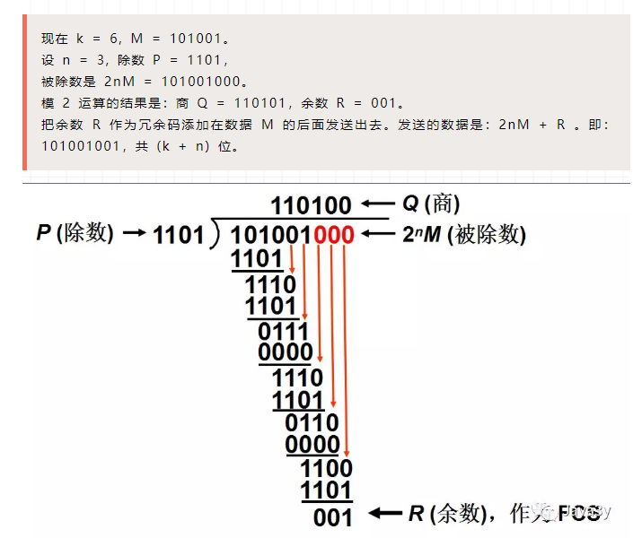
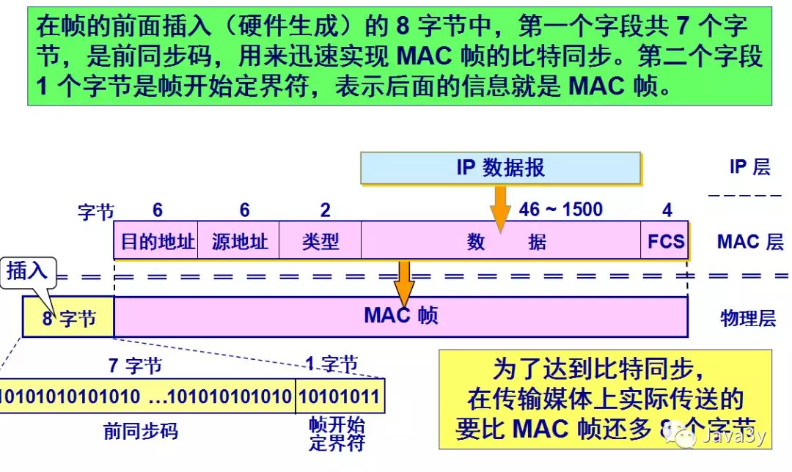

# 数据链路层

---

　　

## 链路层三个基本问题

> 数据链路使用的信道主要有以下两种类型，一种是广播，一种就是点对点。

### 封装成帧

> 在一段数据的前后分别添加首部和尾部，然后就构成了一个帧

　　首部和尾部的一个重要作用就是进行帧定界

　　
当数据是由可打印的 ASCII 码组成的文本文件时，帧定界可以使用特殊的帧定界符

### 透明传输

- 首部和尾部在数据中就已经出现的时候,解决方法：字节填充 (byte stuffing) 或字符填充 (character stuffing)
  - 发送端的数据链路层在数据中出现控制字符“SOH”或“EOT”的前面插入一个转义字符“ESC” (其十六进制编码是 1B)。
  - 接收端的数据链路层在将数据送往网络层之前删除插入的转义字符。
  - 如果转义字符也出现在数据当中，那么应在转义字符前面插入一个转义字符 ESC。当接收端收到连续的两个转义字符时，就删除其中前面的一个。

　　

### 差错控制

#### 循环冗余检验

　　在数据链路层传送的帧中，广泛使用了循环冗余检验 CRC 的检错技术。

- 在发送端，先把数据划分为组。假定每组 k 个比特。
- 假设待传送的一组数据 M = 101001（现在 k = 6）。我们在 M 的后面再添加供差错检测用的 n 位冗余码一起发送。

1. 用二进制的模 2 运算进行 2n 乘 M 的运算，这相当于在 M 后面添加 n 个 0。
2. 得到的 (k + n) 位的数除以事先选定好的长度为 (n + 1) 位的除数 P，得出商是 Q 而余数是 R，余数 R 比除数 P 少 1 位，即 R 是 n 位。
3. 将余数 R 作为冗余码拼接在数据 M 后面发送出去。

　　例如

　　

　　接收端对收到的每一帧进行 CRC 检验

　　(1) 若得出的余数 R = 0，则判定这个帧没有差错，就接受 (accept)。

　　(2) 若余数 R  0，则判定这个帧有差错，就丢弃。

　　但这种检测方法并不能确定究竟是哪一个或哪几个比特出现了差错。

　　**只要经过严格的挑选，并使用位数足够多的除数 P，那么出现检测不到的差错的概率就很小很小。**

#### 帧检验序列 FCS

　　在数据后面添加上的冗余码称为帧检验序列 FCS (Frame Check Sequence)。

　　循环冗余检验 CRC 和帧检验序列 FCS 并不等同。

　　CRC 是一种常用的检错方法，而 FCS 是添加在数据后面的冗余码。

　　FCS 可以用 CRC 这种方法得出，但 CRC 并非用来获得 FCS 的唯一方法。

#### 差错检测只是保证在传输过程中帧无差错

　　仅用循环冗余检验 CRC 差错检测技术只能做到无差错接受 (accept)。

　　“无差错接受”是指：“凡是接受的帧（即不包括丢弃的帧），我们都能以非常接近于 1 的概率认为这些帧在传输过程中没有产生差错”

　　在数据链路层使用 CRC 检验，能够实现无比特差错的传输，但这还不是可靠传输。

　　**要做到“可靠传输”（即发送什么就收到什么）就必须再加上确认和重传机制**

## MAC 地址

> 硬件地址又称为物理地址，或 MAC 地址。

### MAC 地址组成：

- IEEE 802 标准规定 MAC 地址字段可采用 6 字节 ( 48 位) 或 2 字节 ( 16 位) 这两种中的一种。
- IEEE 的注册管理机构 RA 负责向厂家分配地址字段 6 个字节中的前三个字节 (即高位 24 位)，称为组织唯一标识符。
- 地址字段 6 个字节中的后三个字节 (即低位 24 位) 由厂家自行指派，称为扩展唯一标识符，必须保证生产出的适配器没有重复地址。
- ‍

　　

### MAC 帧的格式

　　常用的以太网 MAC 帧格式有两种标准 ：

- DIX Ethernet V2 标准（最常用）
- IEEE 的 802.3 标准

　　

### 无效的 MAC 帧

1. 数据字段的长度与长度字段的值不一致；
2. 帧的长度不是整数个字节；
3. 用收到的帧检验序列 FCS 查出有差错；
4. 数据字段的长度不在 46 ~ 1500 字节之间。
5. 有效的 MAC 帧长度为 64 ~ 1518 字节之间。

　　**无效的帧会被直接丢弃掉，以太网不负责重传丢弃的帧。**
