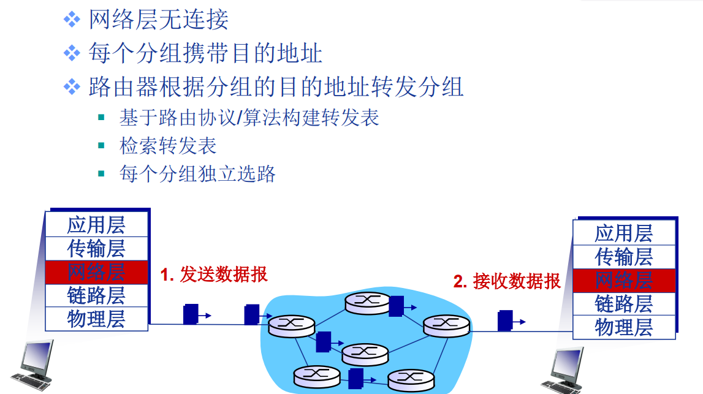
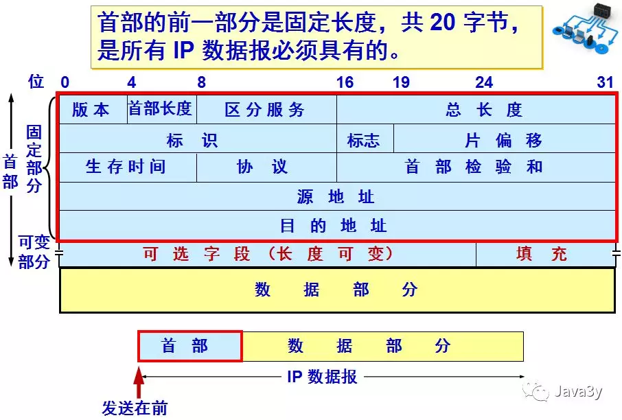
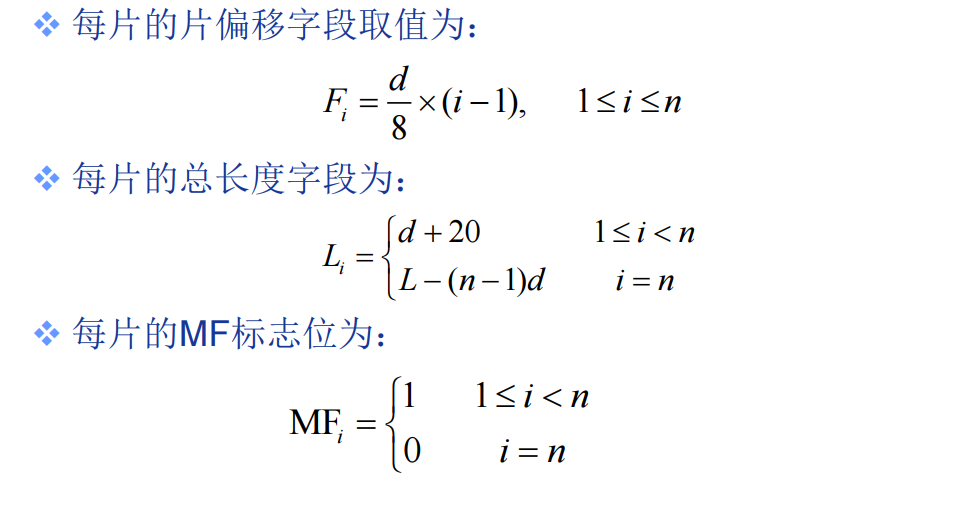
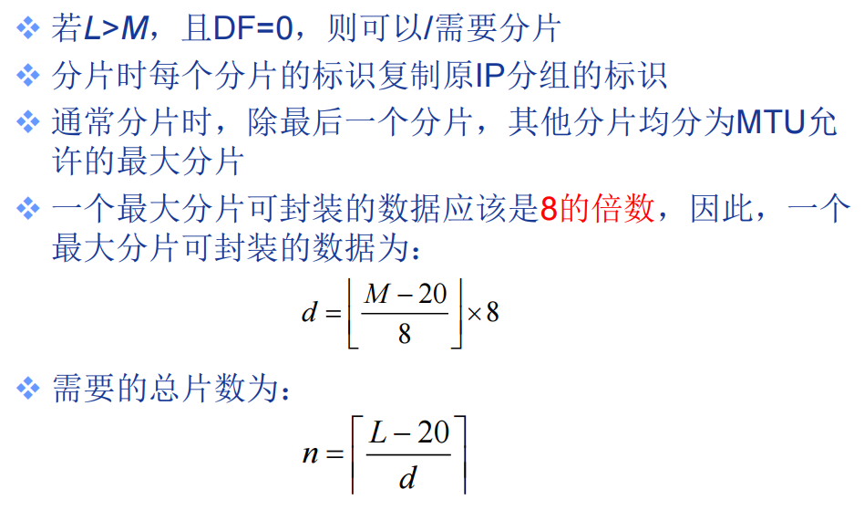
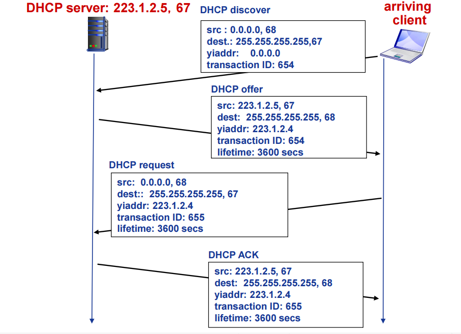
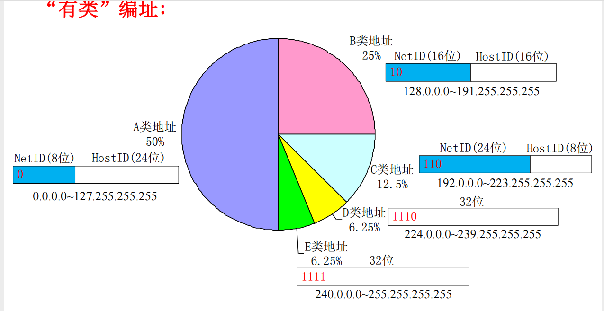
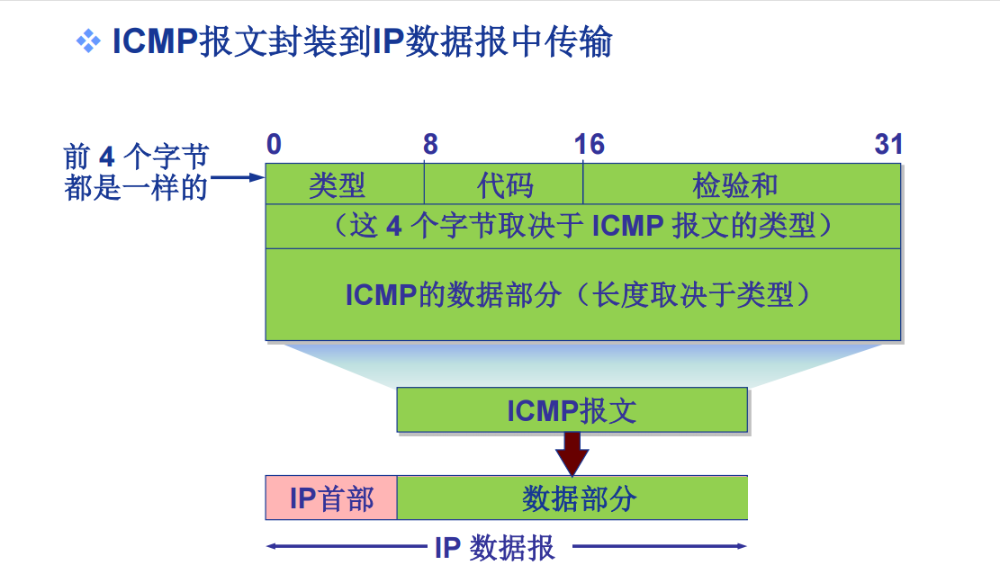
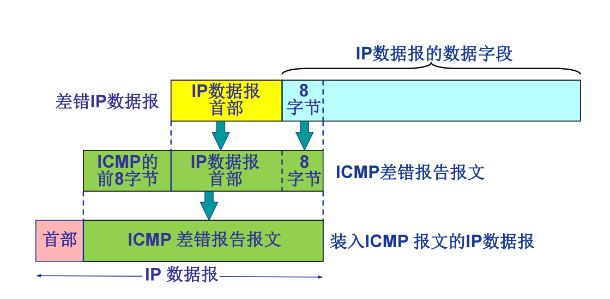
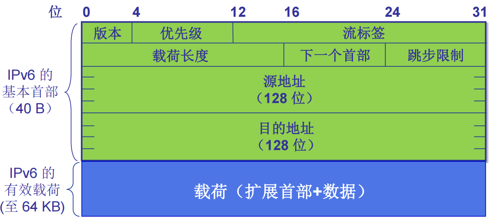
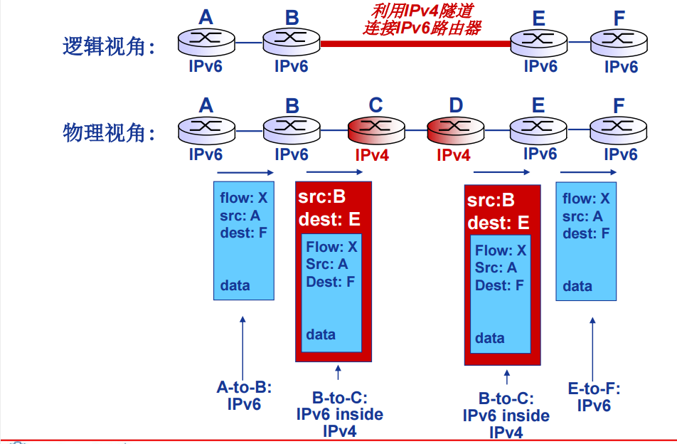

# 网络层

---

## 网络服务

### ATM(VC 网络)

#### 简介

　　

#### VC 实现过程

　　

### 数据包网络

#### 简介

　　

#### 数据包转发原则

　　

#### 对比

　　

## IPv4

### IPv4 数据报

　　

- 首部的前一部分是固定长度，共 20 字节，是所有 IP 数据报必须具有的
- 版本——占 4 位，指 IP 协议的版本。目前的 IP 协议版本号为 4 (即 IPv4)
- 首部长度——占 4 位，可表示的最大数值是 15 个单位(一个单位为 4 字节)，因此 IP 的首部长度的最大值是 60 字节
- 总长度——占 16 位，指首部和数据之和的长度，单位为字节，因此数据报的最大长度为 65535 字节。总长度必须不超过最大传送单元 MTU。
- 标志(flag) ——占 3 位，目前只有前两位有意义。标志字段的最低位是 MF (More Fragment)。MF  1 表示后面“还有分片”。MF  0 表示最后一个分片。标志字段中间的一位是 DF (Don't Fragment) 。只有当 DF  0 时才允许分片。
- 片偏移—— 占 13 位，指出：较长的分组在分片后某片在原分组中的相对位置。片偏移以 8 个字节为偏移单位。
- 生存时间——占 8 位，记为 TTL (Time To Live)，指示数据报在网络中可通过的路由器数的最大值。
- 协议——占 8 位，指出此数据报携带的数据使用何种协议，以便目的主机的 IP 层将数据部分上交给那个处理过程
- 首部检验和——占 16 位，只检验数据报的首部，不检验数据部分。这里不采用 CRC 检验码而采用简单的计算方法。将首部中每两个字节当作一个数求和取反码
- 源地址和目的地址都各占 4 字节

### IP 分片过程

　　

### ip 地址

　　

### IP 子网

> ip 地址具有相同网络号的设备接口

> 不跨越路由器(第三级及一上曾网络设备)可以彼此相互物理联通的端口

### IP 地址分类

　　

　　**特殊地址**

|NetID|HostID|作为 IP 分组源地址|作为 IP 分组目的地址|用途|
| ------| ------------------------| ------------------| --------------------| ---------------------------------------|
|全 0|全 0|可以|不可以|表示整个 Internet 网络|
|全 0|特定值|不可以|可以|表示本网特定主机|
|全 1|全 1|不可以|可以|本地广播地址(路由器不转发)|
|特定值|全 0|不可以|不可以|表示一个网络|
|特定值|全 1|不可以|可以|直接广播地址,对特定网络上的所有主机广播|
|127|非全 0 或非全 1 或任何数|可以|可以|本地环回地址|

　　**私有 IP 地址**

|class|NetID|Blocks|
| -----| -----------------------| ------|
|A|10|1|
|B|172.16 ~ 172.31|16|
|C|192.168.0 ~ 192.168.255|256|

## CIDR

> 无类域间路由

```
NetID+SublD —► Network Prefix (Prefix)可以任意长度
```

　　用处:

- 提高 IPv4 的分配效率
- 提高路由效率
  - 将多个子网聚合为一个大网
  - 构建超网
  - **路由聚合**

### DHCP

> 动态主机配置协议-DHCP: Dynamic Host Configuration Protocol

#### DHCP 作用

- 从服务器动态获取：
  - IP 地址
  - 子网掩码
  - 默认网关地址
  - DNS 服务器名称与 IP 地址
- “即插即用”
- 允许地址重用
- 支持在用地址续租
- 支持移动用户加入网络

#### DHCP 过程

　　

#### DHCP 实现

1. 请求数据包封装到 UDP 中
2. IP 广播
3. 链路层广播
4. DHCP 服务器构建 ack 报文(包括分配给客户的 IP 地址、子网掩码、默认网关、DNS 服务器地址)

### 网络地址转换(NAT)

#### NAT 实现实现:

1. 替换
   1. 利用(NAT IP 地址,新端口号)替换每个外出 IP 数据报
      的(源 IP 地址,源端口号)
2. 记录
   1. 将每对(NAT IP 地址, 新端口号) 与(源 IP 地址, 源端
      口号)的替换信息存储到 NAT 转换表中
3. 替换
   1. 根据 NAT 转换表，利用(源 IP 地址, 源端口号)替换每
      个进入内网 IP 数据报的(目的 IP 地址,目的端口号)，
      即(NAT IP 地址, 新端口号)

#### NAT 内网穿透

1. 静态配置 NAT，将特定端口的连接请求转发给服务器
2. 利用 UPnP(Universal Plug and Play) 互联网网关设备协议 (IGD-Internet Gateway Device ) 自动配置映射
3. 中继(如 Skype) NAT 内部的客户与中继服务器建立连接,外部客户也与中继服务器建立连接,中继服务器桥接两个连接的分组

## ICMP 协议

### ICMP 作用

- 互联网控制报文协议 ICMP (Internet Control Message Protocol)支持主机或路由器：
  - 差错(或异常)报告
  - 网络探询
- 两类 ICMP 报文:
  - 差错报告报文(5 种)
    - 目的不可达
    - 源抑制(Source Quench)
    - 超时/超期
    - 参数问题
    - 重定向 (Redirect)
  - 网络探询报文(2 组)
    - 回声(Echo)请求与应答报文(Reply)
    - 时间戳请求与应答报文

### ICMP 报文

|类型(Type)|编码(Code)|description|
| ----------| ----------| ---------------------|
|0|0|回声应答 (ping)|
|3|0|目的网络不可达|
|3|1|目的主机不可达|
|3|2|目的协议不可达|
|3|3|目的端口不可达|
|3|6|目的网络未知|
|3|7|目的主机未知|
|4|0|源抑制(拥塞控制-未用)|
|8|0|回声请求(ping)|
|9|0|路由通告|
|10|0|路由发现|
|11|0|TTL 超期|
|12|0|IP 首部错误|

　　**例外情况**

- 几种不发送 ICMP 差错报告报文的特殊情况：
  - 对 ICMP 差错报告报文不再发送 ICMP 差错报告报文
  - 除第 1 个 IP 数据报分片外，对所有后续分片均不发送 ICMP 差错报告报文
  - 对所有多播 IP 数据报均不发送 ICMP 差错报告报文
  - 对具有特殊地址（如 127.0.0.0 或 0.0.0.0）的 IP 数据报不发送 ICMP 差错报告报文
- 几种 ICMP 报文已不再使用
  - 信息请求与应答报文
  - 子网掩码请求和应答报文
  - 路由器询问和通告报文

### ICMP报文格式

　　

### ICMP差错报告报文数据封装

　　

## IPv6

### IPv6数据报格式

　　

- 优先级(priority) 表示数据报的优先级
- 流标签(flow label) 表示同一"流"中的数据报
- 下一个首部(next header) 表示下一个选项首部或上一层协议首部(如tcp首部)
- 校验和(checksum) 移除,减少处理时间
- 选项(options) 允许,但是将其从首部移出,定义多个首部,通过"下一个首部"字段指示
- ICMPv6
- 附加报文类型(如:"packet tool big")
- 多播组管理功能

> 一般形式: 1080:0:FF:0:8:800:200C:417A

> 压缩形式: FF01:0:0:0:0:0:0:43,压缩→FF01::43 注意只能出现一对引号

> IPv4-嵌入形式: 0:0:0:0:0:FFFF:13.1.68.3或::FFFF:13.1.68.3

> 地址前缀: 2002:43c:476b::/48(注: IPv6不再使用掩码!)

> URLs: http://[3FFE::1:800:200C:417A]:8000

　　**IPv6不支持广播,用任意播代替**

### IPv4向IPv6过渡

1. 隧道: IPv6数据报作为IPv4数据报载荷进行封装,通过IPv4网络

　　

## ARP协议(地址解析协议)

### ARP 作用：

　　从网络层使用的 IP 地址，解析出在数据链路层使用的硬件地址。

　　不管网络层使用的是什么协议，在实际网络的链路上传送数据帧时，最终还是必须使用硬件地址。

　　每一个主机都设有一个 ARP 高速缓存 (ARP cache)，里面有所在的局域网上的各主机和路由器的 IP 地址到硬件地址的映射表

### 解析的过程：

- 当主机 A 欲向本局域网上的某个主机 B 发送 IP 数据报时，就先在其 ARP 高速缓存中查看有无主机 B 的 IP 地址。
- 如有，就可查出其对应的硬件地址，再将此硬件地址写入 MAC 帧，然后通过局域网将该 MAC 帧发往此硬件地址。
- 如没有， ARP 进程在本局域网上广播发送一个 ARP 请求分组。收到 ARP 响应分组后，将得到的 IP 地址到硬件地址的映射写入 ARP 高速缓存。

　　**ARP 是解决同一个局域网上的主机或路由器的 IP 地址和硬件地址的映射问题。**

- 如果所要找的主机和源主机不在同一个局域网上，那么就要通过 ARP 找到一个位于本局域网上的某个路由器的硬件地址，然后把分组发送给这个路由器，让这个路由器把分组转发给下一个网络。剩下的工作就由下一个网络来做

## 单播、多播（组播）,广播和任意播的区别？

　　单播:网络节点之间的通信就好像是人们之间的对话一样。如果一个人对另外一个人说话，那么用网络技术的术语来描述就是“单播”，此时信息的接收和传递只在两个节点之间进行。单播在网络中得到了广泛的应用，网络上绝大部分的数据都是以单播的形式传输的，只是一般网络用户不知道而已。例如，你在收发电子邮件、浏览网页时，必须与邮件服务器、Web服务器建立连接，此时使用的就是单播数据传输方式。但是通常使用“点对点通信”（Point to Point）代替“单播”，因为“单播”一般与“多播”和“广播”相对应使用。

　　多播:“多播”也可以称为“组播”，在网络技术的应用并不是很多，网上视频会议、网上视频点播特别适合采用多播方式。因为如果采用单播方式，逐个节点传输，有多少个目标节点，就会有多少次传送过程，这种方式显然效率极低，是不可取的；如果采用不区分目标、全部发送的广播方式，虽然一次可以传送完数据，但是显然达不到区分特定数据接收对象的目的。采用多播方式，既可以实现一次传送所有目标节点的数据，也可以达到只对特定对象传送数据的目的。 　　IP网络的多播一般通过多播IP地址来实现。多播IP地址就是D类IP地址，即224.0.0.0至239.255.255.255之间的IP地址。Windows 2000中的DHCP管理器支持多播IP地址的自动分配。

　　广播:“广播”在网络中的应用较多，如客户机通过DHCP自动获得IP地址的过程就是通过广播来实现的。但是同单播和多播相比，广播几乎占用了子网内网络的所有带宽。拿开会打一个比方吧，在会场上只能有一个人发言，想象一下如果所有的人同时都用麦克风发言，那会场上就会乱成一锅粥。集线器由于其工作原理决定了不可能过滤广播风暴，一般的交换机也没有这一功能，不过现在有的网络交换机（如全向的QS系列交换机）也有过滤广播风暴功能了，路由器本身就有隔离广播风暴的作用。 　　广播风暴不能完全杜绝，但是只能在同一子网内传播，就好像喇叭的声音只能在同一会场内传播一样，因此在由几百台甚至上千台电脑构成的大中型局域网中，一般进行子网划分，就像将一个大厅用墙壁隔离成许多小厅一样，以达到隔离广播风暴的目的。 　　在IP网络中，广播地址用IP地址“255.255.255.255”来表示，这个IP地址代表同一子网内所有的IP地址

　　任意播:任播是与单播、广播和组播不同的方式。在单播中，在网络位址和网络节点之间存在一一对应的关系。在广播和组播中，在网络位址和网络节点之间存在一对多的关系：每一个目的位址对应一群接收可以复制资讯的节点。在任播中，在网络位址和网络节点之间存在一对多的关系：每一个位址对应一群接收节点，但在任何给定时间，只有其中之一可以接收到传送端来的资讯。在互联网中，通常使用边界网关协议来实现任播。
