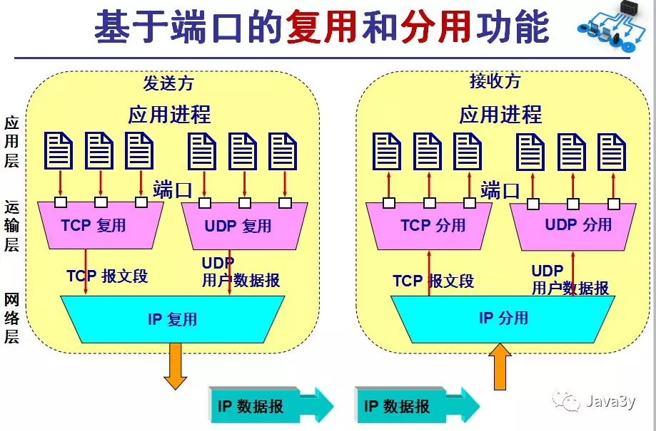
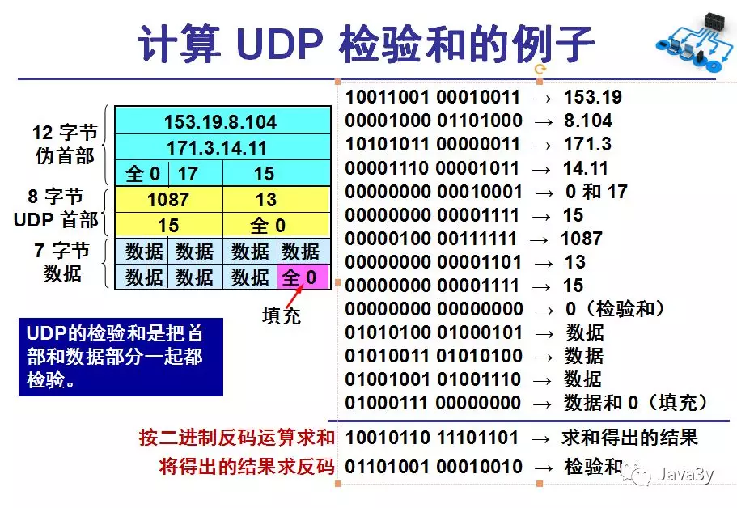
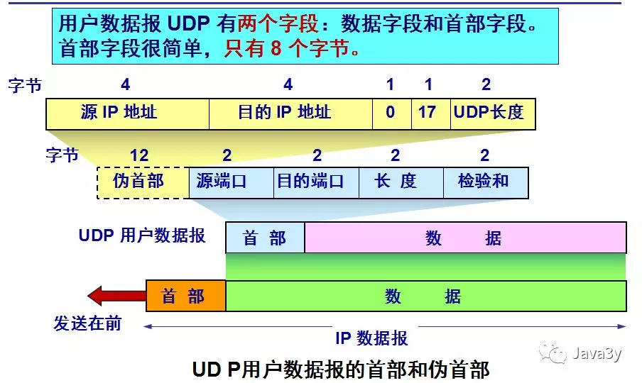
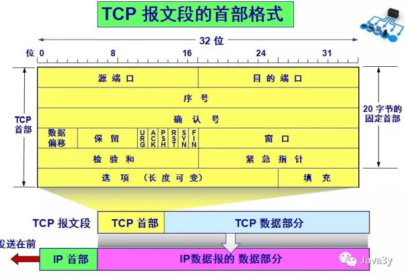
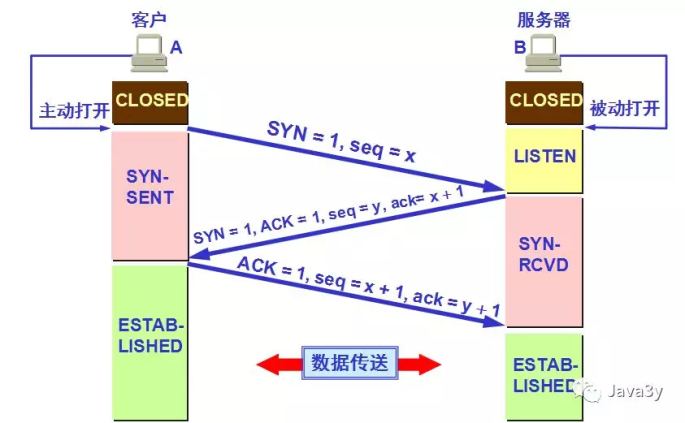
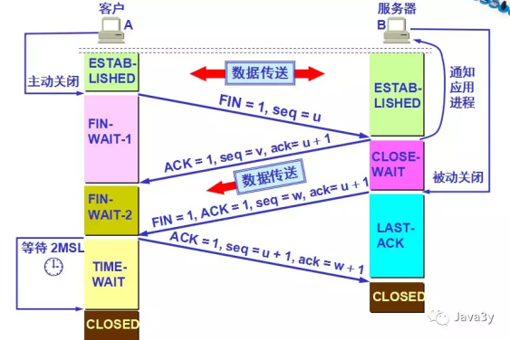
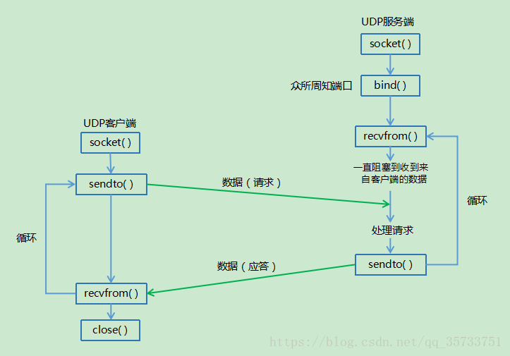
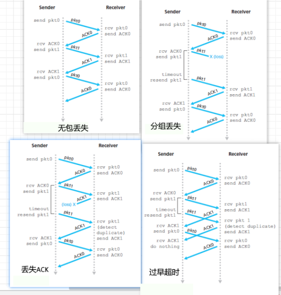
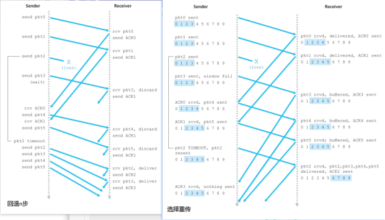

# 运输层

# 运输层

# 运输层

## 多路复用和多路分解

　　

## UDP

### UDP 检验和

　　对报文中所有 16bit 字的和进行反码运算

　　

### UDP 报文结构

### 

## TCP

### TCP 报文结构

　　

- CWR：CWR 标志与后面的 ECE 标志都用于 IP 首部的 ECN 字段，ECE 标志为 1 时，则通知对方已将拥塞窗口缩小；
- ECE：若其值为 1 则会通知对方，从对方到这边的网络有阻塞。在收到数据包的 IP 首部中 ECN 为 1 时将 TCP 首部中的 ECE 设为 1.
- URG：该位设为 1，表示包中有需要紧急处理的数据，对于需要紧急处理的数据，与后面的紧急指针有关；
- ACK：该位设为 1，确认应答的字段有效，TCP 规定除了最初建立连接时的 SYN 包之外该位必须设为 1；
- PSH：该位设为 1，表示需要将收到的数据立刻传给上层应用协议，若设为 0，则先将数据进行缓存；
- RST：该位设为 1，表示 TCP 连接出现异常必须强制断开连接；
- SYN：用于建立连接，该位设为 1，表示希望建立连接，并在其序列号的字段进行序列号初值设定；
- FIN：该位设为 1，表示今后不再有数据发送，希望断开连接。当通信结束希望断开连接时，通信双方的主机之间就可以相互交换 FIN 位置为 1 的 TCP 段。每个主机又对对方的 FIN 包进行确认应答之后可以断开连接。不过，主机收到 FIN 设置为 1 的 TCP 段之后不必马上回复一个 FIN 包，而是可以等到缓冲区中的所有数据都因为已成功发送而被自动删除之后再发 FIN 包

### TCP 连接管理

1. 三次握手

- 第一次握手
  - 客户端向服务端发送连接请求报文段。该报文段的头部中 SYN=1，ACK=0，seq=x。请求发送后，客户端便进入 **等待匹配的回应请求** 状态。PS1：SYN=1，ACK=0 表示该报文段为连接请求报文。PS2：x 为本次 TCP 通信的字节流的初始序号。 TCP 规定：SYN=1 的报文段不能有数据部分，但要消耗掉一个序号。
- 第二次握手
  - 服务端收到连接请求报文段后，如果同意连接，则会发送一个应答：SYN=1，ACK=1，seq=y，ack=x+1。 该应答发送完成后便进入 **等待请求确认** 状态。PS1：SYN=1，ACK=1 表示该报文段为连接同意的应答报文。PS2：seq=y 表示服务端作为发送者时，发送字节流的初始序号。PS3：ack=x+1 表示服务端希望下一个数据报发送序号从 x+1 开始的字节。
- 第三次握手
  - 当客户端收到连接同意的应答后，还要向服务端发送一个确认报文段，表示：服务端发来的连接同意应答已经成功收到。 该报文段的头部为：ACK=1，seq=x+1，ack=y+1。 客户端发完这个报文段后便进入 **可传输数据** 状态，服务端收到这个应答后也进入 **可传输数据** 状态，此时连接的建立完成！

　　为什么连接建立需要三次握手，而不是两次握手？

> 防止失效的连接请求报文段被服务端接收，从而产生错误。

　　PS：失效的连接请求：若客户端向服务端发送的连接请求丢失，客户端等待应答超时后就会再次发送连接请求，此时，上一个连接请求就是『失效的』。

```markdown
本质是双方建立连接，最终模型
A--请求-->B
A<--确认--B
A<--请求--B
A--确认-->B
中间两次合并为一次
```

　　

- 第一次挥手
  - 若 A 认为数据发送完成，则它需要向 B 发送连接释放请求。该请求只有报文头，头中携带的主要参数为： FIN=1，seq=u。此时，A 将进入**等待远程的连接中断请求** 状态。
    - PS1：FIN=1 表示该报文段是一个连接释放请求。
    - PS2：seq=u，u-1 是 A 向 B 发送的最后一个字节的序号。
- 第二次挥手
  - B 收到连接释放请求后，会通知相应的应用程序，告诉它 A 向 B 这个方向的连接已经释放。此时 B 进入 **等待发出连接中断请求** 状态，并向 A 发送连接释放的应答，其报文头包含： ACK=1，seq=v，ack=u+1。
    - PS1：ACK=1：除 TCP 连接请求报文段以外，TCP 通信过程中所有数据报的 ACK 都为 1，表示应答。
    - PS2：seq=v，v-1 是 B 向 A 发送的最后一个字节的序号。
    - PS3：ack=u+1 表示希望收到从第 u+1 个字节开始的报文段，并且已经成功接收了前 u 个字节。A 收到该应答，进入 **等待远程的连接中断请求** 状态，等待 B 发送连接释放请求。

　　第二次挥手完成后，A 到 B 方向的连接已经释放，B 不会再接收数据，A 也不会再发送数据。但 B 到 A 方向的连接仍然存在，B 可以继续向 A 发送数据。

- 第三次挥手
  - 当 B 向 A 发完所有数据后，向 A 发送连接释放请求，请求头：FIN=1，ACK=1，seq=w，ack=u+1。B 便进入 **等待远程的连接中断请求的确认** 状态。
- 第四次挥手 - A 收到释放请求后，向 B 发送确认应答，此时 A 进入 TIME-WAIT（等待足够的时间已确定能够收到请求） 状态。该状态会持续 2MSL 时间，若该时间段内没有 B 的重发请求的话，就进入 **关闭** 状态，撤销 TCP。当 B 收到确认应答后，也便进入 **关闭** 状态，撤销 TCP。
  

> LISTEN：侦听来自远方 TCP 端口的连接请求。

> SYN-SENT：在发送连接请求后等待匹配的连接请求。

> SYN-RECEIVED：在收到和发送一个连接请求后等待对连接请求的确认。

> ESTABLISHED：代表一个打开的连接，数据可以传送给用户。

> FIN-WAIT-1：等待远程 TCP 的连接中断请求，或先前的连接中断请求的确认。

> FIN-WAIT-2：从远程 TCP 等待连接中断请求。

> CLOSE-WAIT：等待从本地用户发来的连接中断请求。

> CLOSING：等待远程 TCP 对连接中断的确认。

> LAST-ACK：等待原来发向远程 TCP 的连接中断请求的确认。

> TIME-WAIT：等待足够的时间以确保远程 TCP 接收到连接中断请求的确认。

> CLOSED：没有任何连接状态。

### UDP

　　**简单通信过程**

　　

### TCP

　　**简单通信过程**

　　

## TCP 和 UDP 区别

- tcp 面向连接，udp 无连接
- tcp 传输可靠，udp 不可靠
- tcp 以字节流形式传输，udp 以数据报文段形式传输
- tcp 传输效率比 udp 慢
- tcp 首部 20-60 字节 udp 首部 8 字节

## tcp 协议如何保证可靠传输

- tcp 数据分块
- tcp 确认号，序号
- 校验和
- 丢弃重复数据
- 流量控制 （滑动窗口控制）
- 拥塞控制 （慢开始，拥塞避免，快重传，快恢复）
- 超时重传
- ARQ（停止等待） 协议

### 拥塞控制

> TCP发送方维护一个拥塞窗口的状态变量（动态变化的）

　　拥塞控制采用四种算法

- 慢开始 由小到大逐渐增加发送窗口大小，每次翻倍。
- 拥塞控制： 每次增加发送窗口的值，每次加一。
- 快重传： 如果接收方收到一个不按顺序的tcp包，会立即给发送方发送一个重复确认，如果发送方收到三次重复确认，则确认数据段丢失，并立刻重传丢失的这些数据段
- 快恢复：

### 可靠数据传输

1. 等停协议

> 每发送完一个分组就停止发送，等待对方的确认。在收到确认后再发送下一个分组

　　

